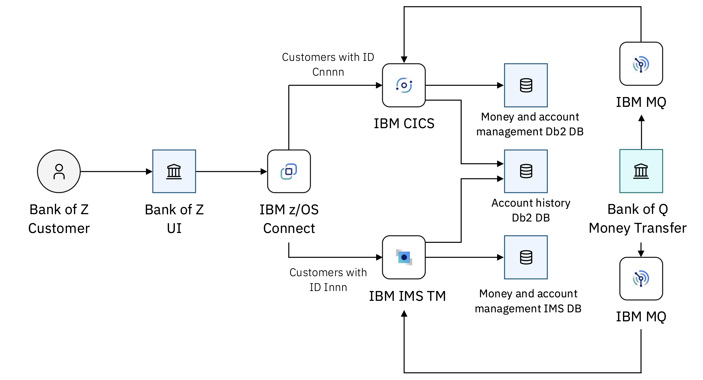

# Bank of Z

Bank of Z is a hybrid banking application that demonstrates modern IBM Z development practices. It routes transactions through CICS or IMS depending on customer ID, with z/OS Connect as the API gateway between the browser-based UI and the z/OS transactional applications.

Full documentation is available at **[https://ibm.github.io/Bank-of-Z/](https://ibm.github.io/Bank-of-Z/)**.

## Architecture



For a detailed walkthrough of components and request flows, see the [Architecture docs](https://ibm.github.io/Bank-of-Z/docs/architecture/).

## Getting Started

> **New here? Start with the [Installation Overview →](https://ibm.github.io/Bank-of-Z/docs/installation-and-setup/)**

Or follow the full setup path step by step:

| Step | Link |
|------|------|
| 1. Review prerequisites | [Prerequisites](https://ibm.github.io/Bank-of-Z/docs/installation-and-setup/prerequisites) |
| 2. Configure your environment | [Environment Configuration](https://ibm.github.io/Bank-of-Z/docs/installation-and-setup/environment-configuration) |
| 3. Set up local tools | [Local Tools Setup](https://ibm.github.io/Bank-of-Z/docs/installation-and-setup/local-tools/) |
| 4. Deploy Bank of Z | [Deploying Bank of Z](https://ibm.github.io/Bank-of-Z/docs/installation-and-setup/deploying) |
| 5. Follow a tutorial | [Tutorials](https://ibm.github.io/Bank-of-Z/docs/tutorials/) |

### Accessing Bank of Z over HTTPS

The setup scripts automatically configure HTTPS on port **9444**. Both the frontend
and the API are served by the same Liberty instance (BAQBANKZ), so there is no
cross-origin issue — `config.js` uses a relative `baseUrl: '/api'`.

The server certificate is generated by `addcert.sh` + `gencert-eku.sh` using a
**CSR round-trip** so the private key stays in the RACF keyring at all times:

1. `RACDCERT GENCERT REQONLY` — RACF generates the keypair and a PKCS#10 CSR; the private key never leaves RACF.
2. Bouncy Castle signs the CSR, adding EKU `TLS Web Server Authentication` + SANs + 397-day validity (Apple's maximum).
3. `RACDCERT IMPORT FORMAT(CERTDER)` — the signed cert is returned to the keyring; RACF matches it to the private key it already holds.
4. Liberty reads the cert+key directly from the keyring via `safkeyring://IBMUSER/BOZRING`.

One manual step is needed **once per workstation** — import the image's CA certificate
into your OS trust store so browsers recognise it as trusted.

First, copy the CA cert from the image (it is EBCDIC-encoded — the Python step converts it):

```bash
ssh ibmuser@<image-ip> \
  '/usr/lpp/IBM/cyp/v3r14/pyz/bin/python3.14 -c "
raw=open(\"/u/ibmuser/common_cacert\",\"rb\").read()
open(\"/tmp/vsica_ca.pem\",\"w\").write(raw.decode(\"cp1047\"))"'
scp ibmuser@<image-ip>:/tmp/vsica_ca.pem /tmp/vsica_ca.pem
```

Then trust it in your OS:

**macOS:**
```bash
sudo security add-trusted-cert -d -r trustRoot \
  -k /Library/Keychains/System.keychain /tmp/vsica_ca.pem
```

**Windows** (run as Administrator):
```cmd
certutil -addstore Root C:\Users\%USERNAME%\Downloads\vsica_ca.pem
```

Then open **`https://<image-ip>:9444`** in any browser.

## Documentation

| Topic | Description |
|-------|-------------|
| [About Bank of Z](https://ibm.github.io/Bank-of-Z/docs/about-bank-of-z/) | Purpose, capabilities, and architecture overview |
| [Architecture](https://ibm.github.io/Bank-of-Z/docs/architecture/) | Components, request flows, and external integrations |
| [Installation Overview](https://ibm.github.io/Bank-of-Z/docs/installation-and-setup/) | Installation workflow and stages |
| [Prerequisites](https://ibm.github.io/Bank-of-Z/docs/installation-and-setup/prerequisites) | Local and z/OS software requirements |
| [Environment Configuration](https://ibm.github.io/Bank-of-Z/docs/installation-and-setup/environment-configuration) | Zowe profile setup and connectivity |
| [Local Tools Setup](https://ibm.github.io/Bank-of-Z/docs/installation-and-setup/local-tools/) | IDE, Zowe CLI, and GRUB setup |
| [Deploying Bank of Z](https://ibm.github.io/Bank-of-Z/docs/installation-and-setup/deploying) | Build the application and deploy to z/OS |
| [Development Workflows](https://ibm.github.io/Bank-of-Z/docs/development-workflows/) | Zowe CLI and GRUB workflow guides |
| [Tutorials](https://ibm.github.io/Bank-of-Z/docs/tutorials/) | Deploy Bank of Z, CICS enhancement scenario |
| [Reference](https://ibm.github.io/Bank-of-Z/docs/reference/) | Commands, configuration, repository structure, glossary |
| [Troubleshooting](https://ibm.github.io/Bank-of-Z/docs/troubleshooting/) | Common issues and solutions |

## Contributing

This is a sample application for demonstration purposes. Feel free to fork the repository, customise it for your environment, add new features or programs, and share improvements.

## License

Licensed under the Apache License, Version 2.0. See [LICENSE](LICENSE) for details.
