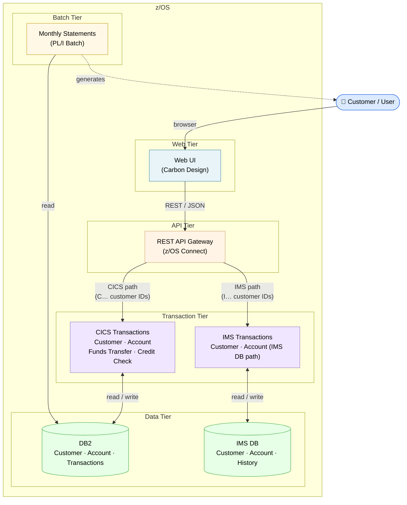
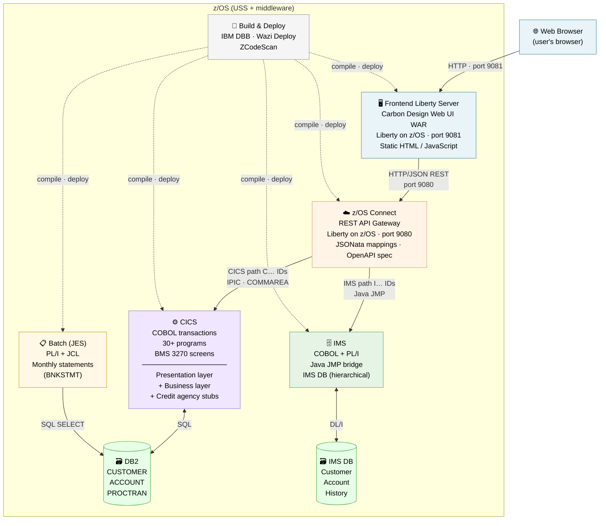

# Bank-of-Z Architecture

## What Is Bank of Z?

**Bank of Z** is a hybrid banking application that demonstrates modern IBM Z development practices. It provides a browser-based interface for banking operations — managing customers, accounts, funds transfers, and transaction history — backed entirely by z/OS middleware and transaction-processing subsystems.

The application routes each request through one of two transaction paths, determined by the leading character of the customer ID:

| Customer ID prefix | Transaction path | Data store |
|---|---|---|
| `C…` | CICS (COBOL, 30+ programs) | DB2 (relational) |
| `I…` | IMS TM (COBOL + PL/I + Java JMP bridge) | IMS DB (hierarchical) |

A single REST API gateway — **z/OS Connect** — presents both paths under one OpenAPI surface, so the web UI and any external consumer see a unified interface regardless of which backend handles the request.

**Languages in use:** COBOL · PL/I · HLASM (Assembler) · JCL · Java · JavaScript
**Runtimes:** CICS · IMS · DB2 · Liberty on z/OS (two instances) · JES batch
**Build & deploy:** IBM Dependency Based Build (DBB) · Wazi Deploy · ZCodeScan
**Full documentation:** [https://ibm.github.io/Bank-of-Z/](https://ibm.github.io/Bank-of-Z/)

---

## Logical Architecture

**What this shows:**
- **Everything runs inside z/OS** — the web UI, API gateway, transaction engine, databases, and batch processing are all z/OS components
- **One REST API, two transaction engines** — z/OS Connect routes requests to CICS or IMS based on the customer ID prefix, but presents a single API surface to the web UI
- **Two data stores** — DB2 (relational) for the CICS path; IMS DB (hierarchical) for the IMS path
- **Batch closes the loop** — the monthly statement job reads all three DB2 tables and delivers output back to the customer

---

## High-Level Overview

**Six layers at a glance:**
- **Browser** — User's browser; connects to the Frontend Liberty server on port 9081
- **Frontend Liberty** — Carbon Design web UI served as a WAR from a **Liberty on z/OS** started task (`FEBoz`). Runs under `/usr/lpp/liberty_zos`. Routes API calls to z/OS Connect on the same host (port 9080). Client-side JavaScript routes `C…` customer IDs → CICS, `I…` → IMS.
- **z/OS Connect** — REST API gateway running as a second **Liberty on z/OS** started task (`BAQBoz`, port 9080, installed under `/usr/lpp/IBM/zosconnect`). Connects to CICS via in-system IPIC. Maps JSON ↔ COBOL COMMAREA via JSONata. Single OpenAPI spec covers both CICS and IMS paths.
- **CICS** — Two sub-layers: BNK1xxx *presentation* programs (3270 + COMMAREA) call *business* programs (CRECUST, INQCUST, XFRFUN, etc.) which write to DB2 and spawn async credit-check child tasks
- **IMS** — Separate path for IMS-backed customers: COBOL programs bridge to a 64-bit Java JMP layer that reads IMS hierarchical DB
- **Batch** — `BNKSTMT.pli` runs under JES on a schedule to generate monthly statements from DB2

---

## Detailed View

```mermaid
graph TB
    classDef ui       fill:#E8F4F8,stroke:#4A90A4,color:#000
    classDef api      fill:#FFF4E6,stroke:#D4A574,color:#000
    classDef cics     fill:#F0E6FF,stroke:#9B7EBF,color:#000
    classDef ims      fill:#E6F4E6,stroke:#5BAD5B,color:#000
    classDef batch    fill:#FFF8E6,stroke:#C9A020,color:#000
    classDef db       fill:#E6FFE6,stroke:#4BAD4B,color:#000
    classDef infra    fill:#F5F5F5,stroke:#999,color:#000
    classDef shared   fill:#FFE6F0,stroke:#C06080,color:#000

    %% ── BROWSER (outside z/OS) ────────────────────────────────
    Browser["🌐  User's Browser\n(outside z/OS)"]:::ui

    %% ── z/OS BOUNDARY ─────────────────────────────────────────
    subgraph zOS["z/OS  (USS + middleware + subsystems)"]

        %% ── FRONTEND LIBERTY SERVER ───────────────────────────
        subgraph FrontendServer["🖥️  Frontend Liberty Server  (Liberty on z/OS · port 9081 · started task FEBoz)"]
            UI["Carbon Design Web UI WAR\nindex / customer / account /\ntransaction / admin pages\n─────────────────────\nconfig.js · api.js\ncustomer-create.html\ncustomer-details.html\naccount-*.html\ntransaction-details.html"]:::ui
        end

        %% ── z/OS CONNECT ──────────────────────────────────────
        subgraph ZConnect["☁️  z/OS Connect  (Liberty on z/OS · port 9080 · started task BAQBoz)"]
            API["OpenAPI REST Gateway\nopenapi.yaml\n─────────────────────\nJSONata request/response\nmappings per operation\n─────────────────────\nCICS path  /api/customers\n            /api/accounts\n            /api/transactions\n\nIMS path   /api/ims/customers\n           /api/ims/accounts"]:::api
        end

        %% ── CICS PATH ─────────────────────────────────────────
        subgraph CICSPath["⚙️  CICS  (z/OS)"]
            direction TB

            subgraph Presentation["Presentation Layer  (BMS 3270 + COMMAREA)"]
                BNKMENU["BNKMENU\nMain menu"]:::cics
                BNK1CCS["BNK1CCS\nCreate customer\n(BNK1CCM.bms)"]:::cics
                BNK1DCS["BNK1DCS\nDisplay customer\n(BNK1DCM.bms)"]:::cics
                BNK1CAC["BNK1CAC\nCreate account\n(BNK1CAM.bms)"]:::cics
                BNK1DAC["BNK1DAC\nDelete account\n(BNK1DAM.bms)"]:::cics
                BNK1CRA["BNK1CRA\nCredit/Debit\n(BNK1CDM.bms)"]:::cics
                BNK1TFN["BNK1TFN\nTransfer funds\n(BNK1TFM.bms)"]:::cics
                BNK1UAC["BNK1UAC\nUpdate account\n(BNK1UAM.bms)"]:::cics
            end

            subgraph Business["Business / Service Layer"]
                CRECUST["CRECUST\nCreate customer\n+ async credit check"]:::cics
                INQCUST["INQCUST\nInquire customer"]:::cics
                UPDCUST["UPDCUST\nUpdate customer"]:::cics
                DELCUS["DELCUS\nDelete customer"]:::cics
                CREACC["CREACC\nCreate account"]:::cics
                INQACC["INQACC\nInquire account"]:::cics
                INQACCS["INQACCS\nInquire accounts"]:::cics
                INQACCCU["INQACCCU\nAccounts by customer"]:::cics
                UPDACC["UPDACC\nUpdate account"]:::cics
                DELACC["DELACC\nDelete account"]:::cics
                DBCRFUN["DBCRFUN\nDebit/Credit"]:::cics
                XFRFUN["XFRFUN\nTransfer funds"]:::cics
                INQTRANL["INQTRANL\nTransaction list"]:::cics
                INQTRAND["INQTRAND\nTransaction detail"]:::cics
            end

            subgraph CreditAgency["Async Credit Agency Stubs  (CICS child tasks)"]
                CRDT["CRDTAGY1 · CRDTAGY2\nCRDTAGY3 · CRDTAGY4 · CRDTAGY5\n─────────────────────────\nRUN TRANSID OCR1–OCR5\nCICS containers + channels\nRandom score 1–999"]:::shared
            end

            ABND["ABNDPROC\nShared abend handler"]:::shared
        end

        %% ── IMS PATH ──────────────────────────────────────────
        subgraph IMSPath["🗄️  IMS  (z/OS)"]
            direction TB

            subgraph IMSCobol["IMS COBOL Programs"]
                IBTRAN["IBTRAN\nJava–COBOL bridge\n(JNI · 31-bit ↔ 64-bit JVM)"]:::ims
                IBGCUDAT["IBGCUDAT\nGet customer"]:::ims
                IBSCUDAT["IBSCUDAT\nSearch customer"]:::ims
                IBACSUM["IBACSUM\nAccount summary"]:::ims
                IBLOGIN1["IBLOGIN1\nLogin"]:::ims
                IBLOGOUT["IBLOGOUT\nLogout"]:::ims
            end

            subgraph IMSPli["IMS PL/I"]
                IBLOGIN_PLI["IBLOGIN.pli\nIMS entry point"]:::ims
            end

            subgraph IMSControl["IMS Control Blocks  (Assembler)"]
                DBD["DBD sources\nCUSTOMER · ACCOUNT\nACCTYPE · CUSTACCS\nHISTORY · TSTAT …"]:::ims
                PSB["PSB sources"]:::ims
            end
        end

        %% ── BATCH ─────────────────────────────────────────────
        subgraph Batch["📋  Batch  (z/OS JES)"]
            BNKSTMT["BNKSTMT.pli\nMonthly statement\ngeneration\n─────────────────────\nBNKSTMT.jcl"]:::batch
        end

        %% ── DB2 ───────────────────────────────────────────────
        subgraph DB2["🗃️  DB2  (z/OS)"]
            direction LR
            CUSTOMER_T[("CUSTOMER\ntable")]:::db
            ACCOUNT_T[("ACCOUNT\ntable")]:::db
            PROCTRAN_T[("PROCTRAN\naudit table")]:::db
            CONTROL_T[("STTESTER.CONTROL\ntest harness")]:::db
        end

        %% ── IMS DB ────────────────────────────────────────────
        subgraph IMSDB["🗃️  IMS DB  (VSAM / HIDAM)"]
            IMS_CUST[("Customer\nIMS segments")]:::db
            IMS_ACCT[("Account\nIMS segments")]:::db
            IMS_HIST[("History\nIMS segments")]:::db
        end

        %% ── BUILD / DEPLOY INFRA ──────────────────────────────
        subgraph Infra["🔧  Build & Deploy  (z/OS USS)"]
            DBB["IBM DBB\nDependency Based Build\ndbb-app.yaml · zapp.yaml"]:::infra
            WaziDeploy["Wazi Deploy\nload library promotion"]:::infra
            ZCodeScan["ZCodeScan\nzcodescan-rules.yaml\nstatic analysis"]:::infra
        end

    end

    %% ── FLOWS ────────────────────────────────────────────────

    %% Browser → Frontend Liberty → z/OS Connect
    Browser  -->|"HTTP · port 9081"| UI
    UI       -->|"REST HTTP/JSON\nport 9080"| API

    %% z/OS Connect → CICS (IPIC · transid OMEN)
    API -->|"CICS path\nIPIC · transid OMEN\nCOMMAREA"| Business
    API -->|"3270 BMS path\n(optional terminal)"| Presentation

    %% z/OS Connect → IMS (Java bridge)
    API -->|"IMS path\nJava JMP"| IBTRAN

    %% Presentation → Business
    BNK1CCS -->|"EXEC CICS LINK\nSYNCONRETURN"| CRECUST
    BNK1DCS -->|EXEC CICS LINK| INQCUST
    BNK1CAC -->|EXEC CICS LINK| CREACC
    BNK1DAC -->|EXEC CICS LINK| DELACC
    BNK1CRA -->|EXEC CICS LINK| DBCRFUN
    BNK1TFN -->|EXEC CICS LINK| XFRFUN
    BNK1UAC -->|EXEC CICS LINK| UPDACC

    %% Credit agency async
    CRECUST -->|"PUT CONTAINER\nRUN TRANSID OCR1–5\nasync child tasks"| CRDT
    CRDT -->|"FETCH ANY NOSUSPEND\nreturns credit scores"| CRECUST

    %% Business → DB2
    CRECUST -->|INSERT| CUSTOMER_T
    CRECUST -->|INSERT| PROCTRAN_T
    INQCUST -->|SELECT| CUSTOMER_T
    UPDCUST -->|SELECT / UPDATE| CUSTOMER_T
    UPDCUST -->|INSERT| PROCTRAN_T
    DELCUS  -->|SELECT / DELETE| CUSTOMER_T
    DELCUS  -->|INSERT| PROCTRAN_T
    CREACC  -->|INSERT| ACCOUNT_T
    INQACC  -->|SELECT| ACCOUNT_T
    INQACCS -->|SELECT| ACCOUNT_T
    INQACCCU-->|SELECT| ACCOUNT_T
    UPDACC  -->|UPDATE| ACCOUNT_T
    DELACC  -->|DELETE| ACCOUNT_T
    DBCRFUN -->|UPDATE| ACCOUNT_T
    DBCRFUN -->|INSERT| PROCTRAN_T
    XFRFUN  -->|UPDATE| ACCOUNT_T
    XFRFUN  -->|INSERT| PROCTRAN_T
    INQTRANL-->|SELECT| PROCTRAN_T
    INQTRAND-->|SELECT| PROCTRAN_T
    CRECUST -->|SELECT/UPDATE| CONTROL_T
    CREACC  -->|UPDATE| CONTROL_T

    %% IMS → IMS DB
    IBTRAN  -->|DL/I calls| IMSCobol
    IMSCobol-->|DL/I PCB| IMS_CUST
    IMSCobol-->|DL/I PCB| IMS_ACCT
    IMSCobol-->|DL/I PCB| IMS_HIST

    %% Batch → DB2
    BNKSTMT -->|SELECT\nCUSTOMER + ACCOUNT + PROCTRAN| CUSTOMER_T
    BNKSTMT -->|SELECT| ACCOUNT_T
    BNKSTMT -->|SELECT| PROCTRAN_T

    %% Abend handler
    Business -->|"on error\nEXEC CICS LINK"| ABND

    %% Build pipeline
    DBB -->|compile · bind · assemble| CICSPath
    DBB -->|compile · bind| Batch
    DBB -->|compile| IMSPath
    WaziDeploy -->|deploy WAR| FrontendServer
    WaziDeploy -->|deploy WAR + config| ZConnect
    WaziDeploy -->|deploy load modules| CICSPath
    ZCodeScan -.->|"pre-commit\nrule check"| CICSPath
```

---

## Component Summary

| Zone | Programs / Assets | Language | Runtime |
|---|---|---|---|
| **Browser** | User's browser | — | Outside z/OS |
| **Frontend Liberty** | `bank-of-z-frontend.war` (10 HTML pages, `api.js`, `config.js`) | JavaScript (Carbon Design) | Liberty on z/OS · port 9081 · started task `FEBoz` |
| **z/OS Connect** | 14 API operations, `openapi.yaml`, JSONata mappings | YAML / JSONata | Liberty on z/OS · port 9080 · started task `BAQBoz` |
| **CICS — Presentation** | `BNKMENU`, `BNK1CAC/CCA/CCS/CRA/DAC/DCS/TFN/UAC` + 10 BMS maps | COBOL + BMS | CICS |
| **CICS — Business** | `CRECUST`, `INQCUST`, `UPDCUST`, `DELCUS`, `CREACC`, `INQACC/ACCS/ACCCU`, `UPDACC`, `DELACC`, `DBCRFUN`, `XFRFUN`, `INQTRANL/TRAND` | COBOL | CICS |
| **CICS — Credit stubs** | `CRDTAGY1`–`CRDTAGY5` | COBOL | CICS async child tasks |
| **CICS — Shared** | `ABNDPROC` | COBOL | CICS |
| **IMS** | `IBTRAN`, `IBGCUDAT`, `IBSCUDAT`, `IBACSUM`, `IBLOGIN1`, `IBLOGOUT`, `IBLOGIN.pli`, PSB/DBD | COBOL + PL/I + Assembler | IMS |
| **Batch** | `BNKSTMT.pli` + `BNKSTMT.jcl` | PL/I + JCL | JES batch |
| **DB2** | `CUSTOMER`, `ACCOUNT`, `PROCTRAN`, `STTESTER.CONTROL` | SQL | DB2 on z/OS |
| **IMS DB** | Customer, Account, History segments | VSAM/HIDAM | IMS DB |
| **Build & Deploy** | DBB, Wazi Deploy, ZCodeScan | `dbb-app.yaml`, `zapp.yaml` | z/OS USS |

## Key Architecture Patterns

| Pattern | Where |
|---|---|
| **Client-side routing** | Web UI routes `C…` IDs → CICS, `I…` IDs → IMS |
| **COMMAREA-based API contract** | z/OS Connect maps JSON ↔ COBOL COMMAREA via `.dai` + JSONata |
| **Presentation / Business separation** | BNK1xxx programs handle 3270 screens; business programs are called via `EXEC CICS LINK` |
| **Async credit scoring** | `CRECUST` spawns 5 child tasks via `RUN TRANSID`, waits 3s, collects results via `FETCH ANY NOSUSPEND` |
| **Audit trail** | All CICS mutations (INSERT/UPDATE/DELETE on CUSTOMER or ACCOUNT) write an audit row to `PROCTRAN` |
| **Shared error handling** | All CICS programs call `ABNDPROC` on abend via `EXEC CICS LINK` |
| **DBB impact build** | Copybook changes automatically trigger recompile of all dependents |
