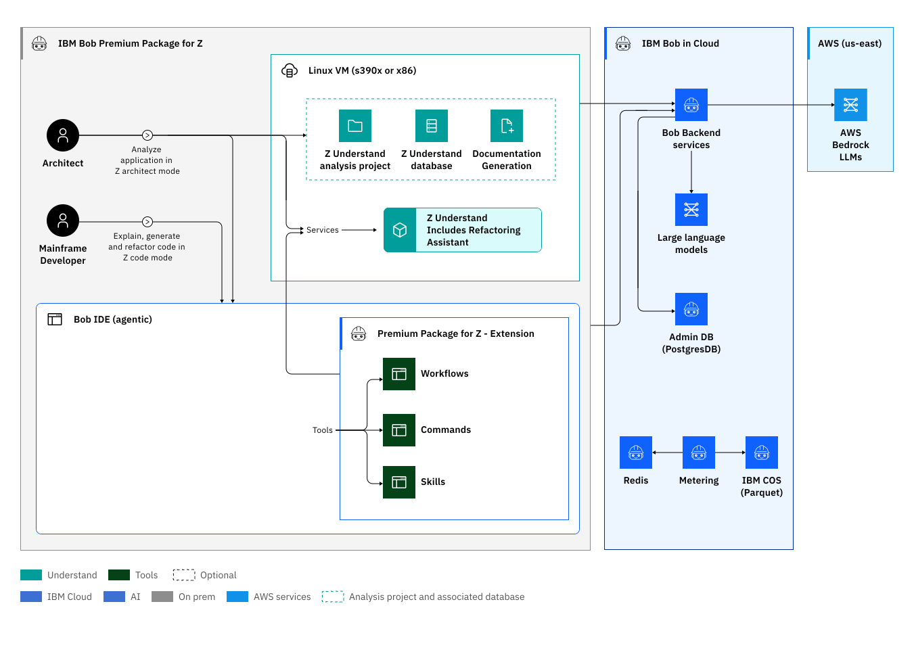

# IBM Bob and Bob Premium Package for Z — Overview

**For use in:** Demo Step 1 — Introduction  
**Audience:** Technical and business stakeholders  

---

## 1. What Is IBM Bob?

**IBM Bob** is an **AI SDLC partner** that helps teams understand, plan, improve, and deliver software — purpose-built for the full development lifecycle, not a general-purpose chatbot. ([bob.ibm.com](https://bob.ibm.com))

Bob is available as **Bob IDE** (VS Code chat experience) and **Bob Shell** (terminal CLI). It combines **intelligent multi-model orchestration** with an **agentic tool loop** — reading files, searching codebases, running commands, and reasoning across multiple sources in a single turn. Bob automatically selects the most appropriate model for each task based on complexity, capability, and cost, connecting to managed LLM services via the IBM Bob cloud backend.

### Bob as a general AI SDLC partner

Bob is on par with — and in key areas ahead of — leading tools such as GitHub Copilot and Claude Code:

| Capability | GitHub Copilot | Claude Code | IBM Bob |
|---|---|---|---|
| **Inline code completion** | ✅ Best-in-class | ❌ No tab completion [a] | ✅ Yes |
| **Multi-file agentic editing** | ✅ Yes | ✅ Yes | ✅ Yes |
| **Model quality** | Frontier (GPT, Claude, Gemini) [b] | Frontier (Claude Sonnet / Opus) [c] | Frontier — intelligent multi-model routing [d] |
| **IDE surface** | VS Code, JetBrains, GitHub.com | VS Code, terminal | VS Code (Bob IDE), terminal (Bob Shell) |
| **Customizable modes** | ✅ Agent/Plan/Ask | ✅ Six permission modes | ✅ Team-defined modes (Markdown, version-controlled) |
| **Reusable skills / rules** | ✅ Agent Skills (`.github/skills`) | ✅ SKILL.md + hooks | ✅ Skills + AGENTS.md — team-authored, enforced per-project |

*[a] Claude Code is an agentic diff tool, not a tab-completion tool. [Source](https://code.claude.com/docs/en/vs-code) — [b] [GitHub supported models](https://docs.github.com/en/copilot/reference/ai-models/supported-models) — [c] [Claude Code overview](https://code.claude.com/docs/en/overview) — [d] [bob.ibm.com/docs/ide](https://bob.ibm.com/docs/ide)*

Bob matches the general SDLC baseline of both tools on completion, agentic editing, and frontier model quality — while going further on governance: modes, skills, and rules are team-authored Markdown files in version control, not platform-managed settings. That foundation is what Bob Premium Package for Z is built on.

---

## 2. What Is Bob Premium Package for Z (PPZ)?

**IBM Bob Premium Package for Z (Bob PPZ)** adds the Z-specific capability layer that turns Bob from a general-purpose AI SDLC partner into a mainframe-aware AI engineer — purpose-built for governed, cross-application modernization on IBM Z. ([IBM Docs, v3.0.0](https://www.ibm.com/docs/en/bobz/3.0.0?topic=overview-discover-whats-inside-bob-premium-package-z))

Bob PPZ ships as extensions to Bob IDE and Bob Shell across four pillars:

| Pillar | What it adds |
|---|---|
| **1 — Workflows** | Guided multi-step processes from the Bob chat interface: generate documentation, refactor COBOL/PL/I into modular services, generate or sync a data dictionary |
| **2 — Application Analysis (Z Understand)** | Pre-indexed knowledge graph of the entire codebase — programs, copybooks, DB2 tables, call chains, paragraph-level control flow — queryable by the agent in real time |
| **3 — Code Capabilities** | Z-aware generation, explanation, business-rule extraction, refactoring, and documentation across COBOL, JCL, PL/I, REXX, and Assembler |
| **4 — Integrations** | Z Open Editor (MCP tools for analysis and editing), ZCodeScan (team-defined YAML rule enforcement), and z/OS Debugger — usable directly from Bob IDE or Bob Shell |

### PPZ Solution Architecture

([IBM Docs — Bob PPZ 3.0 Solution Architecture](https://www.ibm.com/docs/en/bobz/3.0.0?topic=overview-solution-architecture))

**Left to right:**
1. **Developer** — works in Bob IDE or Bob Shell; the local mainframe codebase is read directly
2. **IBM Bob** — hosts the agent with multi-model orchestration; LLM requests route to managed services (e.g. AWS Bedrock) via the IBM Bob cloud backend (on-prem deployment available Q3 2026)
3. **PPZ extensions** — Z Understand (knowledge graph + agent tools, Linux VM s390x or x86) and ZCodeScan (team-defined static analysis rules)
4. **z/OS (remote)** — the mainframe target; Bob builds and deploys via DBB and Wazi Deploy

---

### How IBM Bob PPZ compares to leading AI coding tools

> **Presenter note:** Scoped to Z development tasks. All three tools are capable for general coding. The differentiation is Z-specific depth. Source: *IBM Bob Premium Package for Z — Competitive Battlecard* (IBM Confidential, 2026).

| Capability | GitHub Copilot | Claude Code | IBM Bob PPZ |
|---|---|---|---|
| **IBM Z domain expertise** | ❌ File-level syntax only; no Z subsystem awareness [1] | ❌ No native Z platform knowledge [2] | ✅ IBM-curated Z RAG, Z-specific modes, middleware and standards |
| **Enterprise-wide application context** | ❌ Repo/workspace only; non-persistent [3] | ❌ Context window–limited; no persistent application model [4] | ✅ Metadata-driven graph across programs, dependencies, data flows, and data dictionary |
| **Cross-program dependency graph** | ❌ Inferred from repo; incomplete without full context [3] | ❌ Retrieval-based; constrained by context window [4] | ✅ Z Understand: programs, copybooks, call chains, DB2 tables, BMS — persistent and queryable |
| **COBOL / PL/I / BMS / JCL generation** | ⚠️ File/syntax level; transaction flows require developer reconstruction [1] | ⚠️ Incomplete logic coverage; misses business rules; inconsistent across runs [2] | ✅ Standards-aligned generation with full application context and Z interdependency awareness |
| **CICS / IMS / DB2 semantics** | ❌ No Z subsystem execution awareness [1] | ❌ General-purpose only [2] | ✅ RESP/RESP2, DL/I PCB, DBRM rebind ordering, COMMAREA byte positions |
| **Customizable modes / skills** | ✅ Agent/Plan/Ask; Agent Skills framework [5] | ✅ Permission modes; SKILL.md; /slash commands [6] | ✅ Z Architect and Z Code modes; Z-specific skills; AGENTS.md |
| **Custom rule enforcement** | ⚠️ Via extensions; no Z-aware rule engine | ⚠️ Via CLAUDE.md + hooks; no Z-aware rule engine [6] | ✅ ZCodeScan — team-defined YAML rules, version-controlled, mapped to rule IDs |
| **Enterprise governance and deployment** | ⚠️ Cloud-based; no full intent-to-change audit trail [7] | ⚠️ Execution-time governance only; no plan-to-deploy lifecycle [8] | ✅ Hybrid (on-prem Q3 2026); full intent-to-change audit trail; Bob Shell for CLI orchestration |

*All competitive claims [1]–[8]: IBM Bob Premium Package for Z — Competitive Battlecard (IBM Confidential, 2026), slides 1–2.*

> **Key message:** On general coding tasks, Bob is a peer to Copilot and Claude Code — as established in Section 1. On Z development tasks, the comparison is one-sided: neither competitor has Z domain knowledge, an enterprise-wide application model, or governed SDLC workflows. Bob PPZ is purpose-built for exactly that.

---

## 3. Why PPZ on Top of Bob Matters

GitHub Copilot and Claude Code are trained on public code. IBM Z source — COBOL, PL/I, BMS, JCL, IMS DDL — is almost entirely proprietary, with almost no presence in public training corpora. In practice this means:

- **Code generation fails**: generated COBOL won't compile — wrong column boundaries, missing `PROCESS CICS` directives, `HANDLE CONDITION` instead of RESP/RESP2, no awareness of `dbb-app.yaml` build descriptors.
- **Impact analysis is incomplete**: a tool can grep for `COPY ACCOUNT` but has no model of COMMAREA byte-position sensitivity, z/OS Connect `.dai` startPos fields, DB2 DBRM rebind ordering, or why a PL/I batch program is in the blast radius of a DB2 table change.
- **Cross-language reasoning breaks down**: a trace from JavaScript → z/OS Connect JSONata → CICS COMMAREA → COBOL → DB2 crosses five paradigms. General tools lose the thread.
- **CICS/IMS semantics are unknown**: `PUT/GET CONTAINER`, `RUN TRANSID`, `EXEC CICS LINK SYNCONRETURN`, IMS DL/I PCB — these have no equivalent in the web/cloud world those models were trained on.

---

## 4. Key Talking Points for the Demo

### 1. "Frontier LLMs — but with eyes on your entire mainframe codebase"

Bob PPZ applies the same frontier model quality as any leading AI tool. The difference: those tools see only what fits in their context window and have no Z semantics. Bob PPZ has a pre-indexed knowledge graph of every program, paragraph, copybook, DB2 table, and call chain — it knows the codebase before the first question is asked.

### 2. "Z Understand: a dependency graph, not a text search"

Ask "what changes if I modify the CUSTOMER table?" — Copilot greps for `COPY CUSTOMER`. Bob PPZ queries the Z Understand graph and returns every affected program, which need a DB2 DBRM rebind, which have BMS dependencies requiring reassembly first, and which are PL/I rather than COBOL. That's a structured query against a pre-built program model.

### 3. "Your rules, enforced by your AI"

ZCodeScan applies the team's own YAML rule file — not generic advice. Bob maps violations to *your* rule IDs, *your* severities, and *your* fixes. A new developer gets the same code review as your most experienced COBOL engineer, and the rules are version-controlled alongside the code.

### 4. "Extensible — not a black box"

Every mode and skill is a Markdown file. Your team writes the rules, constraints, and workflows. A "DB2 Performance Mode" or "Batch JCL Generation Skill" is buildable in hours. The AI applies *your* standards — and you can audit exactly what those standards are.

### 5. "Sensitive code stays local"

No context switching, no copy-paste into a browser. Developers work in Bob IDE or Bob Shell as normal. The Z Understand knowledge graph runs on a local Linux VM — mainframe source never leaves your environment.

---

## 5. Quick Reference: Bob PPZ vs Competitors

> Scoped to Z development tasks. For general coding (web, cloud, Python), Copilot and Claude Code are strong. The table below covers what matters for mainframe teams.

| Question | GitHub Copilot | Claude Code | Bob PPZ |
|---|---|---|---|
| "Which programs use the CUSTOMER table?" | Semantic search — finds likely matches, no Z-aware program model | Reads files on demand; no pre-indexed dependency graph | Queries Z Understand graph — programs, copybooks, DB2, call chains; instant and complete |
| "Generate a CICS COBOL program" | No CICS/Z-specific training; generation quality for Z unverified | No CICS/Z-specific training; generation quality for Z unverified | Generates with correct PROCESS CICS, RESP/RESP2, column boundaries, ZCodeScan rules applied |
| "What's the blast radius of changing SORTCODE.cpy?" | Finds references; no DBRM/BMS dependency model | Reads files on demand; no DBRM rebind or BMS reassembly knowledge | 21 programs enumerated, DBRM vs plain recompile split, BMS dependency flagged |
| "Does this code have ZCodeScan violations?" | No knowledge of ZCodeScan | No knowledge of ZCodeScan | Reads your YAML rule file, maps violations to rule IDs and severities |
| "Trace the flow from UI to DB2" | Can search codebase; no Z-layer semantics | Possible with large context; no Z semantics | 5-layer trace: JS → JSONata → CICS → COBOL → DB2, including async child tasks |
| "Apply our team's Z coding standards" | Custom agents exist; no Z-aware rule engine | CLAUDE.md + hooks exist; no Z-aware rule engine | Z Code mode + ZCodeScan encodes and enforces team Z standards |

---

*Reference: [ibm.com/docs/en/bobz/3.0.0](https://www.ibm.com/docs/en/bobz/3.0.0)*
