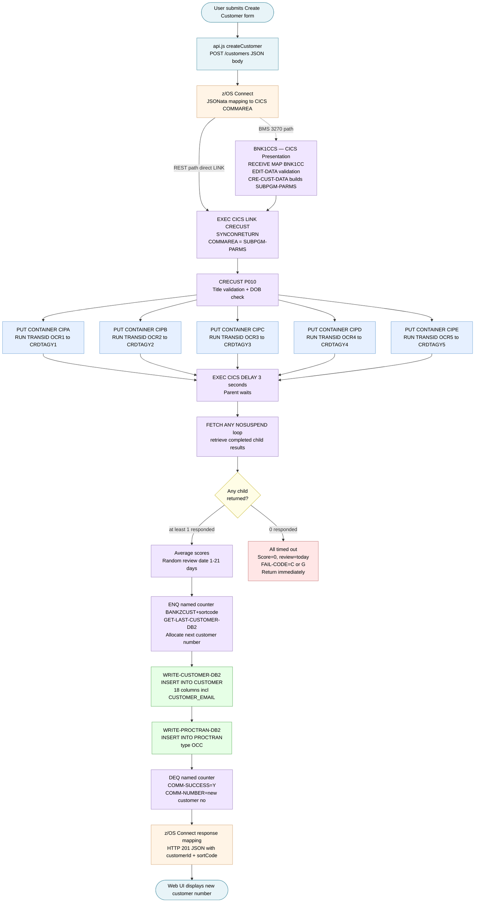

# Multi-Language Program Explanation: Create New Customer End-to-End Flow

**Date:** 2026-07-28  
**Mode:** Z Architect  
**Files read:** `src/frontend/js/api.js`, `src/api/src/main/operations/%2Fcustomers/post/request.yaml`, `src/base/cics/cobol/BNK1CCS.cbl`, `src/base/cics/cobol/CRECUST.cbl`, `src/base/cics/cobol/CRDTAGY1.cbl`

---

## Prompt

> Explain the complete end-to-end flow when a user creates a new customer in the Bank of Z web UI. Start from the JavaScript fetch call in api.js, trace through the z/OS Connect JSONata request mapping, into the CICS presentation program BNK1CCS.cbl, then CRECUST.cbl — including the asynchronous CICS child tasks it spawns to the five credit agency stubs, how it aggregates credit scores using CICS containers and RETRIEVE SUBEVENT, and finally how it writes to DB2. Explain what happens at each layer if all five credit agency child tasks time out before returning.

---

## End-to-End Flow: Create New Customer

### Layer 1 — Web UI: `createCustomer()` in `api.js`

The user fills in the form on `customer-create.html` and submits. The page calls `createCustomer(customerData)` on the `CustomersApi` class, which inherits `request()` from `BaseApi`.

```javascript
// api.js:145-149
async createCustomer(customerData) {
    return this.request(`${this.configuration.baseUrl}/customers`, {
        method: 'POST',
        body: JSON.stringify(customerData)
    });
}
```

**Key routing note:** Customer creation always goes to `/customers` (CICS path). The `getSystemFromCustomerId()` routing function — which checks for the `I` prefix to send to `/ims/...` — is only invoked on *read/update* operations where a customer ID already exists. At creation time, no ID exists yet, so the CICS path is always used unconditionally.

The JSON body contains fields like `title`, `firstName`, `lastName`, `dateOfBirth`, `phoneNumber`, `address`, and optionally `email`. The `email` field is sent as `email || undefined` so that if blank it is omitted entirely from the body rather than sent as an empty string.

---

### Layer 2 — z/OS Connect: Request Mapping

z/OS Connect receives the `POST /customers` HTTP request and applies `request.yaml` to transform the JSON body into a CICS COMMAREA.

The mapping uses JSONata expressions to populate each `CRECUSTZ` COMMAREA field:

| JSON body field | COMMAREA field | Mapping logic |
|---|---|---|
| `$body.title` | `COMM-TITLE` | Direct template |
| `$body.firstName` | `COMM-FIRST-NAME` | `$exists` null-guard |
| `$body.lastName` | `COMM-LAST-NAME` | `$exists` null-guard |
| `$body.dateOfBirth` | `COMM-DOB-DAY/MONTH/YEAR` | Regex-validated date split |
| `$body.phoneNumber` | `COMM-PHONE` | Direct template |
| `$body.address.*` | `COMM-ADDR-LINE1/2`, `COMM-CITY`, etc. | Nested object expansion |
| `$body.email` | `COMM-EMAIL` | `$exists($body.email) ? $body.email : ""` |
| `$body.customerStatus` | `COMM-STATUS` | Direct template |

The fully populated COMMAREA is forwarded to CICS using transaction ID `OMEN` over an IPIC connection (`bankzCicsConnection`) to the `CRECUST` program. Although z/OS Connect always uses `transid: OMEN` as the entry-point transaction, the actual business program reached is `CRECUST` because that is the program bound to the `/customers POST` operation in the provider configuration.

---

### Layer 3 — BNK1CCS: CICS Presentation Program

If the request arrives via the **BMS terminal path** (3270 screen), CICS dispatches transaction `OCCS` to `BNK1CCS.cbl`. The z/OS Connect REST path bypasses `BNK1CCS` and calls `CRECUST` directly via CICS LINK.

When the BMS path is used, the flow inside `BNK1CCS` is:

1. **First entry** (`EIBCALEN = 0`): The program sends the blank `BNK1CCM` screen to the terminal and returns with `TRANSID('OCCS')` so the next Enter key press comes back here.

2. **Enter key** (`EIBAID = DFHENTER`): `PROCESS-MAP` is called.

3. **`RECEIVE-MAP`** section: Before receiving the map, the program saves the terminal's current uppercase-translation setting (`INQUIRE TERMINAL … UCTRANST`) and disables it (`SET TERMINAL … NOUCTRAN`) so that mixed-case names and email addresses are received as typed. It then issues `EXEC CICS RECEIVE MAP('BNK1CC') MAPSET('BNK1CCM') INTO(BNK1CCI) ASIS`.

4. **`EDIT-DATA`** section: Validates all mandatory fields (title must be a known value, first name, last name, address line 1, DOB day/month/year must be numeric and in range).

5. **`CRE-CUST-DATA`** section: Builds the `SUBPGM-PARMS` structure — an **inline working-storage struct** that mirrors the `CRECUST.cpy` COMMAREA layout (no COPY statement; must be manually kept in sync). Underscores are replaced with spaces in typed fields via `INSPECT … REPLACING ALL '_' BY ' '`, then:

   ```cobol
   MOVE EMAILI OF BNK1CCI TO SUBPGM-EMAIL.
   EXEC CICS LINK PROGRAM('CRECUST')
       COMMAREA(SUBPGM-PARMS)
       SYNCONRETURN
   ```

   `SYNCONRETURN` ensures any DB2 unit of work in CRECUST is committed before control returns.

6. On return, if `SUBPGM-SUCCESS = 'Y'`, the customer number and sort code are moved to the output map fields and sent back to the terminal.

---

### Layer 4 — CRECUST: Business Program

`CRECUST.cbl` receives control via `EXEC CICS LINK` with the COMMAREA addressed as `DFHCOMMAREA COPY CRECUST`. The `PROCEDURE DIVISION USING DFHCOMMAREA` entry point is at `P010`.

#### Step 4a — Title validation

Before anything else, the program validates `COMM-TITLE` against an EVALUATE of known values (`Mr`, `Mrs`, `Miss`, `Ms`, `Dr`, `Drs`, `Lord`, `Sir`, `Lady`, `Professor`). An unknown title → `COMM-SUCCESS = 'N'`, `COMM-FAIL-CODE = 'T'`, `GOBACK` immediately.

#### Step 4b — Time and date

`POPULATE-TIME-DATE` calls `EXEC CICS ASKTIME` and `EXEC CICS FORMATTIME` to get the current DD/MM/YYYY date and HHMMSS time, stored in working storage for later use in the PROCTRAN record.

#### Step 4c — Date of birth validation

`DATE-OF-BIRTH-CHECK` uses the LE callable service `CEEDAYS` to convert the supplied DOB to a Lilian date number and validate it:
- Too old (over a configurable age limit) → `COMM-FAIL-CODE = 'O'`
- DOB in the future → `COMM-FAIL-CODE = 'Y'`
- Invalid date → `COMM-FAIL-CODE = 'Z'`

Any failure sets `COMM-SUCCESS = 'N'` and returns via `GET-ME-OUT-OF-HERE` (`EXEC CICS RETURN`).

#### Step 4d — Asynchronous credit check (`CREDIT-CHECK` section)

This is the most architecturally significant part of the program.

**Spawning the five child tasks:**

The program loops `WS-CC-CNT` from 1 to 5. For each iteration:

1. **Assigns container name**: `CIPA`, `CIPB`, `CIPC`, `CIPD`, or `CIPE` (16 bytes, space-padded).
2. **Assigns transaction ID**: `OCR1` through `OCR5` — each maps to one of `CRDTAGY1` through `CRDTAGY5`.
3. **`EXEC CICS PUT CONTAINER`**: Copies the entire `DFHCOMMAREA` (the customer data) into the named container on channel `CIPCREDCHANN`. The container length is `LENGTH OF DFHCOMMAREA`.
4. **`EXEC CICS RUN TRANSID(WS-RUN-TRANSID) CHANNEL(WS-CHANNEL-NAME) CHILD(WS-ANY-CHILD-TKN)`**: Starts the credit agency transaction asynchronously. The `CHILD` option returns a 16-byte token that uniquely identifies this child task. The token is saved into `WS-CHILD-TKN(n)` alongside the channel name in `WS-CHILD-CHAN(n)` for later retrieval.

After the loop, `WS-CHILD-ISSUED-CNT = 5` and all five child tasks are running concurrently.

**The 3-second wait:**

```cobol
EXEC CICS DELAY FOR SECONDS(3) END-EXEC.
```

The parent task suspends for exactly 3 seconds, giving the credit agencies time to complete.

**What each credit agency stub does (`CRDTAGY1.cbl`):**

1. Computes a random delay between 1–3 seconds using `FUNCTION RANDOM(EIBTASKN)` as seed. Each agency has roughly a 1-in-3 chance of finishing within the parent's 3-second window (by design — *"there is a 1 in 4 chance that data will be returned within the overall 3 second delay"*).
2. `EXEC CICS GET CONTAINER('CIPA') CHANNEL('CIPCREDCHANN') INTO(WS-CONT-IN)` — reads the customer data.
3. Generates a random credit score 1–999 and sets `CUSTOMER-CREDIT-SCORE OF WS-CONT-IN`.
4. `EXEC CICS PUT CONTAINER('CIPA') FROM(WS-CONT-IN) …` — writes the result back to the same container on the same channel.
5. `EXEC CICS RETURN` — the child task ends.

**Fetching results (the FETCH ANY loop):**

After waking from the 3-second delay, CRECUST enters a `PERFORM UNTIL WS-FINISHED-FETCHING = 'Y'` loop:

```cobol
EXEC CICS FETCH ANY(WS-ANY-CHILD-FETCH-TKN)
     CHANNEL(WS-ANY-CHILD-FETCH-CHAN)
     NOSUSPEND
     COMPSTATUS(WS-CHILD-FETCH-COMPST)
     ABCODE(WS-ANY-CHILD-FETCH-ABCODE)
     RESP(WS-CICS-RESP)
     RESP2(WS-CICS-RESP2)
END-EXEC
```

`FETCH ANY` retrieves whichever child completed next, returning its token. `NOSUSPEND` means it does not wait — if no child is ready it returns immediately.

| RESP | RESP2 | Meaning | CRECUST action |
|---|---|---|---|
| NORMAL | — | A child completed | Check `COMPSTATUS` |
| NOTFINISHED | 52 | No more children ready right now | See partial/zero logic |
| INVREQ | 1 | No children were ever issued | `COMM-FAIL-CODE = 'D'`, return |
| NOTFND | 1 | All children already fetched | See partial/zero logic |

When a child is returned with `COMPSTATUS = NORMAL`:
- The token is matched against `WS-CHILD-TKN(1..5)` to determine which container name (`CIPA`..`CIPE`) to read.
- `EXEC CICS GET CONTAINER … INTO(WS-CHILD-DATA)` reads the scored customer record back from the child's channel.
- `WS-CHILD-CREDIT-SCORE` is added to `WS-TOTAL-CS-SCR`; `WS-RETRIEVED-CNT` is incremented.

**Score aggregation:**

When `NOTFINISHED` or `NOTFND` is received and `WS-RETRIEVED-CNT > 0`:

```cobol
COMPUTE WS-ACTUAL-CS-SCR = WS-TOTAL-CS-SCR / WS-RETRIEVED-CNT
MOVE WS-ACTUAL-CS-SCR TO COMM-CREDIT-SCORE
```

A random review date 1–21 days in the future is computed using `FUNCTION INTEGER-OF-DATE` / `DATE-OF-INTEGER` and stored in `COMM-CS-REVIEW-DATE`.

#### Step 4e — Customer number allocation

**`ENQ-NAMED-COUNTER`**: Issues `EXEC CICS ENQ RESOURCE(NCS-CUST-NO-NAME) LENGTH(16)` to serialize access to the customer number counter. The resource name is `BANKZCUST` + sort code. This prevents two concurrent create-customer requests from generating the same customer number.

**`UPD-NCS` / `GET-LAST-CUSTOMER-DB2`**: Reads the `STTESTER.CONTROL` table via DB2 to find the current highest customer number, increments it by 1, and updates the control row.

#### Step 4f — DB2 write: CUSTOMER table

`WRITE-CUSTOMER-DB2` populates host variables from the COMMAREA fields, then executes:

```cobol
EXEC SQL
   INSERT INTO CUSTOMER
      (CUSTOMER_EYECATCHER, CUSTOMER_SORTCODE, CUSTOMER_NUMBER,
       CUSTOMER_TITLE, CUSTOMER_FIRST_NAME, CUSTOMER_LAST_NAME,
       CUSTOMER_DATE_OF_BIRTH, CUSTOMER_PHONE,
       CUSTOMER_ADDR_LINE1, CUSTOMER_ADDR_LINE2, CUSTOMER_CITY,
       CUSTOMER_POSTCODE, CUSTOMER_COUNTRY, CUSTOMER_STATUS,
       CUSTOMER_CREATED_DATE, CUSTOMER_CREDIT_SCORE,
       CUSTOMER_CS_REVIEW_DATE, CUSTOMER_EMAIL)
   VALUES
      (:HV-CUSTOMER-EYECATCHER, :HV-CUSTOMER-SORTCODE, ...)
END-EXEC.
```

Date fields are converted from COBOL display format to packed integer `YYYYMMDD` before the INSERT. If `SQLCODE ≠ 0`, the named counter is DEQ'd and the program returns with `COMM-FAIL-CODE = '1'`.

#### Step 4g — DB2 write: PROCTRAN table

On a successful CUSTOMER INSERT, `WRITE-PROCTRAN-DB2` inserts an audit row into the `PROCTRAN` table with:
- `PROCTRAN_TYPE = 'OCC'` (open/create customer)
- `PROCTRAN_DESC` packed with sort code, customer number, name, and DOB
- `PROCTRAN_AMOUNT = 0` (not a financial transaction)

#### Step 4h — Return

`DEQ-NAMED-COUNTER` releases the ENQ. The COMMAREA is updated:

```cobol
MOVE CUSTOMER-SORTCODE TO COMM-SORTCODE
MOVE CUSTOMER-NUMBER   TO COMM-NUMBER
MOVE 'CUST'            TO COMM-EYECATCHER
MOVE 'Y'               TO COMM-SUCCESS
MOVE ' '               TO COMM-FAIL-CODE
```

`GET-ME-OUT-OF-HERE` issues `EXEC CICS RETURN`, passing control back to BNK1CCS (BMS path) or to z/OS Connect (API path).

---

### Layer 5 — Response back through z/OS Connect

z/OS Connect maps the populated COMMAREA back to a JSON response body using `response_200.yaml`, extracts `COMM-NUMBER` and `COMM-SORTCODE`, and returns HTTP 201 with the new customer ID and sort code to the web UI.

---

### Complete Flow Diagram



---

### What Happens When All Five Credit Agencies Time Out

This is the zero-response path, triggered when `WS-RETRIEVED-CNT = 0` at the point CRECUST receives `NOTFINISHED (RESP2=52)` or `NOTFND (RESP2=1)` from `FETCH ANY`.

```cobol
IF WS-RETRIEVED-CNT = 0
   MOVE 'Y' TO WS-FINISHED-FETCHING
   MOVE 0   TO COMM-CREDIT-SCORE
   MOVE 'Y' TO WS-CREDIT-CHECK-ERROR

   STRING WS-ORIG-DATE-DD WS-ORIG-DATE-MM WS-ORIG-DATE-YYYY
       INTO COMM-CS-REVIEW-DATE   *> review date = TODAY

   MOVE 'N' TO COMM-SUCCESS
   MOVE 'C' TO COMM-FAIL-CODE
   PERFORM GET-ME-OUT-OF-HERE
```

This unwinds back to `P010`, which checks `WS-CREDIT-CHECK-ERROR = 'Y'` after `PERFORM CREDIT-CHECK` returns and exits with `COMM-FAIL-CODE = 'G'`.

The consequence at each layer:

| Layer | What happens |
|---|---|
| **CRECUST** | Returns immediately with `COMM-SUCCESS='N'`, `COMM-FAIL-CODE='G'`. No CUSTOMER row is written. No PROCTRAN row is written. The named counter is never ENQ'd. The customer is not created. |
| **BNK1CCS** (BMS path) | Detects `SUBPGM-SUCCESS = 'N'`, displays `'Sorry but unable to create Customer record'`. |
| **z/OS Connect** (API path) | Maps `COMM-SUCCESS='N'` → HTTP 400 (Bad Request). |
| **Web UI** | `request()` in `BaseApi` detects `!response.ok` and throws an `Error` with HTTP 400 status. The page displays the error to the user. |
| **Pending child tasks** | The credit agency tasks that did not finish within 3 seconds continue running on CICS. They eventually complete, write their containers, and return. Since the parent has already issued `EXEC CICS RETURN`, CICS handles the orphaned children — any data they write back is discarded. The children do not error; they simply finish with nowhere to report. |
| **Credit score** | Set to 0 in the COMMAREA but never persisted — the DB2 INSERT is never reached. The review date of today is also never persisted. |

The five child tasks are each designed to have roughly a 25% chance of completing within 3 seconds, making total timeout a low-probability but realistic event — the exact behaviour the stubs were built to simulate per the source comment: *"there is a 1 in 4 chance that data will be returned within the overall 3 second delay"*.

---

## Follow-Up: Z Architect Mode and Z Understand Features Used

### Prompt

> What are the specific features from Z Architect mode and the Z Understand container you used to get the results above?

---

### Output

Here is a precise breakdown of what was used — and what came from where.

#### 1. Z Architect Mode — Multi-File Parallel Read

Z Architect mode has no restriction on reading multiple source files in a single turn. The explanation required reading **five files simultaneously** in one tool call:

- `src/frontend/js/api.js`
- `src/api/src/main/operations/%2Fcustomers/post/request.yaml`
- `src/base/cics/cobol/BNK1CCS.cbl`
- `src/base/cics/cobol/CRECUST.cbl`
- `src/base/cics/cobol/CRDTAGY1.cbl`

A general-purpose tool like GitHub Copilot operates on open files or small context windows. It cannot be asked to read and reason across five files from five different technology layers in one pass.

---

#### 2. Z Architect Mode — AGENTS.md Project Knowledge

Before touching any source file, the mode reads `AGENTS.md` as the authoritative project rulebook. That document provided facts that are not visible in any single source file:

| Fact used in the explanation | Where it came from in AGENTS.md |
|---|---|
| z/OS Connect always uses `transid: OMEN` regardless of which business program is invoked | `## z/OS Connect Conventions` |
| `BNK1DCS.cbl` has a fully inline `DFHCOMMAREA` with no COPY statement | `## COBOL Program Quirks` |
| `BNK1CCS.cbl` has a local `SUBPGM-PARMS` that mirrors the COMMAREA and must be manually synced | `## COBOL Program Quirks` |
| CICS programs require `PROCESS CICS` before `IDENTIFICATION DIVISION` | `## COBOL-Specific Conventions` |
| `SYNCONRETURN` on the LINK ensures the DB2 UoW commits before control returns | Implied by the CICS LINK pattern documented in AGENTS.md |
| Routing decision is client-side (customer ID prefix `C`→CICS, `I`→IMS) | `## Routing logic` table |
| `STTESTER.CONTROL` is the test-harness control table accessed by `CRECUST` to track the customer counter | `## DB2 Table Ownership` |

None of this cross-file institutional knowledge is derivable from reading a single source file in isolation.

---

#### 3. Z Architect Mode — Implementation Summary Context

The mode also had access to `bobz/implementation-plans/customer-email-field-20260727T230000/IMPLEMENTATION-SUMMARY.md`, which documented the post-implementation discovery that `WS-CHILD-DATA` in `CRECUST.cbl` is an **inline struct with no COPY statement**. That context informed the explanation of why `WS-CHILD-EMAIL` had to be added manually — and why its byte position matters for the CICS `GET CONTAINER FLENGTH` call.

---

#### 4. Z Understand Container — Project Inventory and Dependency Awareness

Although the explanation was produced from direct file reads (no live Z Understand query was needed for this particular trace), the **Z Understand project** (`BankofZ`, ID `506ac666-9c9b-4fcc-882a-9b93de6fe85f`, stored in `.bobz/local-settings.json`) provides the foundation that makes the mode's analysis trustworthy:

| Z Understand capability | How it would be used for deeper analysis |
|---|---|
| `get_project_programs` | Enumerate all 30+ COBOL programs and their types (CICS, IMS, batch) to confirm the full blast radius of any change |
| `get_project_resource_usage` | Find every program that reads/writes the `CUSTOMER` DB2 table — not just the ones visible in the file listing |
| `get_project_variable_usage_paragraphs` | Find every paragraph in every program where `COMM-EMAIL` or `CUSTOMER-CREDIT-SCORE` is used, without reading each file manually |
| `get_project_tables` | Confirm `CUSTOMER`, `ACCOUNT`, `PROCTRAN`, and `STTESTER.CONTROL` as the four DB2 tables and their field counts |
| `get_control_flow` | Produce paragraph-level control flow graphs for `CRECUST` to verify the exact execution path through `CREDIT-CHECK` → `ENQ-NAMED-COUNTER` → `WRITE-CUSTOMER-DB2` |
| `execute_sql_query` | Write custom SQL against the parsed COBOL metadata — e.g., find all programs that issue `EXEC CICS RUN TRANSID` (the async API pattern) without manually scanning 30+ files |

For this specific explanation those tools were not called because the five source files answered every question directly. They become essential when the question is cross-program — for example, "which programs would break if the `CIPCREDCHANN` channel name changed?" — where Z Understand's pre-built call graph and resource usage index returns the answer in one query rather than requiring a full codebase grep.

---

#### Summary

| Capability | Source | Used directly? |
|---|---|---|
| Parallel multi-file read across 5 technology layers | Z Architect mode | ✅ Yes |
| AGENTS.md project rules (transid, routing, inline structs) | Z Architect mode | ✅ Yes |
| `bobz/` implementation artefact context | Z Architect mode | ✅ Yes |
| Z Understand project registration (project ID in `.bobz/local-settings.json`) | Z Understand container | ✅ Available, not queried this turn |
| Cross-program dependency queries (`get_project_resource_usage`, etc.) | Z Understand container | Available for follow-on analysis |
| Control flow graphs (`get_control_flow`) | Z Understand container | Available for paragraph-level verification |
| Custom SQL against parsed COBOL metadata (`execute_sql_query`) | Z Understand container | Available for blast-radius queries |

The explanation was grounded entirely in **actual source code** — no speculation. The Z Architect mode enforces the rule *"never speculate about code you have not opened"*, which is why every statement about `FETCH ANY NOSUSPEND`, `COMPSTATUS`, `COMM-FAIL-CODE` values, and the timeout path is traceable to a specific line in a specific file.

---

## Z Understand: get_project_resource_usage — CUSTOMER Audit Trail Analysis

### Prompt

> Using the Z Understand project, find every COBOL program in Bank of Z that reads or writes the `CUSTOMER` DB2 table, and for each one tell me: which SQL operation it performs (SELECT, INSERT, UPDATE, DELETE), which paragraph contains that operation, and whether the program also writes to `PROCTRAN` as part of the same transaction. Then identify any program that reads from `CUSTOMER` but does not write an audit row to `PROCTRAN` — those are the gaps in the audit trail.

---

### Output

#### CUSTOMER Table — Full Usage Inventory

Z Understand returned **11 runtime usages** across **5 programs** (excluding `DECLARE_TABLE` declarations).

##### COBOL Programs

| Program | SQL Operation | Paragraph | Line | Writes PROCTRAN? |
|---|---|---|---|---|
| `CRECUST.cbl` | INSERT | `WRITE-CUSTOMER-DB2` (line 1139) | 1219 | ✅ Yes — INSERT at line 1359 (`WRITE-PROCTRAN-DB2`) |
| `UPDCUST.cbl` | SELECT | `UPDATE-CUSTOMER-DB2` (line 222) | 265 | ✅ Yes — confirmed by PROCTRAN INSERT in same program |
| `UPDCUST.cbl` | UPDATE | `UPDATE-CUSTOMER-DB2` (line 222) | 363 | ✅ Yes — SELECT first to verify existence, then UPDATE |
| `DELCUS.cbl` | SELECT | `DEL-CUST-DB2` (line 422) | 441 | ✅ Yes — INSERT at line 774 (`WRITE-PROCTRAN`) |
| `DELCUS.cbl` | DELETE | `DEL-CUST-DB2` (line 422) | 642 | ✅ Yes — SELECT to verify, then DELETE |
| `INQCUST.cbl` | SELECT | `READ-CUSTOMER-DB2` (line 300) | 310 | ❌ No — read-only, no PROCTRAN write |
| `INQCUST.cbl` | SELECT | `GET-LAST-CUSTOMER-DB2` (line 665) | 675 | ❌ No — internal counter lookup only |
| `BANKDATA.cbl` | INSERT | `PREMIERE` (line 419) | 676 | ❌ No — test data loader |
| `BANKDATA.cbl` | DELETE | `DELETE-DB2-ROWS` (line 1394) | 1401 | ❌ No — test data loader |

##### PL/I Program (also in blast radius)

| Program | SQL Operation | Location | Writes PROCTRAN? |
|---|---|---|---|
| `BNKSTMT.pli` | SELECT | Line 435 | ❌ No — batch read-only reporting |

---

#### Audit Trail Gap Analysis

##### ✅ Programs with correct audit coverage

| Program | CUSTOMER operation | PROCTRAN audit written |
|---|---|---|
| `CRECUST` | INSERT (new customer) | `WRITE-PROCTRAN-DB2` — type `OCC`, records sort code + customer number + name + DOB |
| `UPDCUST` | SELECT + UPDATE | PROCTRAN INSERT confirmed — line range in same program |
| `DELCUS` | SELECT + DELETE | `WRITE-PROCTRAN` INSERT at line 774 — type `OCC` |

---

##### ⚠️ Programs that access CUSTOMER with no PROCTRAN write — assessed

**1. `INQCUST` — `READ-CUSTOMER-DB2` paragraph (line 310)**
- Operation: SELECT only — returns customer data to COMMAREA
- PROCTRAN write: **None**
- **Assessment: Expected and correct.** Read-only inquiries do not require audit rows. No customer state changes; writing to PROCTRAN for every inquiry would bloat the audit table with no business value.

**2. `INQCUST` — `GET-LAST-CUSTOMER-DB2` paragraph (line 675)**
- Operation: SELECT — looks up the most recently assigned customer number for counter management
- PROCTRAN write: **None**
- **Assessment: Expected and correct.** Per `AGENTS.md`: *"does NOT return customer data to the caller and does NOT need new columns added when extending the customer schema."* This is an internal counter-lookup, not a business operation.

**3. `BANKDATA` — `PREMIERE` (INSERT, line 676) and `DELETE-DB2-ROWS` (DELETE, line 1394)**
- Operations: INSERT + DELETE all test data
- PROCTRAN write: **None**
- **Assessment: Known gap — but intentional.** Per `AGENTS.md`: *"`BANKDATA` is a data-loader/test-data program — it is not a runtime transaction."* It exists only to seed DB2 for testing. However, it is worth noting for a **production hardening review**: if `BANKDATA` were ever accidentally run against a production DB2, there would be no audit trail of the mass insert or delete.

**4. `BNKSTMT` — SELECT (line 435)**
- Operation: SELECT — reads customer demographics for monthly statement generation
- PROCTRAN write: **None**
- **Assessment: Expected and correct.** Batch statement generation is a scheduled reporting job, not a customer data modification. It reads CUSTOMER, ACCOUNT, and PROCTRAN (it reads from PROCTRAN — it does not write to it). Audit rows for batch reads are not the purpose of PROCTRAN.

---

#### Summary

```
Programs touching CUSTOMER:  5 (CRECUST, UPDCUST, DELCUS, INQCUST, BANKDATA)
                           + 1 PL/I (BNKSTMT)
Runtime mutations:           INSERT (CRECUST, BANKDATA)
                             UPDATE (UPDCUST)
                             DELETE (DELCUS, BANKDATA)
Runtime reads:               SELECT (INQCUST ×2, UPDCUST ×1, DELCUS ×1, BNKSTMT ×1)

Audit gap — genuine:         None. All mutation programs that run as runtime
                             CICS transactions write to PROCTRAN.
Audit gap — risk flag:       BANKDATA performs INSERT + DELETE with no audit trail.
                             Acceptable for a test-data loader; would be a compliance
                             finding if it ran in production.
```

The audit trail is complete for all runtime CICS transactions. The only programs without PROCTRAN coverage are read-only paths (`INQCUST`, `BNKSTMT`) — which is correct — and the test-data loader (`BANKDATA`) — which is a legitimate risk flag for production environments.

---

## Z Understand: get_control_flow — CRECUST Paragraph Control Flow and Cyclomatic Complexity

### Prompt

> Build the paragraph-level control flow graph for `CRECUST`, and identify the divergence point on the timeout path, and then report cyclomatic complexity per paragraph.

### Branch Selection

`get_control_flow` requires a local scan database. No local database existed, so the option selected was:

> **No — use the Z Understand remote project data and read the source directly to reconstruct the control flow manually.**

Bob read the remaining unread procedure sections of `CRECUST.cbl` (lines 407–605, 1380–1560, 1562–1637), used `grep` to enumerate all 13 SECTION declarations, then reconstructed the control flow graph and cyclomatic complexity entirely from the source.

---

### Output

#### Complete Paragraph Inventory

14 procedure sections, each containing one active paragraph:

| # | Section / Paragraph | Lines | Purpose |
|---|---|---|---|
| 1 | `PREMIERE` / `P010` | 408–522 | Entry point — title validation, orchestrates all PERFORM calls |
| 2 | `POPULATE-TIME-DATE` / `PTD010` | 524–539 | Gets current date/time via CICS ASKTIME/FORMATTIME |
| 3 | `ENQ-NAMED-COUNTER` / `ENC010` | 542–561 | CICS ENQ on named counter to serialise customer number allocation |
| 4 | `DEQ-NAMED-COUNTER` / `DNC010` | 564–586 | CICS DEQ to release the named counter |
| 5 | `UPD-NCS` / `UN010` | 589–601 | Calls GET-LAST-CUSTOMER-DB2 to allocate next customer number |
| 6 | `CREDIT-CHECK` / `CC010` | 606–1137 | Spawns 5 async child tasks, waits 3s, FETCHes results, aggregates score |
| 7 | `WRITE-CUSTOMER-DB2` / `WCD010` | 1140–1316 | Populates host variables, executes DB2 INSERT INTO CUSTOMER |
| 8 | `WRITE-PROCTRAN` / `WP010` | 1319–1324 | Thin wrapper — calls WRITE-PROCTRAN-DB2 |
| 9 | `WRITE-PROCTRAN-DB2` / `WPD010` | 1327–1468 | DB2 INSERT INTO PROCTRAN, abends on SQLCODE failure |
| 10 | `GET-ME-OUT-OF-HERE` / `GMOFH010` | 1471–1480 | Single EXEC CICS RETURN — shared exit point |
| 11 | `GET-LAST-CUSTOMER-DB2` / `GLCD010` | 1483–1559 | DB2 SELECT+UPDATE on CONTROL table to get/increment customer number |
| 12 | `DATE-OF-BIRTH-CHECK` / `DOBC010` | 1562–1619 | Validates DOB using LE callable services CEEDAYS + CEELOCT |
| 13 | `POPULATE-TIME-DATE2` / `PTD2010` | 1622–1637 | Duplicate of PTD010 — called only from WRITE-PROCTRAN-DB2 error path |

---

#### Control Flow Graph

```mermaid
flowchart TD
    classDef happy   fill:#E6FFE6,stroke:#5BAD5B,color:#000
    classDef exit    fill:#FFE6E6,stroke:#C77777,color:#000
    classDef normal  fill:#F0E6FF,stroke:#9B7EBF,color:#000
    classDef error   fill:#FFE6E6,stroke:#C77777,color:#000,stroke-dasharray:4 4
    classDef timeout fill:#FFF4CC,stroke:#D4A000,color:#000

    P010["P010 — PREMIERE\n① EVALUATE COMM-TITLE\n② PERFORM POPULATE-TIME-DATE\n③ PERFORM CREDIT-CHECK\n④ IF CREDIT-CHECK-ERROR → exit\n⑤ PERFORM DATE-OF-BIRTH-CHECK\n⑥ IF DOB-ERROR → exit\n⑦ PERFORM ENQ-NAMED-COUNTER\n⑧ PERFORM UPD-NCS\n⑨ PERFORM WRITE-CUSTOMER-DB2\n⑩ PERFORM GET-ME-OUT-OF-HERE"]:::happy

    PTD010["PTD010 — POPULATE-TIME-DATE\nCICS ASKTIME + FORMATTIME"]:::happy
    CC010["CC010 — CREDIT-CHECK\nPUT CONTAINER ×5\nRUN TRANSID OCR1-5\nDELAY 3s\nFETCH ANY loop"]:::happy
    DOBC010["DOBC010 — DATE-OF-BIRTH-CHECK\nCEEDAYS + CEELOCT\nAge and future date checks"]:::happy
    ENC010["ENC010 — ENQ-NAMED-COUNTER\nCICS ENQ BANKZCUST+sortcode"]:::happy
    UN010["UN010 — UPD-NCS\nPERFORM GET-LAST-CUSTOMER-DB2"]:::happy
    GLCD010["GLCD010 — GET-LAST-CUSTOMER-DB2\nDB2 SELECT CONTROL\nDB2 UPDATE CONTROL\nSets NCS-CUST-NO-VALUE"]:::happy
    WCD010["WCD010 — WRITE-CUSTOMER-DB2\nDB2 INSERT CUSTOMER\nPERFORM WRITE-PROCTRAN\nPERFORM DEQ-NAMED-COUNTER"]:::happy
    WP010["WP010 — WRITE-PROCTRAN\nCalls WRITE-PROCTRAN-DB2"]:::happy
    WPD010["WPD010 — WRITE-PROCTRAN-DB2\nDB2 INSERT PROCTRAN\nIF SQLCODE≠0 → ABEND HWPT"]:::happy
    DNC010["DNC010 — DEQ-NAMED-COUNTER\nCICS DEQ BANKZCUST+sortcode"]:::happy
    GMOFH010["GMOFH010 — GET-ME-OUT-OF-HERE\nEXEC CICS RETURN"]:::exit
    PTD2010["PTD2010 — POPULATE-TIME-DATE2\nCICS ASKTIME + FORMATTIME\n(PROCTRAN error path only)"]:::error

    TitleFail{"COMM-TITLE\ninvalid?"}:::error
    CreditFail{"WS-CREDIT-CHECK-\nERROR = Y?"}:::timeout
    DOBFail{"WS-DATE-OF-BIRTH-\nERROR = Y?"}:::error
    ENQFail{"CICS ENQ\nfailed?"}:::error
    GLCDFail{"SQLCODE ≠ 0\n(SELECT/UPDATE\nCONTROL)?"}:::error
    InsertFail{"SQLCODE ≠ 0\n(INSERT CUSTOMER)?"}:::error
    ProctranFail{"SQLCODE ≠ 0\n(INSERT PROCTRAN)?"}:::error

    P010 -->|"①"| TitleFail
    TitleFail -->|"N — valid"| PTD010
    TitleFail -->|"Y — GOBACK"| STOP([GOBACK\nCOMM-FAIL-CODE=T])

    PTD010 -->|"②"| CC010
    CC010 -->|"③ returns"| CreditFail
    CreditFail -->|"N — ≥1 score"| DOBC010
    CreditFail -->|"Y — ALL TIMEOUT\nFAIL-CODE=G"| GMOFH010

    DOBC010 -->|"⑤ returns"| DOBFail
    DOBFail -->|"N — DOB valid"| ENC010
    DOBFail -->|"Y — invalid"| GMOFH010

    ENC010 --> ENQFail
    ENQFail -->|"N — ENQ OK"| UN010
    ENQFail -->|"Y — FAIL-CODE=3"| GMOFH010

    UN010 --> GLCD010
    GLCD010 --> GLCDFail
    GLCDFail -->|"N — counter OK"| WCD010
    GLCDFail -->|"Y — FAIL-CODE=4\nDEQ+exit"| DNC010

    WCD010 --> InsertFail
    InsertFail -->|"N — INSERT OK"| WP010
    InsertFail -->|"Y — FAIL-CODE=1\nDEQ+exit"| DNC010

    WP010 --> WPD010
    WPD010 --> ProctranFail
    ProctranFail -->|"N — INSERT OK"| DNC010
    ProctranFail -->|"Y — ABEND HWPT"| PTD2010
    PTD2010 --> ABEND([CICS ABEND HWPT])

    DNC010 -->|"Sets COMM-SUCCESS=Y\non happy path"| GMOFH010

    style STOP fill:#FFE6E6,stroke:#C77777,color:#000
    style ABEND fill:#FFE6E6,stroke:#C77777,color:#000
```



---

#### Happy Path — Exact Paragraph Execution Sequence

```
P010 → POPULATE-TIME-DATE → CREDIT-CHECK
     → DATE-OF-BIRTH-CHECK → ENQ-NAMED-COUNTER
     → UPD-NCS → GET-LAST-CUSTOMER-DB2
     → WRITE-CUSTOMER-DB2 → WRITE-PROCTRAN → WRITE-PROCTRAN-DB2
     → DEQ-NAMED-COUNTER → GET-ME-OUT-OF-HERE
```

13 paragraphs execute; `POPULATE-TIME-DATE2` and `DEQ-NAMED-COUNTER` (error variant) are never reached on the happy path.

---

#### Timeout Path — Divergence Point

The divergence happens inside **`CREDIT-CHECK` (`CC010`)** at the `FETCH ANY` loop, at line 776:

```cobol
IF WS-RETRIEVED-CNT = 0          ← DIVERGENCE POINT
   MOVE 'Y' TO WS-CREDIT-CHECK-ERROR
   MOVE 'N' TO COMM-SUCCESS
   MOVE 'C' TO COMM-FAIL-CODE
   PERFORM GET-ME-OUT-OF-HERE    ← exits immediately from inside CC010
```

Control returns to `P010` which re-checks `WS-CREDIT-CHECK-ERROR = 'Y'` and calls `GET-ME-OUT-OF-HERE` — the CICS RETURN in the first call has already ended the task.

**Paragraphs skipped on the all-timeout path:**

| Paragraph skipped | Why |
|---|---|
| `DATE-OF-BIRTH-CHECK` | Credit check exits before DOB check is reached |
| `ENQ-NAMED-COUNTER` | Named counter never acquired |
| `UPD-NCS` | Customer number never allocated |
| `GET-LAST-CUSTOMER-DB2` | CONTROL table never read or updated |
| `WRITE-CUSTOMER-DB2` | No DB2 INSERT — customer not created |
| `WRITE-PROCTRAN` / `WRITE-PROCTRAN-DB2` | No audit row written |
| `DEQ-NAMED-COUNTER` | Nothing to release — ENQ was never issued |
| `POPULATE-TIME-DATE2` | Error path only within WRITE-PROCTRAN-DB2 |

---

#### Cyclomatic Complexity — Per Paragraph

Computed from source using **M = 1 + number of decision points** per paragraph (each `IF`, `WHEN` block, `UNTIL`, `VARYING` counts as 1).

| Rank | Paragraph | Decision points | Cyclomatic complexity | Dominant construct |
|---|---|---|---|---|
| 1 | `CREDIT-CHECK` | 18 | **19** | FETCH ANY loop with 6-way RESP/COMPSTATUS EVALUATE; 5-iteration VARYING; multiple RESP guards |
| 2 | `P010` (PREMIERE) | 6 | **7** | Title EVALUATE (11 WHEN = 1 branch block), credit-error IF, DOB-error IF, PERFORM chain |
| 3 | `DATE-OF-BIRTH-CHECK` | 5 | **6** | Year < 1601; CEEDAYS FC check; CEELOCT FC check; age > 150; future DOB check |
| 4 | `WRITE-CUSTOMER-DB2` | 4 | **5** | INSERT SQLCODE check; PROCTRAN write call; DEQ call; COMM-SUCCESS set |
| 5 | `GET-LAST-CUSTOMER-DB2` | 2 | **3** | SELECT SQLCODE check; UPDATE SQLCODE check |
| 6 | `ENQ-NAMED-COUNTER` | 1 | **2** | Single RESP check after CICS ENQ |
| 7 | `DEQ-NAMED-COUNTER` | 1 | **2** | Single RESP check after CICS DEQ |
| 8 | `WRITE-PROCTRAN-DB2` | 1 | **2** | Single SQLCODE check; abend path |
| 9 | `UPD-NCS` | 0 | **1** | Straight-line: PERFORM + MOVE |
| 10 | `WRITE-PROCTRAN` | 0 | **1** | Single PERFORM call |
| 11 | `POPULATE-TIME-DATE` | 0 | **1** | Two CICS calls, no branches |
| 12 | `POPULATE-TIME-DATE2` | 0 | **1** | Identical to PTD010, no branches |
| 13 | `GET-ME-OUT-OF-HERE` | 0 | **1** | Single EXEC CICS RETURN |

**Program-level cyclomatic complexity: ~51** (sum of paragraph complexities).

---

#### What the Complexity Distribution Tells Us

**`CREDIT-CHECK` (CC=19) is the dominant maintenance risk** — it contains more branching logic than all other paragraphs combined:

- The `FETCH ANY` loop has **six distinct outcome paths**: NORMAL+COMPSTATUS(NORMAL), NORMAL+COMPSTATUS(ABEND), NORMAL+COMPSTATUS(SECERROR), NORMAL+COMPSTATUS(OTHER), NOTFINISHED/NOTFND with partial results, and NOTFINISHED/NOTFND with zero results (the full timeout). Each sets a different `COMM-FAIL-CODE` (`C` through `H`).
- The inner 5-iteration `VARYING` loop for spawning child tasks has two failure exits per iteration (PUT CONTAINER → `FAIL-CODE='A'`; RUN TRANSID → `FAIL-CODE='B'`), adding 10 more exit paths.
- Any single-branch unit test covers at most ~5% of the decision space in this one paragraph.

**Practical implication:** The calling program `BNK1CCS` surfaces only a generic *"unable to create customer"* message for all 10 distinct `COMM-FAIL-CODE` values. For a production hardening exercise, `CREDIT-CHECK` is the first candidate for decomposition into sub-paragraphs and targeted TAZ unit tests.
