# Create Customer — End-to-End Flow Diagram

> Verified against Z Understand project **BankofZ** (`506ac666`).  
> All paragraph names, line numbers, table accesses, and variable usages are Z Understand–confirmed.

```mermaid
flowchart TD
    classDef browser  fill:#DBEAFE,stroke:#2563EB,color:#000
    classDef js       fill:#FEF9C3,stroke:#CA8A04,color:#000
    classDef zconn    fill:#FFF4E6,stroke:#D4A574,color:#000
    classDef cics     fill:#F0E6FF,stroke:#9B7EBF,color:#000
    classDef async    fill:#E6F4E6,stroke:#5BAD5B,color:#000
    classDef db2      fill:#E6FFE6,stroke:#4BAD4B,color:#000
    classDef error    fill:#FEE2E2,stroke:#DC2626,color:#000
    classDef decision fill:#FFF8E6,stroke:#C9A020,color:#000

    %% ── BROWSER ──────────────────────────────────────────────────
    A(["👤 User submits Create Customer form"]):::browser

    %% ── JAVASCRIPT ───────────────────────────────────────────────
    B["📄 api.js — createCustomer(customerData)\nfetch POST /api/customers\nContent-Type: application/json"]:::js

    %% ── z/OS CONNECT ─────────────────────────────────────────────
    C["☁️ z/OS Connect  BAQBoz :9080\nroutes POST /api/customers → zasset: CRECUST\nrequest.yaml JSONata mapping:\n  COMM-TITLE ← $body.title\n  COMM-FIRST/LAST-NAME ← null-guard\n  COMM-DOB-DAY/MM/YYYY ← $substring(dateOfBirth)\n  COMM-EMAIL ← null-guard\n  COMM-ADDR-* ← $body.address.*\n→ 453-byte CRECUST COMMAREA"]:::zconn

    %% ── CICS ENTRY ───────────────────────────────────────────────
    D["⚙️ CICS transid OMEN → CRECUST\nPREMIERE_P010  lines 407–520\nDFHCOMMAREA ← COPY CRECUST.cpy"]:::cics

    %% ── TITLE VALIDATION ─────────────────────────────────────────
    TV{"EVALUATE COMM-TITLE\nvalid title?"}:::decision
    TVE["COMM-SUCCESS='N'\nCOMM-FAIL-CODE='T'\nGOBACK"]:::error

    %% ── POPULATE TIME ────────────────────────────────────────────
    PT["PERFORM POPULATE-TIME-DATE\nEXEC CICS ASKTIME\nEXEC CICS FORMATTIME"]:::cics

    %% ── CREDIT CHECK SECTION ─────────────────────────────────────
    CC["PERFORM CREDIT-CHECK\nCREDIT-CHECK_CC010  lines 606–1131\nchannel: CIPCREDCHANN"]:::cics

    %% ── SPAWN 5 CHILD TASKS ──────────────────────────────────────
    SP["Loop WS-CC-CNT 1→5\nPUT CONTAINER(CIPA…CIPE) ← DFHCOMMAREA\nRUN TRANSID(OCR1…OCR5) CHILD(token1…5)\n5 async child tasks dispatched"]:::cics

    %% ── DELAY ────────────────────────────────────────────────────
    DL["EXEC CICS DELAY FOR SECONDS(3)\nCRECUST suspends\n5 agencies run concurrently"]:::cics

    %% ── AGENCIES (parallel) ──────────────────────────────────────
    subgraph ASYNC["CICS async child tasks — run concurrently during 3-second window"]
        direction LR
        G1["CRDTAGY1  OCR1\nA010\nDELAY 1–3s (RANDOM seed=EIBTASKN)\nCOMPUTE score 1–999  line 201\nMOVE score  line 204\nPUT CONTAINER(CIPA)\nEXEC CICS RETURN"]:::async
        G2["CRDTAGY2  OCR2\nDELAY 1–3s\nCOMPUTE score 1–999\nPUT CONTAINER(CIPB)\nRETURN"]:::async
        G3["CRDTAGY3  OCR3\nDELAY 1–3s\nCOMPUTE score 1–999\nPUT CONTAINER(CIPC)\nRETURN"]:::async
        G4["CRDTAGY4  OCR4\nDELAY 1–3s\nCOMPUTE score 1–999\nPUT CONTAINER(CIPD)\nRETURN"]:::async
        G5["CRDTAGY5  OCR5\nDELAY 1–3s\nCOMPUTE score 1–999\nPUT CONTAINER(CIPE)\nRETURN"]:::async
    end

    %% ── FETCH LOOP ───────────────────────────────────────────────
    FL["FETCH ANY NOSUSPEND loop\nCOMPSTATUS / ABCODE\nGET CONTAINER(CIPx) → WS-CHILD-CREDIT-SCORE\nWS-TOTAL-CS-SCR += score\nWS-RETRIEVED-CNT += 1\n(loop until NOTFINISHED or NOTFND)"]:::cics

    %% ── RETRIEVED DECISION ───────────────────────────────────────
    RD{"WS-RETRIEVED-CNT = 0?\n(all 5 timed out)"}:::decision

    %% ── TIMEOUT ERROR PATH ───────────────────────────────────────
    TE["COMM-CREDIT-SCORE = 0\nCOMM-SUCCESS = 'N'\nCOMM-FAIL-CODE = 'C'\nWS-CREDIT-CHECK-ERROR = 'Y'\nGET-ME-OUT-OF-HERE\n→ EXEC CICS RETURN"]:::error

    %% ── PREMIERE CATCHES ERROR ───────────────────────────────────
    PE["PREMIERE_P010 line 475\nIF WS-CREDIT-CHECK-ERROR = Y\n  COMM-FAIL-CODE = 'G'\n  PERFORM GET-ME-OUT-OF-HERE\n  No DB2 writes"]:::error

    %% ── PARTIAL SUCCESS PATH ─────────────────────────────────────
    AVG["COMPUTE COMM-CREDIT-SCORE =\nWS-TOTAL-CS-SCR / WS-RETRIEVED-CNT\n(average of agencies that responded)\nSet review date = today + RANDOM(1–21 days)\nCREDIT-CHECK_CC010 — 12 usages of\nCOMM-CREDIT-SCORE confirmed by Z Understand"]:::cics

    %% ── DOB VALIDATION ───────────────────────────────────────────
    DOB["PERFORM DATE-OF-BIRTH-CHECK\nCEE CEEDAYS → Lilian day number\ncompute customer age"]:::cics
    DOBE{"DOB valid?"}:::decision
    DOBER["COMM-SUCCESS='N'\nFAIL-CODE: O=too old\n           Y=future date\n           Z=invalid\nGET-ME-OUT-OF-HERE"]:::error

    %% ── NAMED COUNTER ────────────────────────────────────────────
    NCS["PERFORM ENQ-NAMED-COUNTER\nENQ on BANKZCUST NCS counter\nPERFORM UPD-NCS\n→ NCS-CUST-NO-VALUE = new customer number"]:::cics

    %% ── DB2 WRITES ───────────────────────────────────────────────
    DC["PERFORM WRITE-CUSTOMER-DB2\nWRITE-CUSTOMER-DB2_WCD010  lines 1139–1306"]:::cics

    DB2CT_R[("SQL SELECT STTESTER.CONTROL\nline 1496\nGET-LAST-CUSTOMER-DB2")]:::db2
    DB2CT_W[("SQL UPDATE STTESTER.CONTROL\nline 1524")]:::db2

    DB2INS[("SQL INSERT INTO CUSTOMER\nlines 1219–1256  18 columns\nCUSTOMER_CREDIT_SCORE ← COMM-CREDIT-SCORE\nCUSTOMER_EMAIL ← COMM-EMAIL\nVerified: Z Understand table usage")]:::db2

    SQLE{"SQLCODE = 0?"}:::decision
    SQLER["DEQ-NAMED-COUNTER\nCOMM-SUCCESS='N'\nCOMM-FAIL-CODE='1'\nGET-ME-OUT-OF-HERE"]:::error

    DB2PT[("SQL INSERT INTO PROCTRAN\nlines 1359–1384\ntype=CPC  name+DOB audit row")]:::db2

    %% ── SUCCESS RETURN ───────────────────────────────────────────
    SUC["DEQ-NAMED-COUNTER (release BANKZCUST ENQ)\nCOMM-SORTCODE ← sort code constant\nCOMM-NUMBER ← new customer number\nCOMM-SUCCESS = 'Y'\nEXEC CICS RETURN"]:::cics

    %% ── z/OS CONNECT RESPONSE ────────────────────────────────────
    RESP["☁️ z/OS Connect response_201.yaml\ncustomerId ← COMM-NUMBER\nsortCode  ← COMM-SORTCODE\n→ HTTP 201 Created"]:::zconn

    %% ── ERROR RESPONSE ───────────────────────────────────────────
    RESPE["☁️ z/OS Connect response_mapping.yaml\nCOMM-SUCCESS='N'\n→ HTTP 400 Bad Request"]:::error

    %% ── BROWSER RESULT ───────────────────────────────────────────
    Z(["👤 Browser: customerId + sortCode\nNavigate to C{customerId} detail page"]):::browser

    %% ── EDGES: HAPPY PATH ────────────────────────────────────────
    A --> B --> C --> D
    D --> TV
    TV -- valid --> PT
    TV -- invalid --> TVE --> RESPE

    PT --> CC --> SP --> DL
    DL -.->|spawns| G1 & G2 & G3 & G4 & G5
    DL --> FL

    FL --> RD
    RD -- "No — partial/full response" --> AVG
    RD -- "Yes — all timed out" --> TE --> PE --> RESPE

    AVG --> DOB
    DOB --> DOBE
    DOBE -- valid --> NCS
    DOBE -- invalid --> DOBER --> RESPE

    NCS --> DC
    DC --> DB2CT_R --> DB2CT_W --> DB2INS
    DB2INS --> SQLE
    SQLE -- "yes" --> DB2PT --> SUC --> RESP --> Z
    SQLE -- "no" --> SQLER --> RESPE
```

**Key:** 🔵 Browser · 🟡 JavaScript · 🟠 z/OS Connect · 🟣 CICS / COBOL · 🟢 Async child tasks · 🟩 DB2 · 🔴 Error paths

