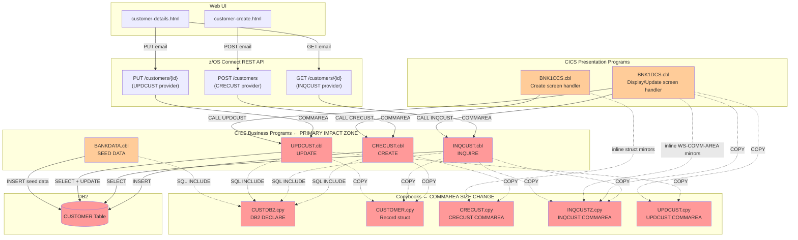
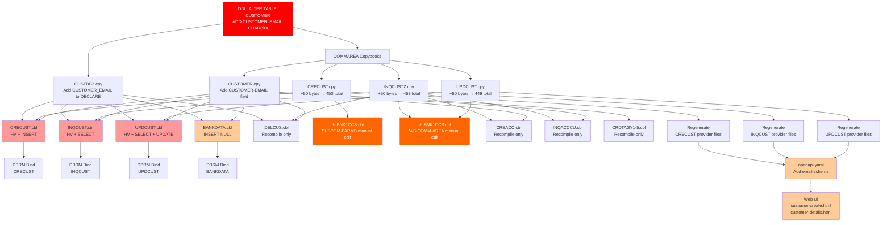

# Impact Analysis Report: Add CUSTOMER_EMAIL Field to Customer Data Model

**Created**: 2025-07-28T00:00:00Z
**Author**: IBM Bob Premium Package for Z AI Assistant
**Analysis Method**: Z Understand + Local Workspace
**Workspace Alignment**: Fully Aligned
**Confidence Level**: High

---

## 1. Change Summary

### Change Specification

**Title**: Add CUSTOMER_EMAIL to Bank of Z Customer Data Model

**Type**: Enhancement

**Description**: Add a nullable `CUSTOMER_EMAIL CHAR(50)` column to the `CUSTOMER` DB2 table.
The field is optional (nullable, no NOT NULL constraint), max 50 characters, and must be
positioned immediately after `CUSTOMER_PHONE` in the DB2 schema, all COBOL copybooks, host
variable structures, and COMMAREA definitions. No BMS 3270 screen changes. Email is exposed
only via the REST API (z/OS Connect) and Web UI.

**Business Objective**: Enable customer email capture for digital communications across all
CICS customer create, inquire, and update operations.

### Confirmed Scope Decisions

- **`BANKDATA.cbl` INSERT**: **In scope** — include `CUSTOMER_EMAIL` explicitly so seed-data
  rows insert a NULL email rather than relying on column default
- **BMS screens**: **Out of scope** — email is REST/Web UI only; no changes to `BNK1CCM.bms`
  or `BNK1DCM.bms`
- **IMS path**: Out of scope — confirmed; no IMS programs, DBDs, or PSBs change

---

## 2. Scope Definition

### In Scope

| Component | Type | Reason |
|---|---|---|
| `CUSTDB2.cpy` | Copybook — DB2 DECLARE | Add `CUSTOMER_EMAIL CHAR(50)` after `CUSTOMER_PHONE` |
| `CUSTOMER.cpy` | Copybook — record struct | Add `05 CUSTOMER-PHONE-EMAIL PIC X(50)` after `CUSTOMER-PHONE` |
| `CRECUST.cpy` | Copybook — COMMAREA | Add `03 COMM-EMAIL PIC X(50)` after `COMM-PHONE` |
| `INQCUSTZ.cpy` | Copybook — COMMAREA | Add `03 INQCUST-EMAIL PIC X(50)` after `INQCUST-PHONE` |
| `UPDCUST.cpy` | Copybook — COMMAREA | Add `03 COMM-EMAIL PIC X(50)` after `COMM-PHONE` |
| `CRECUST.cbl` | COBOL program | Add HV, add to SQL INSERT, MOVE from COMM-EMAIL |
| `INQCUST.cbl` | COBOL program | Add HV, add to SQL SELECT, MOVE to INQCUST-EMAIL |
| `UPDCUST.cbl` | COBOL program | Add HV, add to SQL SELECT + UPDATE, conditional MOVE |
| `BANKDATA.cbl` | COBOL program | Add `CUSTOMER_EMAIL = NULL` to SQL INSERT |
| `BNK1CCS.cbl` | COBOL program | Add `SUBPGM-EMAIL PIC X(50)` to inline `SUBPGM-PARMS` |
| `BNK1DCS.cbl` | COBOL program | Add email to inline `WS-COMM-AREA`, pass to UPDCUST |
| `CRECUST/request.dai` | z/OS Connect provider | **Regenerate** — COMMAREA size changes from 400 to 450 bytes |
| `INQCUST/response.dai` | z/OS Connect provider | **Regenerate** — COMMAREA size changes from 403 to 453 bytes |
| `UPDCUST/request.dai` | z/OS Connect provider | **Regenerate** — COMMAREA size changes from 399 to 449 bytes |
| `openapi.yaml` | OpenAPI spec | Add `email` field to `CreateCustomerRequest`, `Customer`, `CustomerUpdate` schemas |
| `customer-create.html` | Web UI | Add optional email `<cds-text-input>` field; add to request body |
| `customer-details.html` | Web UI | Display email field; include in PUT update payload |

### Out of Scope

| Component | Reason |
|---|---|
| `BNK1CCM.bms`, `BNK1DCM.bms` | No BMS screen changes — email is REST/Web UI only |
| `DELCUS.cbl` | SELECT uses `CUSTOMER.cpy` for key lookup only; no email field needed |
| `CREACC.cbl` | Uses `INQCUSTZ.cpy` for customer existence check; email not used |
| `INQACCCU.cbl` | Uses `INQCUSTZ.cpy` for customer data; email not required in account inquiry |
| `BNKSTMT.pli` | SELECT uses named columns; email column is nullable — no change needed |
| All IMS programs | IMS path is out of scope |
| `INQTRAND.cbl`, `INQTRANL.cbl`, `DBCRFUN.cbl`, `XFRFUN.cbl` | No customer email dependency |

### System Boundaries

- **External boundary — upstream**: z/OS Connect REST API (`POST /customers`, `GET /customers/{id}`, `PUT /customers/{id}`)
- **External boundary — downstream**: Web UI (`customer-create.html`, `customer-details.html`)
- **Data boundary**: `CUSTOMER` DB2 table — only Bank of Z owns and writes this table

---

## 3. System Context Diagram



---

## 4. Dependency Analysis

### Copybook Impact Chain

`CUSTOMER.cpy` is the root record structure. `CUSTDB2.cpy` is the DB2 DECLARE table. Three
separate COMMAREA copybooks serve the three business programs. `INQCUSTZ.cpy` is the widest
propagation risk — used by **5 programs**.

| Copybook | Programs using it | Action |
|---|---|---|
| [`CUSTDB2.cpy`](src/base/cics/copy/CUSTDB2.cpy) | CRECUST, INQCUST, UPDCUST, DELCUS, BANKDATA | Add `CUSTOMER_EMAIL CHAR(50)` to SQL DECLARE |
| [`CUSTOMER.cpy`](src/base/cics/copy/CUSTOMER.cpy) | BANKDATA, CRDTAGY1–5, CREACC, CRECUST, DELCUS, INQACCCU, INQCUST, UPDCUST | Add `05 CUSTOMER-EMAIL PIC X(50)` after `CUSTOMER-PHONE` |
| [`CRECUST.cpy`](src/base/cics/copy/CRECUST.cpy) | CRECUST only | Add `03 COMM-EMAIL PIC X(50)` after `COMM-PHONE` |
| [`INQCUSTZ.cpy`](src/base/cics/copy/INQCUSTZ.cpy) | **BNK1DCS, CREACC, DELCUS, INQACCCU, INQCUST** | Add `03 INQCUST-EMAIL PIC X(50)` after `INQCUST-PHONE` |
| [`UPDCUST.cpy`](src/base/cics/copy/UPDCUST.cpy) | BNK1DCS, UPDCUST | Add `03 COMM-EMAIL PIC X(50)` after `COMM-PHONE` |

> ⚠️ **INQCUSTZ.cpy is used by CREACC, DELCUS, and INQACCCU** — programs that do NOT need
> to read or write email. They will recompile cleanly with the new field present but unused.
> No logic changes are required in those programs. However, they **must be recompiled** after
> the copybook changes or they will fail at link-edit time with a COMMAREA size mismatch.

### Programs Requiring Logic Changes

| Program | SQL changes | COMMAREA changes | Host variable changes |
|---|---|---|---|
| [`CRECUST.cbl`](src/base/cics/cobol/CRECUST.cbl) | INSERT: add column + host variable | `CRECUST.cpy` adds `COMM-EMAIL` | Add `HV-CUSTOMER-EMAIL PIC X(50)` to `HOST-CUSTOMER-ROW` |
| [`INQCUST.cbl`](src/base/cics/cobol/INQCUST.cbl) | SELECT: add column + host variable | `INQCUSTZ.cpy` adds `INQCUST-EMAIL` | Add `HV-CUSTOMER-EMAIL PIC X(50)` to `HOST-CUSTOMER-ROW` |
| [`UPDCUST.cbl`](src/base/cics/cobol/UPDCUST.cbl) | SELECT + UPDATE: add column + HV | `UPDCUST.cpy` adds `COMM-EMAIL` | Add `HV-CUSTOMER-EMAIL PIC X(50)` to `HOST-CUSTOMER-ROW` |
| [`BANKDATA.cbl`](src/base/cics/cobol/BANKDATA.cbl) | INSERT: add `CUSTOMER_EMAIL = NULL` | No COMMAREA | No host variable needed (NULL literal) |
| [`BNK1CCS.cbl`](src/base/cics/cobol/BNK1CCS.cbl) | None | Inline `SUBPGM-PARMS` must add `SUBPGM-EMAIL PIC X(50)` | None |
| [`BNK1DCS.cbl`](src/base/cics/cobol/BNK1DCS.cbl) | None | Inline `WS-COMM-AREA` must add `WS-COMM-EMAIL PIC X(50)` | None |

### Programs Requiring Recompile Only (No Logic Changes)

| Program | Reason |
|---|---|
| [`CREACC.cbl`](src/base/cics/cobol/CREACC.cbl) | COPYs `INQCUSTZ.cpy` — recompile required; email field unused |
| [`DELCUS.cbl`](src/base/cics/cobol/DELCUS.cbl) | COPYs `CUSTOMER.cpy`, `CUSTDB2.cpy`, `INQCUSTZ.cpy` — recompile required; SELECT and DELETE use named columns, email field unused |
| [`INQACCCU.cbl`](src/base/cics/cobol/INQACCCU.cbl) | COPYs `CUSTOMER.cpy`, `INQCUSTZ.cpy` — recompile required; email field unused |
| `CRDTAGY1–5.cbl` | COPYs `CUSTOMER.cpy` — recompile required; email field unused |

### z/OS Connect Provider File Impact

The `.dai` descriptor files encode exact byte positions from the COMMAREA copybooks.
When the copybook changes, **all `startPos` values for fields after `COMM-PHONE` shift by +50**.
These files must be **regenerated** using the z/OS Connect CLI — never hand-edited.

| Provider | File | Current total bytes | New total bytes | Fields shifted |
|---|---|---|---|---|
| CRECUST | [`request.dai`](src/api/src/main/zosAssets/CRECUST/providerFiles/request.dai) | 400 (399 data + 1 filler) | 450 | `COMM-ADDR` onwards: `startPos` 159→209, etc. |
| INQCUST | [`response.dai`](src/api/src/main/zosAssets/INQCUST/providerFiles/response.dai) | 403 | 453 | `INQCUST-ADDR` onwards: `startPos` 159→209, etc. |
| UPDCUST | [`request.dai`](src/api/src/main/zosAssets/UPDCUST/providerFiles/request.dai) | 399 | 449 | `COMM-ADDR` onwards: `startPos` 159→209, etc. |

> ⚠️ **CRITICAL**: The CRECUST provider also has a [`COMMAREA.cpy`](src/api/src/main/zosAssets/CRECUST/providerFiles/COMMAREA.cpy)
> file in the provider directory. This file is auto-generated by the z/OS Connect CLI and
> **must not be hand-edited**. The full regeneration process is: update `CRECUST.cpy` →
> run `zosconnect update-asset` → regenerated files replace both `COMMAREA.cpy` and `request.dai`.

---

## 5. Detailed Component Impact

### DB2 Schema — `CUSTOMER` Table

**Change**: Add nullable `CUSTOMER_EMAIL` column immediately after `CUSTOMER_PHONE`.

```sql
ALTER TABLE CUSTOMER
  ADD COLUMN CUSTOMER_EMAIL CHAR(50);
```

No NOT NULL constraint. Existing rows acquire `NULL` for the new column. No data migration
required. DBRM bind for all affected programs must follow DDL execution.

---

### [`CUSTDB2.cpy`](src/base/cics/copy/CUSTDB2.cpy) — DB2 DECLARE TABLE

Insert after line 16 (`CUSTOMER_PHONE CHAR(20)`):

```cobol
*  BEFORE:
             CUSTOMER_PHONE                 CHAR(20),
             CUSTOMER_ADDR_LINE1            CHAR(50),

*  AFTER:
             CUSTOMER_PHONE                 CHAR(20),
             CUSTOMER_EMAIL                 CHAR(50),
             CUSTOMER_ADDR_LINE1            CHAR(50),
```

---

### [`CUSTOMER.cpy`](src/base/cics/copy/CUSTOMER.cpy) — Master Record Structure

Insert after line 21 (`05 CUSTOMER-PHONE PIC X(20)`):

```cobol
*  BEFORE:
            05 CUSTOMER-PHONE                      PIC X(20).
            05 CUSTOMER-ADDRESS.

*  AFTER:
            05 CUSTOMER-PHONE                      PIC X(20).
            05 CUSTOMER-EMAIL                      PIC X(50).
            05 CUSTOMER-ADDRESS.
```

---

### [`CRECUST.cpy`](src/base/cics/copy/CRECUST.cpy) — CRECUST COMMAREA

**Current COMMAREA size: 400 bytes** (398 data + `COMM-SUCCESS` + `COMM-FAIL-CODE`).
`COMM-PHONE` is at byte offset 139, 20 bytes, ends at byte 158.
Inserting 50 bytes pushes all subsequent fields by +50.

Insert after line 19 (`03 COMM-PHONE PIC X(20)`):

```cobol
*  BEFORE:
        03 COMM-PHONE                      PIC X(20).
        03 COMM-ADDR.

*  AFTER:
        03 COMM-PHONE                      PIC X(20).
        03 COMM-EMAIL                      PIC X(50).
        03 COMM-ADDR.
```

**New COMMAREA size: 450 bytes.**

---

### [`INQCUSTZ.cpy`](src/base/cics/copy/INQCUSTZ.cpy) — INQCUST COMMAREA

**Current COMMAREA size: 403 bytes.**
`INQCUST-PHONE` at byte offset 139, 20 bytes, ends at byte 158.

Insert after line 17 (`03 INQCUST-PHONE PIC X(20)`):

```cobol
*  BEFORE:
        03 INQCUST-PHONE                PIC X(20).
        03 INQCUST-ADDR.

*  AFTER:
        03 INQCUST-PHONE                PIC X(20).
        03 INQCUST-EMAIL                PIC X(50).
        03 INQCUST-ADDR.
```

**New COMMAREA size: 453 bytes.**

---

### [`UPDCUST.cpy`](src/base/cics/copy/UPDCUST.cpy) — UPDCUST COMMAREA

**Current COMMAREA size: 399 bytes.**
`COMM-PHONE` at byte offset 139, 20 bytes, ends at byte 158.

Insert after line 18 (`03 COMM-PHONE PIC X(20)`):

```cobol
*  BEFORE:
        03 COMM-PHONE                PIC X(20).
        03 COMM-ADDR.

*  AFTER:
        03 COMM-PHONE                PIC X(20).
        03 COMM-EMAIL                PIC X(50).
        03 COMM-ADDR.
```

**New COMMAREA size: 449 bytes.**

---

### [`CRECUST.cbl`](src/base/cics/cobol/CRECUST.cbl) — Create Customer

Three changes required:

1. **`HOST-CUSTOMER-ROW`** (line 67–84): Add `HV-CUSTOMER-EMAIL PIC X(50)` after `HV-CUSTOMER-PHONE`.
2. **SQL INSERT** (lines 1219–1256): Add `CUSTOMER_EMAIL` to column list and `:HV-CUSTOMER-EMAIL` to VALUES.
3. **Procedure Division**: Add `MOVE COMM-EMAIL TO HV-CUSTOMER-EMAIL` before the INSERT. Initialize `HV-CUSTOMER-EMAIL` to SPACES if `COMM-EMAIL` is not provided.

---

### [`INQCUST.cbl`](src/base/cics/cobol/INQCUST.cbl) — Inquire Customer

Three changes required:

1. **`HOST-CUSTOMER-ROW`**: Add `HV-CUSTOMER-EMAIL PIC X(50)` after `HV-CUSTOMER-PHONE`.
2. **SQL SELECT** (lines 310–348): Add `CUSTOMER_EMAIL` to column list and `:HV-CUSTOMER-EMAIL` to INTO list.
3. **Procedure Division** (after line 356 MOVE block): Add `MOVE HV-CUSTOMER-EMAIL TO INQCUST-EMAIL OF INQCUST-COMMAREA`.

---

### [`UPDCUST.cbl`](src/base/cics/cobol/UPDCUST.cbl) — Update Customer

Four changes required:

1. **`HOST-CUSTOMER-ROW`**: Add `HV-CUSTOMER-EMAIL PIC X(50)` after `HV-CUSTOMER-PHONE`.
2. **SQL SELECT** (lines 265–303): Add `CUSTOMER_EMAIL` to column list and `:HV-CUSTOMER-EMAIL` to INTO list.
3. **SQL UPDATE** (lines 363–378): Add `CUSTOMER_EMAIL = :HV-CUSTOMER-EMAIL` to SET clause.
4. **Procedure Division** (after line 335 `COMM-PHONE` check): Add conditional MOVE — `IF COMM-EMAIL(1:1) NOT = ' ' MOVE COMM-EMAIL TO HV-CUSTOMER-EMAIL END-IF`.

---

### [`BANKDATA.cbl`](src/base/cics/cobol/BANKDATA.cbl) — Seed Data Loader

One change required:

- **SQL INSERT** (lines 676–712): Add `CUSTOMER_EMAIL` to column list and `NULL` to VALUES list.

---

### [`BNK1CCS.cbl`](src/base/cics/cobol/BNK1CCS.cbl) — Create Customer Screen Handler

**⚠️ RISK — Inline struct, no COPY statement.**

`SUBPGM-PARMS` (lines 102–133) is a hard-coded inline working storage struct that mirrors `CRECUST.cpy`. It will **not** automatically inherit the new `COMM-EMAIL` field when `CRECUST.cpy` is updated. If this struct is not manually extended before recompile, `CRECUST` will receive a truncated COMMAREA and write garbage into address fields.

Add after line 115 (`03 SUBPGM-PHONE PIC X(20)`):

```cobol
*  BEFORE:
        03 SUBPGM-PHONE                      PIC X(20).
        03 SUBPGM-ADDR.

*  AFTER:
        03 SUBPGM-PHONE                      PIC X(20).
        03 SUBPGM-EMAIL                      PIC X(50).
        03 SUBPGM-ADDR.
```

No BMS map changes. BNK1CCS does not display email on the 3270 screen.

---

### [`BNK1DCS.cbl`](src/base/cics/cobol/BNK1DCS.cbl) — Display/Update Customer Screen Handler

**⚠️ RISK — Two inline structs, no COPY statements.**

`WS-COMM-AREA` (lines 128–149) is a hard-coded inline working storage struct that mirrors the
INQCUST/UPDCUST COMMAREA layout. It is used to carry data between CICS pseudo-conversational
passes. If not manually extended, the program will silently corrupt data by writing email
bytes over the address fields.

Add after line 137 (`03 WS-COMM-PHONE PIC X(20)`):

```cobol
*  BEFORE:
        03 WS-COMM-PHONE            PIC X(20).
        03 WS-COMM-ADDR-LINE1       PIC X(50).

*  AFTER:
        03 WS-COMM-PHONE            PIC X(20).
        03 WS-COMM-EMAIL            PIC X(50).
        03 WS-COMM-ADDR-LINE1       PIC X(50).
```

BNK1DCS also COPYs `INQCUSTZ.cpy` (line 120) and `UPDCUST.cpy` (line 126) — those will pick
up the new email field automatically via the copybook. No BMS map changes required.

---

### z/OS Connect Provider Files

All three provider directories require regeneration after the corresponding CRECUST, INQCUST,
and UPDCUST COMMAREA copybooks are updated. **Do not hand-edit `.dai` files.**

```bash
# After updating CRECUST.cpy, INQCUSTZ.cpy, UPDCUST.cpy on USS:
zosconnect update-asset CRECUST
zosconnect update-asset INQCUST
zosconnect update-asset UPDCUST
```

The `gen/` subdirectories contain regenerated mapping YAMLs. These must also be reviewed
after regeneration to add `email` field mappings for the POST, GET, and PUT operations.

---

### [`openapi.yaml`](src/api/src/main/api/openapi.yaml) — OpenAPI Specification

Add optional `email` field to three schemas:

- **`CreateCustomerRequest`** (around line 694, after `phoneNumber`): add `email: { type: string, maxLength: 50, description: "Customer email address" }`
- **`Customer`** (around line 750, after `phoneNumber`): add `email: { type: string, nullable: true, maxLength: 50 }`
- **`CustomerUpdate`** (around line 808, after `phoneNumber`): add `email: { type: string, nullable: true, maxLength: 50 }`

All three additions are optional (`required: false`).

---

### Web UI — [`customer-create.html`](src/frontend/customer-create.html)

Add an optional email input field after the `phoneNumber` field (around line 77):

```html
<cds-text-input
    id="email"
    label="Email address"
    placeholder="Enter email address"
    type="email"
    maxlength="50">
</cds-text-input>
```

In the `createCustomer()` JavaScript function:
- Read `document.getElementById('email').value`
- Add to `customerData` body: `email: email || undefined` (omit if empty)

---

### Web UI — [`customer-details.html`](src/frontend/customer-details.html)

Two changes in the dynamically rendered customer form (`displayCustomerDetails()` around line 324):

1. Add display field after `phoneNumber` row:
   ```html
   <cds-text-input id="email" label="Email Address" value="${customer.email || ''}"></cds-text-input>
   ```

2. In `updateCustomer()` (around line 602, after `phoneNumber`):
   ```javascript
   const email = document.getElementById('email').value.trim();
   if (email) updatedData.email = email;
   ```

---

## 6. Change Propagation Map



### Critical Deployment Sequence

```
1. DDL: ALTER TABLE CUSTOMER ADD COLUMN CUSTOMER_EMAIL CHAR(50)
2. Update all 5 copybooks (CUSTDB2, CUSTOMER, CRECUST, INQCUSTZ, UPDCUST)
3. Manual edits: BNK1CCS SUBPGM-PARMS, BNK1DCS WS-COMM-AREA
4. COBOL compile: CRECUST, INQCUST, UPDCUST, BANKDATA (logic changes)
5. COBOL recompile: BNK1CCS, BNK1DCS, CREACC, DELCUS, INQACCCU, CRDTAGY1-5
6. DBRM bind: CRECUST, INQCUST, UPDCUST, BANKDATA (programs must NOT run before bind)
7. Regenerate z/OS Connect provider files (CRECUST, INQCUST, UPDCUST)
8. Update openapi.yaml and redeploy z/OS Connect
9. Update Web UI (customer-create.html, customer-details.html)
```

---

## 7. Risk Assessment

| Risk ID | Description | Category | Likelihood | Impact | Level | Mitigation |
|---|---|---|---|---|---|---|
| **R1** | `BNK1CCS.cbl` `SUBPGM-PARMS` not updated — CRECUST receives truncated COMMAREA, address fields corrupted | Regression | High if missed | Critical | 🔴 HIGH | Manual checklist item; review SUBPGM-PARMS alongside CRECUST.cpy changes |
| **R2** | `BNK1DCS.cbl` `WS-COMM-AREA` not updated — address data corrupted in pseudo-conversational flow | Regression | High if missed | Critical | 🔴 HIGH | Manual checklist item; review WS-COMM-AREA alongside INQCUSTZ.cpy changes |
| **R3** | z/OS Connect `.dai` files not regenerated — startPos misalignment causes field mapping errors at runtime | Runtime Failure | Medium | High | 🔴 HIGH | Never edit `.dai` files manually; always regenerate via CLI after copybook changes |
| **R4** | DBRM bind executed before DDL — DB2 rejects INSERT/SELECT with SQL error on unknown column | Deployment | Low | High | 🟠 MEDIUM | Enforce deployment sequence: DDL → compile → bind |
| **R5** | `INQCUSTZ.cpy` used by CREACC/DELCUS/INQACCCU — those programs not recompiled after copybook change | Regression | Medium | Medium | 🟠 MEDIUM | Include all INQCUSTZ consumers in the compile list; use DBB impact build |
| **R6** | `CUSTOMER.cpy` used by CRDTAGY1–5 — credit agency programs not recompiled | Regression | Medium | Low | 🟡 LOW | Include all CUSTOMER.cpy consumers in compile sweep |
| **R7** | `BNKSTMT.pli` (batch statement generator) SELECT uses named columns; nullable column — no code change needed but should be verified | Regression | Low | Low | 🟢 LOW | Confirm SELECT in BNKSTMT.pli does not use `SELECT *` (confirmed: uses named columns) |

---

## 8. Effort Estimate

| Layer | Files | Effort |
|---|---|---|
| DB2 DDL | 1 statement | < 30 min |
| COBOL copybooks | 5 files | 1–2 hours |
| COBOL logic changes | 4 files (CRECUST, INQCUST, UPDCUST, BANKDATA) | 2–4 hours |
| COBOL inline struct edits | 2 files (BNK1CCS, BNK1DCS) | 1 hour |
| COBOL recompile-only | 9 files | Build time only |
| z/OS Connect regeneration | 3 provider sets | 1–2 hours |
| OpenAPI update | 1 file | 30 min |
| Web UI | 2 files | 1–2 hours |
| Testing | All layers | 4–8 hours |
| **Total estimate** | **16 affected components** | **~2 days** |

---

## 9. Assumptions

1. No other external application reads or writes the `CUSTOMER` DB2 table directly — Bank of Z owns this table exclusively.
2. `BNKSTMT.pli` uses named SELECT columns (confirmed) — no change required.
3. Email format validation is not required server-side; the Web UI `type="email"` attribute provides browser-side hint only.
4. The IMS path (`IBGCUDAT.cbl`, `IBSCUDAT.cbl`, IMS DBDs/PSBs) is fully out of scope.
5. DELCUS SELECT uses `CUSTOMER.cpy` and `INQCUSTZ.cpy` for customer existence checks; the email field in those copybooks will be present but not used by DELCUS logic — no logic change needed.

---

*Analysis performed using IBM Bob Premium Package for Z — Z Understand project: BankofZ*
