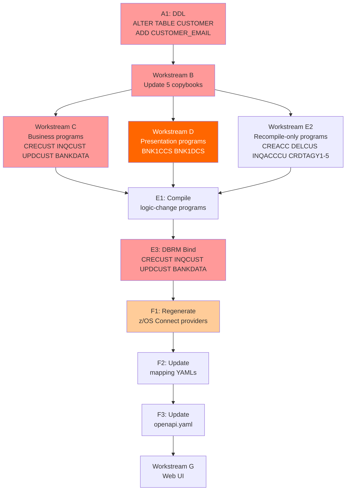

# Implementation Plan: Add Email Address Field to Customer Data Model

**Created**: 2025-07-28T00:00:00Z
**Author**: IBM Bob Premium Package for Z AI Assistant
**Analysis Method**: Z Understand + Local Workspace
**Workspace Alignment**: Fully Aligned
**Data Dictionary Coverage**: Not required (field additions only)
**Reference**: `bobz-demo/add-email-impact-analysis.md`

---

## 1. Executive Summary

Add a 50-character email address field (`CUSTOMER_EMAIL`) to the Bank of Z CICS customer data
model end-to-end: DB2 schema, COBOL copybooks, CICS business programs, inline COBOL working
storage structs, z/OS Connect provider files, the OpenAPI specification, and the Web UI.
No BMS 3270 screen changes — email is REST/Web UI only.

**Business Value**: Enables customer email capture and downstream digital communications across
all CICS customer operations — create, inquire, and update.

**Key Risks**:
1. `BNK1CCS.cbl` has a hard-coded inline `SUBPGM-PARMS` struct that mirrors CRECUST COMMAREA —
   it will silently corrupt address data if not manually extended before recompile.
2. `BNK1DCS.cbl` has a hard-coded inline `WS-COMM-AREA` that mirrors the INQCUST/UPDCUST layout —
   same corruption risk.
3. z/OS Connect provider `.dai` files encode exact byte `startPos` values — they must be
   **regenerated via CLI**, never hand-edited.

**IMS path**: Confirmed out of scope.

---

## 2. Prerequisites

- DB2 DDL execution rights on the `CUSTOMER` table
- z/OS Connect CLI (`zosconnect`) available on USS to regenerate provider files
- All commits signed off with `git commit -s` (DCO)

---

## 3. Requirements

### Functional Requirements

- **FR1**: `CUSTOMER` DB2 table stores a nullable `CUSTOMER_EMAIL CHAR(50)` column immediately after `CUSTOMER_PHONE`
- **FR2**: `CRECUST` accepts and persists email via COMMAREA and SQL INSERT
- **FR3**: `INQCUST` retrieves and returns email via COMMAREA and SQL SELECT
- **FR4**: `UPDCUST` accepts, reads, and persists email via COMMAREA, SQL SELECT, and SQL UPDATE
- **FR5**: `BANKDATA` seed-data INSERT includes `CUSTOMER_EMAIL = NULL` explicitly
- **FR6**: `POST /customers`, `GET /customers/{id}`, and `PUT /customers/{id}` z/OS Connect operations expose the email field
- **FR7**: OpenAPI `CreateCustomerRequest`, `Customer`, and `CustomerUpdate` schemas include an optional `email` field
- **FR8**: Web UI Create Customer page captures and submits email
- **FR9**: Web UI Customer Details page displays and allows updating email

### Non-Functional Requirements

- **NFR1**: `CUSTOMER_EMAIL` is nullable — no NOT NULL constraint — preserving all existing rows
- **NFR2**: Email field is optional at all API boundaries (`required: false`, nullable)
- **NFR3**: `maxlength="50"` in Web UI; `type="email"` as browser hint only — no server-side regex validation
- **NFR4**: DBRM bind must follow DDL; programs must not run against the new column until bind completes

### Business Requirements

- **BR1**: Email must be consistent across all three CICS customer COMMAREAs (create/inquire/update)
- **BR2**: Existing customers with NULL email continue to function — COBOL programs initialize or MOVE SPACES before SELECT

---

## 4. Goals and Non-Goals

### Goals

1. Add `CUSTOMER_EMAIL CHAR(50)` nullable column to `CUSTOMER` DB2 table (after `CUSTOMER_PHONE`)
2. Update all five COBOL copybooks that define the customer data structure or COMMAREA
3. Add SQL column to INSERT, SELECT (named columns), and UPDATE statements in business programs
4. Extend `BNK1CCS.cbl` inline `SUBPGM-PARMS` struct to carry email to `CRECUST`
5. Extend `BNK1DCS.cbl` inline `WS-COMM-AREA` struct to carry email across pseudo-conversational passes
6. Regenerate z/OS Connect provider files for CRECUST, INQCUST, UPDCUST
7. Update z/OS Connect mapping YAMLs for POST, GET, PUT /customers
8. Add `email` field to OpenAPI `CreateCustomerRequest`, `Customer`, and `CustomerUpdate` schemas
9. Update Web UI Create Customer and Customer Details pages

### Non-Goals

1. Any changes to the IMS processing path
2. Server-side email format validation
3. Changes to `DELCUS` delete operation
4. Changes to `BNKSTMT.pli` batch (SELECT uses named columns; nullable column requires no change)
5. BMS screen changes — email is REST/Web UI only

---

## 5. Current State Analysis

### Key Source Structure (confirmed by file inspection)

| File | Location | Current COMMAREA/struct size |
|---|---|---|
| `CUSTDB2.cpy` | `src/base/cics/copy/` | 17-column DECLARE TABLE; `CUSTOMER_PHONE` at column 8 |
| `CUSTOMER.cpy` | `src/base/cics/copy/` | Record struct; `CUSTOMER-PHONE PIC X(20)` at line 21 |
| `CRECUST.cpy` | `src/base/cics/copy/` | 400 bytes (398 data + SUCCESS + FAIL-CODE) |
| `INQCUSTZ.cpy` | `src/base/cics/copy/` | 403 bytes (401 data + INQ-SUCCESS + FAIL-CD + PCB-POINTER) |
| `UPDCUST.cpy` | `src/base/cics/copy/` | 399 bytes (397 data + UPD-SUCCESS + UPD-FAIL-CD) |
| `BNK1CCS.cbl` | `src/base/cics/cobol/` | `SUBPGM-PARMS` inline struct (lines 102–133) mirrors CRECUST.cpy — **no COPY** |
| `BNK1DCS.cbl` | `src/base/cics/cobol/` | `WS-COMM-AREA` inline struct (lines 128–149) mirrors INQCUSTZ/UPDCUST — **no COPY** |

### Assumptions

- No other application accesses the `CUSTOMER` table directly
- DBB impact build will automatically identify all INQCUSTZ/CUSTOMER copybook consumers for recompile

---

## 6. Workstreams and Execution Sequence

### Workstream A — DB2 Schema

**Execute first. All COBOL compile and bind steps depend on this.**

#### A1 — `CUSTOMER` table DDL

```sql
ALTER TABLE CUSTOMER
  ADD COLUMN CUSTOMER_EMAIL CHAR(50);
```

Existing rows acquire NULL for `CUSTOMER_EMAIL`. No data migration required.

---

### Workstream B — COBOL Copybooks (5 files)

**Execute after A1. All program compiles depend on these.**

#### B1 — [`CUSTDB2.cpy`](src/base/cics/copy/CUSTDB2.cpy) line 16

```cobol
* BEFORE (line 16–17):
             CUSTOMER_PHONE                 CHAR(20),
             CUSTOMER_ADDR_LINE1            CHAR(50),

* AFTER:
             CUSTOMER_PHONE                 CHAR(20),
             CUSTOMER_EMAIL                 CHAR(50),
             CUSTOMER_ADDR_LINE1            CHAR(50),
```

#### B2 — [`CUSTOMER.cpy`](src/base/cics/copy/CUSTOMER.cpy) line 21

```cobol
* BEFORE (line 21–22):
            05 CUSTOMER-PHONE                      PIC X(20).
            05 CUSTOMER-ADDRESS.

* AFTER:
            05 CUSTOMER-PHONE                      PIC X(20).
            05 CUSTOMER-EMAIL                      PIC X(50).
            05 CUSTOMER-ADDRESS.
```

#### B3 — [`CRECUST.cpy`](src/base/cics/copy/CRECUST.cpy) line 19

```cobol
* BEFORE (line 19–20):
        03 COMM-PHONE                      PIC X(20).
        03 COMM-ADDR.

* AFTER:
        03 COMM-PHONE                      PIC X(20).
        03 COMM-EMAIL                      PIC X(50).
        03 COMM-ADDR.
```

New COMMAREA size: **450 bytes** (was 400).

#### B4 — [`INQCUSTZ.cpy`](src/base/cics/copy/INQCUSTZ.cpy) line 17

```cobol
* BEFORE (line 17–18):
        03 INQCUST-PHONE                PIC X(20).
        03 INQCUST-ADDR.

* AFTER:
        03 INQCUST-PHONE                PIC X(20).
        03 INQCUST-EMAIL                PIC X(50).
        03 INQCUST-ADDR.
```

New COMMAREA size: **453 bytes** (was 403).

#### B5 — [`UPDCUST.cpy`](src/base/cics/copy/UPDCUST.cpy) line 18

```cobol
* BEFORE (line 18–19):
        03 COMM-PHONE                PIC X(20).
        03 COMM-ADDR.

* AFTER:
        03 COMM-PHONE                PIC X(20).
        03 COMM-EMAIL                PIC X(50).
        03 COMM-ADDR.
```

New COMMAREA size: **449 bytes** (was 399).

---

### Workstream C — COBOL Business Programs (4 files)

**Execute after Workstream B.**

#### C1 — [`CRECUST.cbl`](src/base/cics/cobol/CRECUST.cbl)

**Change 1 — `HOST-CUSTOMER-ROW` host variable** (after line 75):

```cobol
* BEFORE (lines 75–76):
          03 HV-CUSTOMER-PHONE          PIC X(20).
          03 HV-CUSTOMER-ADDR-LINE1     PIC X(50).

* AFTER:
          03 HV-CUSTOMER-PHONE          PIC X(20).
          03 HV-CUSTOMER-EMAIL          PIC X(50).
          03 HV-CUSTOMER-ADDR-LINE1     PIC X(50).
```

**Change 2 — SQL INSERT column list** (lines 1219–1237, after `CUSTOMER_PHONE`):

```cobol
* BEFORE:
               INSERT INTO CUSTOMER
                  (CUSTOMER_EYECATCHER,
                   CUSTOMER_SORTCODE,
                   CUSTOMER_NUMBER,
                   CUSTOMER_TITLE,
                   CUSTOMER_FIRST_NAME,
                   CUSTOMER_LAST_NAME,
                   CUSTOMER_DATE_OF_BIRTH,
                   CUSTOMER_PHONE,
                   CUSTOMER_ADDR_LINE1,
                   ...
                   CUSTOMER_CS_REVIEW_DATE)
               VALUES
                  (:HV-CUSTOMER-EYECATCHER,
                   ...
                   :HV-CUSTOMER-PHONE,
                   :HV-CUSTOMER-ADDR-LINE1,
                   ...
                   :HV-CUSTOMER-CS-REVIEW-DATE)

* AFTER (add after CUSTOMER_PHONE / :HV-CUSTOMER-PHONE):
               INSERT INTO CUSTOMER
                  (CUSTOMER_EYECATCHER,
                   CUSTOMER_SORTCODE,
                   CUSTOMER_NUMBER,
                   CUSTOMER_TITLE,
                   CUSTOMER_FIRST_NAME,
                   CUSTOMER_LAST_NAME,
                   CUSTOMER_DATE_OF_BIRTH,
                   CUSTOMER_PHONE,
                   CUSTOMER_EMAIL,
                   CUSTOMER_ADDR_LINE1,
                   ...
                   CUSTOMER_CS_REVIEW_DATE)
               VALUES
                  (:HV-CUSTOMER-EYECATCHER,
                   ...
                   :HV-CUSTOMER-PHONE,
                   :HV-CUSTOMER-EMAIL,
                   :HV-CUSTOMER-ADDR-LINE1,
                   ...
                   :HV-CUSTOMER-CS-REVIEW-DATE)
```

**Change 3 — Procedure Division MOVE** (add before the INSERT EXEC SQL, after the CS-REVIEW-DATE COMPUTE block around line 1197):

```cobol
* ADD before the INSERT:
           MOVE COMM-EMAIL TO HV-CUSTOMER-EMAIL.
```

If `COMM-EMAIL` arrives as SPACES (caller did not supply email), the host variable will be SPACES and DB2 stores an empty string; this is acceptable. For a NULL insert, explicitly move LOW-VALUES or use an indicator variable — but SPACES is the simpler and consistent approach here.

---

#### C2 — [`INQCUST.cbl`](src/base/cics/cobol/INQCUST.cbl)

**Change 1 — `HOST-CUSTOMER-ROW`**: Add `HV-CUSTOMER-EMAIL PIC X(50)` after `HV-CUSTOMER-PHONE` (same pattern as C1 Change 1).

**Change 2 — SQL SELECT column list** (lines 310–348, after `CUSTOMER_PHONE` / `:HV-CUSTOMER-PHONE`):

```cobol
* BEFORE:
               SELECT CUSTOMER_EYECATCHER,
                      ...
                      CUSTOMER_PHONE,
                      CUSTOMER_ADDR_LINE1,
                      ...
                 INTO :HV-CUSTOMER-EYECATCHER,
                      ...
                      :HV-CUSTOMER-PHONE,
                      :HV-CUSTOMER-ADDR-LINE1,
                      ...

* AFTER:
               SELECT CUSTOMER_EYECATCHER,
                      ...
                      CUSTOMER_PHONE,
                      CUSTOMER_EMAIL,
                      CUSTOMER_ADDR_LINE1,
                      ...
                 INTO :HV-CUSTOMER-EYECATCHER,
                      ...
                      :HV-CUSTOMER-PHONE,
                      :HV-CUSTOMER-EMAIL,
                      :HV-CUSTOMER-ADDR-LINE1,
                      ...
```

**Change 3 — MOVE block after SQLCODE = 0 check** (after line 360, in the MOVE block that populates `INQCUST-COMMAREA`):

```cobol
* ADD after the MOVE block for HV-CUSTOMER-PHONE:
              MOVE HV-CUSTOMER-EMAIL
                 TO INQCUST-EMAIL OF INQCUST-COMMAREA
```

---

#### C3 — [`UPDCUST.cbl`](src/base/cics/cobol/UPDCUST.cbl)

**Change 1 — `HOST-CUSTOMER-ROW`**: Add `HV-CUSTOMER-EMAIL PIC X(50)` after `HV-CUSTOMER-PHONE`.

**Change 2 — SQL SELECT** (lines 265–303): Add `CUSTOMER_EMAIL` / `:HV-CUSTOMER-EMAIL` after `CUSTOMER_PHONE` / `:HV-CUSTOMER-PHONE` (same pattern as C2 Change 2).

**Change 3 — Conditional MOVE** (after line 335 `IF COMM-PHONE` block):

```cobol
* BEFORE (lines 335–337):
          IF COMM-PHONE(1:1) NOT = ' '
             MOVE COMM-PHONE TO HV-CUSTOMER-PHONE
          END-IF.

* AFTER (add block immediately after):
          IF COMM-PHONE(1:1) NOT = ' '
             MOVE COMM-PHONE TO HV-CUSTOMER-PHONE
          END-IF.

          IF COMM-EMAIL(1:1) NOT = ' '
             MOVE COMM-EMAIL TO HV-CUSTOMER-EMAIL
          END-IF.
```

**Change 4 — SQL UPDATE SET clause** (lines 363–378, after `CUSTOMER_PHONE` line):

```cobol
* BEFORE:
               UPDATE CUSTOMER
                  SET CUSTOMER_TITLE = :HV-CUSTOMER-TITLE,
                      ...
                      CUSTOMER_PHONE = :HV-CUSTOMER-PHONE,
                      CUSTOMER_ADDR_LINE1 = :HV-CUSTOMER-ADDR-LINE1,
                      ...
                      CUSTOMER_STATUS = :HV-CUSTOMER-STATUS
                WHERE ...

* AFTER:
               UPDATE CUSTOMER
                  SET CUSTOMER_TITLE = :HV-CUSTOMER-TITLE,
                      ...
                      CUSTOMER_PHONE = :HV-CUSTOMER-PHONE,
                      CUSTOMER_EMAIL = :HV-CUSTOMER-EMAIL,
                      CUSTOMER_ADDR_LINE1 = :HV-CUSTOMER-ADDR-LINE1,
                      ...
                      CUSTOMER_STATUS = :HV-CUSTOMER-STATUS
                WHERE ...
```

---

#### C4 — [`BANKDATA.cbl`](src/base/cics/cobol/BANKDATA.cbl)

**Change — SQL INSERT** (lines 676–712, after `CUSTOMER_PHONE` entry):

```cobol
* BEFORE (excerpt):
                   CUSTOMER_PHONE,
                   CUSTOMER_ADDR_LINE1,

               VALUES ( ...
                   :HV-CUSTOMER-PHONE,
                   :HV-CUSTOMER-ADDR-LINE1,

* AFTER:
                   CUSTOMER_PHONE,
                   CUSTOMER_EMAIL,
                   CUSTOMER_ADDR_LINE1,

               VALUES ( ...
                   :HV-CUSTOMER-PHONE,
                   NULL,
                   :HV-CUSTOMER-ADDR-LINE1,
```

`NULL` literal is used directly in VALUES — no host variable declaration needed in BANKDATA.

---

### Workstream D — COBOL Presentation Programs (2 files)

**⚠️ These programs contain inline structs with no COPY statement. Manual edits required.**

#### D1 — [`BNK1CCS.cbl`](src/base/cics/cobol/BNK1CCS.cbl) — `SUBPGM-PARMS`

**Change** (line 115, after `SUBPGM-PHONE PIC X(20)`):

```cobol
* BEFORE (lines 115–116):
        03 SUBPGM-PHONE                      PIC X(20).
        03 SUBPGM-ADDR.

* AFTER:
        03 SUBPGM-PHONE                      PIC X(20).
        03 SUBPGM-EMAIL                      PIC X(50).
        03 SUBPGM-ADDR.
```

No BMS map field needed. Email is not displayed on the 3270 Create screen. `BNK1CCS.cbl` must
also MOVE the email value from a new source (e.g., a working-storage field populated from z/OS
Connect) to `SUBPGM-EMAIL` before the `CALL 'CRECUST'` statement. Since BNK1CCS is a BMS
presentation program and email input is REST-only, simply INITIALIZE `SUBPGM-EMAIL` to SPACES
so the 3270 path creates customers without email.

Add before the CALL to CRECUST:

```cobol
           MOVE SPACES TO SUBPGM-EMAIL.
```

#### D2 — [`BNK1DCS.cbl`](src/base/cics/cobol/BNK1DCS.cbl) — `WS-COMM-AREA`

**Change** (line 137, after `WS-COMM-PHONE PIC X(20)`):

```cobol
* BEFORE (lines 137–138):
        03 WS-COMM-PHONE            PIC X(20).
        03 WS-COMM-ADDR-LINE1       PIC X(50).

* AFTER:
        03 WS-COMM-PHONE            PIC X(20).
        03 WS-COMM-EMAIL            PIC X(50).
        03 WS-COMM-ADDR-LINE1       PIC X(50).
```

BNK1DCS also COPYs `INQCUSTZ.cpy` (line 120) and `UPDCUST.cpy` (line 126) — those will pick
up the email field automatically via the copybook update in Workstream B. No BMS screen
changes required.

---

### Workstream E — Build, Bind, and Verify

#### E1 — Compile with logic changes

Programs with logic edits: `CRECUST`, `INQCUST`, `UPDCUST`, `BANKDATA`, `BNK1CCS`, `BNK1DCS`

#### E2 — Recompile (copybook dependents, no logic changes)

Use DBB impact build. Programs requiring recompile only:
`CREACC`, `DELCUS`, `INQACCCU`, `CRDTAGY1`, `CRDTAGY2`, `CRDTAGY3`, `CRDTAGY4`, `CRDTAGY5`

#### E3 — DBRM Bind

Bind DBRM packages for: `CRECUST`, `INQCUST`, `UPDCUST`, `BANKDATA`

```
BIND PACKAGE(BANKZPLN) MEMBER(CRECUST) ...
BIND PACKAGE(BANKZPLN) MEMBER(INQCUST) ...
BIND PACKAGE(BANKZPLN) MEMBER(UPDCUST) ...
BIND PACKAGE(BANKZPLN) MEMBER(BANKDATA) ...
```

**Must not run new programs against DB2 until bind completes.**

---

### Workstream F — z/OS Connect API Layer

**Execute after Workstream E (copybooks must be updated on USS first).**

#### F1 — Regenerate provider files

```bash
zosconnect update-asset CRECUST
zosconnect update-asset INQCUST
zosconnect update-asset UPDCUST
```

Do **not** hand-edit `.dai` files. See Appendix B for the new `startPos` values that the
regenerated files must produce.

#### F2 — Update mapping YAMLs in `gen/` subdirectories

For each of the three provider sets, open the regenerated mapping YAML and add `email` field
mappings:

**POST /customers request mapping** (CRECUST):
```yaml
# Add after phoneNumber mapping:
- from: $.email
  to: CRECUSTZ.COMM-EMAIL
  default: ""
```

**GET /customers/{id} response mapping** (INQCUST):
```yaml
# Add after phoneNumber mapping:
- from: INQCUSTZ.INQCUST-EMAIL
  to: $.email
```

**PUT /customers/{id} request mapping** (UPDCUST):
```yaml
# Add after phoneNumber mapping:
- from: $.email
  to: UPDCUST.COMM-EMAIL
  default: ""
```

#### F3 — [`openapi.yaml`](src/api/src/main/api/openapi.yaml)

Add `email` to three schemas. Insert after `phoneNumber` in each:

**`CreateCustomerRequest`** (around line 697, after phoneNumber block):

```yaml
        email:
          type: string
          maxLength: 50
          nullable: true
          description: Customer email address (optional)
```

**`Customer`** (around line 753, after phoneNumber block):

```yaml
        email:
          type: string
          maxLength: 50
          nullable: true
          description: Customer email address
```

**`CustomerUpdate`** (around line 811, after phoneNumber block):

```yaml
        email:
          type: string
          maxLength: 50
          nullable: true
          description: Updated customer email address
```

---

### Workstream G — Web UI (2 files)

**Execute after Workstream F.**

#### G1 — [`customer-create.html`](src/frontend/customer-create.html)

**HTML change** — insert after the `phoneNumber` `<cds-text-input>` block (after line 77):

```html
                    <cds-text-input
                        id="email"
                        label="Email address"
                        placeholder="Enter email address"
                        type="email"
                        maxlength="50">
                    </cds-text-input>
```

**JavaScript change 1** — add `email` to `validateCustomerData` destructure (line 163) and
`maxLengths` object (line 180):

```javascript
// In maxLengths (add after phoneNumber entry):
'Email': [email, 50],
```

**JavaScript change 2** — read email value (after line 214, in `createCustomer()`):

```javascript
const email = document.getElementById('email').value;
```

**JavaScript change 3** — add to `customerData` body (after `phoneNumber` line 229):

```javascript
email: email || undefined,
```

---

#### G2 — [`customer-details.html`](src/frontend/customer-details.html)

**HTML change** — in `displayCustomerDetails()` (around line 324), insert after the
`phoneNumber` `<cds-text-input>` line:

```html
<cds-text-input id="email" label="Email Address" value="${customer.email || ''}"></cds-text-input>
```

**JavaScript change 1** — in `updateCustomer()` (after line 602 `phoneNumber` block):

```javascript
const email = document.getElementById('email').value.trim();
```

**JavaScript change 2** — add to `updatedData` (after `phoneNumber` entry around line 602):

```javascript
if (email) updatedData.email = email;
```

---

## 7. Execution Sequence (Critical Path)



**Step-by-step critical path**:

| Step | Action | Depends on |
|---|---|---|
| 1 | Execute DB2 DDL (`ALTER TABLE`) | Nothing |
| 2 | Update 5 copybooks (B1–B5) | Step 1 |
| 3 | Edit CRECUST, INQCUST, UPDCUST, BANKDATA (C1–C4) | Step 2 |
| 4 | Edit BNK1CCS, BNK1DCS (D1–D2) | Step 2 |
| 5 | Compile all logic-change programs | Steps 3, 4 |
| 6 | Recompile copybook-only dependents | Step 2 |
| 7 | DBRM Bind (CRECUST, INQCUST, UPDCUST, BANKDATA) | Step 5 |
| 8 | Regenerate z/OS Connect providers | Step 2 (copybooks on USS) |
| 9 | Update mapping YAMLs + openapi.yaml | Step 8 |
| 10 | Update Web UI | Step 9 |

Steps 3, 4, and 6 can proceed in parallel after Step 2.
Steps 8 and 9 can proceed in parallel with Steps 5–7.

---

## 8. Affected Components

### Copybooks

| File | Change | New COMMAREA Size |
|---|---|---|
| [`CUSTDB2.cpy`](src/base/cics/copy/CUSTDB2.cpy) | Add `CUSTOMER_EMAIL CHAR(50)` to SQL DECLARE | n/a |
| [`CUSTOMER.cpy`](src/base/cics/copy/CUSTOMER.cpy) | Add `05 CUSTOMER-EMAIL PIC X(50)` | n/a |
| [`CRECUST.cpy`](src/base/cics/copy/CRECUST.cpy) | Add `03 COMM-EMAIL PIC X(50)` | 450 bytes |
| [`INQCUSTZ.cpy`](src/base/cics/copy/INQCUSTZ.cpy) | Add `03 INQCUST-EMAIL PIC X(50)` | 453 bytes |
| [`UPDCUST.cpy`](src/base/cics/copy/UPDCUST.cpy) | Add `03 COMM-EMAIL PIC X(50)` | 449 bytes |

### COBOL Programs

| Program | Change Type | Workstream |
|---|---|---|
| [`CRECUST.cbl`](src/base/cics/cobol/CRECUST.cbl) | HV + SQL INSERT + MOVE | C1 |
| [`INQCUST.cbl`](src/base/cics/cobol/INQCUST.cbl) | HV + SQL SELECT + MOVE | C2 |
| [`UPDCUST.cbl`](src/base/cics/cobol/UPDCUST.cbl) | HV + SQL SELECT + UPDATE + conditional MOVE | C3 |
| [`BANKDATA.cbl`](src/base/cics/cobol/BANKDATA.cbl) | SQL INSERT + NULL | C4 |
| [`BNK1CCS.cbl`](src/base/cics/cobol/BNK1CCS.cbl) | Inline struct + MOVE SPACES | D1 ⚠️ |
| [`BNK1DCS.cbl`](src/base/cics/cobol/BNK1DCS.cbl) | Inline struct | D2 ⚠️ |
| `CREACC`, `DELCUS`, `INQACCCU`, `CRDTAGY1–5` | Recompile only | E2 |

### z/OS Connect

| Asset | Change |
|---|---|
| `CRECUST` provider | Regenerate (request.dai: 400→450 bytes) |
| `INQCUST` provider | Regenerate (response.dai: 403→453 bytes) |
| `UPDCUST` provider | Regenerate (request.dai: 399→449 bytes) |
| `openapi.yaml` | Add `email` to 3 schemas |

### Web UI

| File | Change |
|---|---|
| [`customer-create.html`](src/frontend/customer-create.html) | Add email input + JS |
| [`customer-details.html`](src/frontend/customer-details.html) | Add email display + update JS |

---

## 9. Risks and Mitigations

| Risk | Likelihood | Impact | Level | Mitigation |
|---|---|---|---|---|
| `SUBPGM-PARMS` in BNK1CCS not updated — address corruption | High if missed | Critical | 🔴 HIGH | Treat D1 as a mandatory checklist item separate from copybook work |
| `WS-COMM-AREA` in BNK1DCS not updated — address corruption | High if missed | Critical | 🔴 HIGH | Treat D2 as a mandatory checklist item separate from copybook work |
| `.dai` files hand-edited instead of regenerated | Medium | High | 🔴 HIGH | Only use `zosconnect update-asset`; never edit `.dai` directly |
| DBRM bind runs before DDL — SQL error on unknown column | Low | High | 🟠 MEDIUM | Enforce sequence: DDL → compile → bind |
| INQCUSTZ consumers (CREACC, DELCUS, INQACCCU) not recompiled | Medium | Medium | 🟠 MEDIUM | Use DBB impact build to catch all transitive dependents |
| CRDTAGY1–5 not recompiled after CUSTOMER.cpy change | Medium | Low | 🟡 LOW | Include in E2 recompile list |

---

## 10. Testing Strategy

### BMS Screen Tests (manual, via 3270 or emulator)

- Create a customer via `BNK1CCM` — confirm no corruption of address fields post-change
- Display a customer via `BNK1DCM` — confirm all fields display correctly
- Update a customer via `BNK1DCM` PF10 — confirm address and phone still update cleanly

### API Tests (via z/OS Connect REST endpoint)

| Test | Method | Payload | Expected |
|---|---|---|---|
| Create customer with email | POST /customers | `{ ..., "email": "test@example.com" }` | 201, customerId returned |
| Create customer without email | POST /customers | `{ ... }` (no email key) | 201, no error |
| Get customer — email present | GET /customers/{id} | — | 200, `email` in response |
| Get customer — email null | GET /customers/{id} | — | 200, `email` absent or null |
| Update customer email | PUT /customers/{id} | `{ "email": "new@example.com" }` | 200, email updated |
| Update customer — no email | PUT /customers/{id} | `{ "firstName": "Jane" }` | 200, email unchanged |

### Web UI Tests (manual, via browser)

- Open Create Customer page — verify email field appears below phone number
- Submit with email — confirm customer created and email stored (verify via GET)
- Submit without email — confirm customer created successfully
- Open Customer Details — verify email field displayed
- Update email via Customer Details — confirm PUT succeeds and email reflected

### Regression Tests

- Full create → inquire → update → inquire cycle (CICS path) — confirm all other fields unaffected
- BANKDATA seed-data INSERT — confirm no SQL errors after DDL

### Build Verification

```
RC 0: DBB compile for all modified programs
RC 0: DBB compile for all recompile-only programs
RC 0: DBRM bind for CRECUST, INQCUST, UPDCUST, BANKDATA
RC 0: z/OS Connect provider regeneration
```

---

## 11. Rollback Plan

| State at failure | Rollback action |
|---|---|
| DDL executed, programs not yet bound | `ALTER TABLE CUSTOMER DROP COLUMN CUSTOMER_EMAIL` — safe, no data written yet |
| Programs bound, defects found | Restore previous copybook versions; recompile and rebind from previous DBRMs |
| z/OS Connect deployed, mapping broken | Restore previous `.dai` and YAML from git; redeploy |
| Web UI deployed, issues found | Revert HTML/JS from git; redeploy static assets |

---

## Appendix A: COMMAREA Byte Layout

### CRECUST COMMAREA — before and after

| Field | PIC | Current offset | New offset | Bytes |
|---|---|---|---|---|
| COMM-EYECATCHER | X(4) | 1 | 1 | 4 |
| COMM-SORTCODE | 9(6) | 5 | 5 | 6 |
| COMM-NUMBER | 9(10) | 11 | 11 | 10 |
| COMM-TITLE | X(10) | 21 | 21 | 10 |
| COMM-FIRST-NAME | X(50) | 31 | 31 | 50 |
| COMM-LAST-NAME | X(50) | 81 | 81 | 50 |
| COMM-DOB-DAY | 99 | 131 | 131 | 2 |
| COMM-DOB-MONTH | 99 | 133 | 133 | 2 |
| COMM-DOB-YEAR | 9999 | 135 | 135 | 4 |
| COMM-PHONE | X(20) | 139 | 139 | 20 |
| **COMM-EMAIL** | **X(50)** | **—** | **159** | **50** |
| COMM-ADDR-LINE1 | X(50) | 159 | 209 | 50 |
| COMM-ADDR-LINE2 | X(50) | 209 | 259 | 50 |
| COMM-CITY | X(50) | 259 | 309 | 50 |
| COMM-POSTCODE | X(10) | 309 | 359 | 10 |
| COMM-COUNTRY | X(50) | 319 | 369 | 50 |
| COMM-STATUS | X(10) | 369 | 419 | 10 |
| COMM-CREATED-DAY | 99 | 379 | 429 | 2 |
| COMM-CREATED-MONTH | 99 | 381 | 431 | 2 |
| COMM-CREATED-YEAR | 9999 | 383 | 433 | 4 |
| COMM-CREDIT-SCORE | 999 | 387 | 437 | 3 |
| COMM-CS-REVIEW-DAY | 99 | 390 | 440 | 2 |
| COMM-CS-REVIEW-MONTH | 99 | 392 | 442 | 2 |
| COMM-CS-REVIEW-YEAR | 9999 | 394 | 444 | 4 |
| COMM-SUCCESS | X | 398 | 448 | 1 |
| COMM-FAIL-CODE | X | 399 | 449 | 1 |
| **Padding / unused** | | 400 | 450 | |
| **Total** | | **400** | **450** | |

### INQCUSTZ COMMAREA — new offsets

Same shift pattern as CRECUST. After `INQCUST-PHONE` (offset 139, 20 bytes):

| Field | New offset |
|---|---|
| INQCUST-EMAIL (new) | 159 |
| INQCUST-ADDR-LINE1 | 209 |
| INQCUST-ADDR-LINE2 | 259 |
| INQCUST-CITY | 309 |
| INQCUST-POSTCODE | 359 |
| INQCUST-COUNTRY | 369 |
| INQCUST-STATUS | 419 |
| INQCUST-CREATED-DD | 429 |
| INQCUST-CREATED-MM | 431 |
| INQCUST-CREATED-YYYY | 433 |
| INQCUST-CREDIT-SCORE | 437 |
| INQCUST-CS-REVIEW-DD | 440 |
| INQCUST-CS-REVIEW-MM | 442 |
| INQCUST-CS-REVIEW-YYYY | 444 |
| INQCUST-INQ-SUCCESS | 448 |
| INQCUST-INQ-FAIL-CD | 449 |
| INQCUST-PCB-POINTER | 450 |
| **Total** | **453** |

### UPDCUST COMMAREA — new offsets

Same shift. After `COMM-PHONE` (offset 139):

| Field | New offset |
|---|---|
| COMM-EMAIL (new) | 159 |
| COMM-ADDR-LINE1 | 209 |
| COMM-ADDR-LINE2 | 259 |
| COMM-CITY | 309 |
| COMM-POSTCODE | 359 |
| COMM-COUNTRY | 369 |
| COMM-STATUS | 419 |
| COMM-CREATED-DAY | 429 |
| COMM-CREATED-MONTH | 431 |
| COMM-CREATED-YEAR | 433 |
| COMM-CREDIT-SCORE | 437 |
| COMM-CS-REVIEW-DAY | 440 |
| COMM-CS-REVIEW-MONTH | 442 |
| COMM-CS-REVIEW-YEAR | 444 |
| COMM-UPD-SUCCESS | 448 |
| COMM-UPD-FAIL-CD | 449 |
| **Total** | **449** |

---

## Appendix B: z/OS Connect Provider startPos Values After Regeneration

The table below shows the expected `startPos` for every field that shifts in each provider
file after regeneration. Use this to verify the regenerated `.dai` files are correct.

### CRECUST `request.dai` — fields from COMM-ADDR onwards

| Field | Old startPos | New startPos |
|---|---|---|
| COMM-EMAIL (new) | — | 159 |
| COMM-ADDR | 159 | 209 |
| COMM-ADDR-LINE1 | 159 | 209 |
| COMM-ADDR-LINE2 | 209 | 259 |
| COMM-CITY | 259 | 309 |
| COMM-POSTCODE | 309 | 359 |
| COMM-COUNTRY | 319 | 369 |
| COMM-STATUS | 369 | 419 |
| COMM-CREATED-DATE | 379 | 429 |
| COMM-CREATED-DAY | 379 | 429 |
| COMM-CREATED-MONTH | 381 | 431 |
| COMM-CREATED-YEAR | 383 | 433 |
| COMM-CREDIT-SCORE | 387 | 437 |
| COMM-CS-REVIEW-DATE | 390 | 440 |
| COMM-CS-REVIEW-DAY | 390 | 440 |
| COMM-CS-REVIEW-MONTH | 392 | 442 |
| COMM-CS-REVIEW-YEAR | 394 | 444 |
| COMM-SUCCESS | 398 | 448 |
| COMM-FAIL-CODE | 399 | 449 |
| **Segment total bytes** | **400 (incl. padding)** | **450** |

### INQCUST `response.dai` — fields from INQCUST-ADDR onwards

| Field | Old startPos | New startPos |
|---|---|---|
| INQCUST-EMAIL (new) | — | 159 |
| INQCUST-ADDR | 159 | 209 |
| INQCUST-ADDR-LINE1 | 159 | 209 |
| INQCUST-ADDR-LINE2 | 209 | 259 |
| INQCUST-CITY | 259 | 309 |
| INQCUST-POSTCODE | 309 | 359 |
| INQCUST-COUNTRY | 319 | 369 |
| INQCUST-STATUS | 369 | 419 |
| INQCUST-CREATED-DATE | 379 | 429 |
| INQCUST-CREATED-DD | 379 | 429 |
| INQCUST-CREATED-MM | 381 | 431 |
| INQCUST-CREATED-YYYY | 383 | 433 |
| INQCUST-CREDIT-SCORE | 387 | 437 |
| INQCUST-CS-REVIEW-DT | 390 | 440 |
| INQCUST-CS-REVIEW-DD | 390 | 440 |
| INQCUST-CS-REVIEW-MM | 392 | 442 |
| INQCUST-CS-REVIEW-YYYY | 394 | 444 |
| INQCUST-INQ-SUCCESS | 398 | 448 |
| INQCUST-INQ-FAIL-CD | 399 | 449 |
| INQCUST-PCB-POINTER | 400 | 450 |
| **Segment total bytes** | **403** | **453** |

### UPDCUST `request.dai` — fields from COMM-ADDR onwards

| Field | Old startPos | New startPos |
|---|---|---|
| COMM-EMAIL (new) | — | 159 |
| COMM-ADDR | 159 | 209 |
| COMM-ADDR-LINE1 | 159 | 209 |
| COMM-ADDR-LINE2 | 209 | 259 |
| COMM-CITY | 259 | 309 |
| COMM-POSTCODE | 309 | 359 |
| COMM-COUNTRY | 319 | 369 |
| COMM-STATUS | 369 | 419 |
| COMM-CREATED-DATE | 379 | 429 |
| COMM-CREATED-DAY | 379 | 429 |
| COMM-CREATED-MONTH | 381 | 431 |
| COMM-CREATED-YEAR | 383 | 433 |
| COMM-CREDIT-SCORE | 387 | 437 |
| COMM-CS-REVIEW-DATE | 390 | 440 |
| COMM-CS-REVIEW-DAY | 390 | 440 |
| COMM-CS-REVIEW-MONTH | 392 | 442 |
| COMM-CS-REVIEW-YEAR | 394 | 444 |
| COMM-UPD-SUCCESS | 398 | 448 |
| COMM-UPD-FAIL-CD | 399 | 449 |
| **Segment total bytes** | **399** | **449** |
