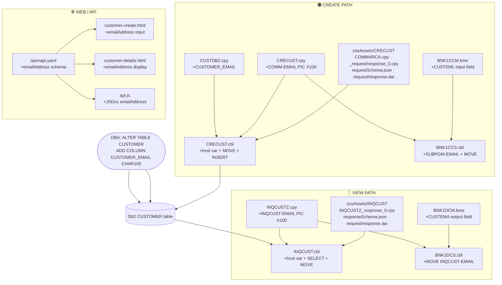

# Impact Analysis — Add Email ID Field (Create + View)

**Created**: 2026-08-18
**Scope**: Accept email on customer create; display email on customer view
**Channels**: CICS 3270 BMS + Web Frontend + REST API (z/OS Connect)

---

## Change Summary

| What | Detail |
|---|---|
| New field | `CUSTOMER_EMAIL` / `COMM-EMAIL` / `INQCUST-EMAIL` |
| Size | `CHAR(100)` in Db2 · `PIC X(100)` in COBOL · `maxLength: 100` in JSON schema |
| COMMAREA impact | Total size increases from **403 → 503 bytes** (all files) |
| Programs to recompile | `CRECUST`, `BNK1CCS`, `INQCUST`, `BNK1DCS` |
| BMS mapsets to re-assemble | `BNK1CCM`, `BNK1DCM` |

---

## 1. Database

| # | Artifact | Change |
|---|---|---|
| 1 | Db2 `CUSTOMER` table | `ALTER TABLE CUSTOMER ADD COLUMN CUSTOMER_EMAIL CHAR(100)` — DBA action |

---

## 2. COBOL Copybooks

| # | File | Change |
|---|---|---|
| 2 | [`src/base/cics/copy/CUSTDB2.cpy`](../../src/base/cics/copy/CUSTDB2.cpy) | Add `CUSTOMER_EMAIL CHAR(100)` to `EXEC SQL DECLARE TABLE` |
| 3 | [`src/base/cics/copy/CRECUST.cpy`](../../src/base/cics/copy/CRECUST.cpy) | Add `03 COMM-EMAIL PIC X(100)` after `COMM-PHONE` |
| 4 | [`src/base/cics/copy/INQCUSTZ.cpy`](../../src/base/cics/copy/INQCUSTZ.cpy) | Add `03 INQCUST-EMAIL PIC X(100)` after `INQCUST-PHONE` |

---

## 3. COBOL Programs

| # | File | Change |
|---|---|---|
| 5 | [`src/base/cics/cobol/CRECUST.cbl`](../../src/base/cics/cobol/CRECUST.cbl) | Add `HV-CUSTOMER-EMAIL` host variable + `MOVE COMM-EMAIL` + add `CUSTOMER_EMAIL` column and `:HV-CUSTOMER-EMAIL` value to `EXEC SQL INSERT` |
| 6 | [`src/base/cics/cobol/BNK1CCS.cbl`](../../src/base/cics/cobol/BNK1CCS.cbl) | Add `SUBPGM-EMAIL PIC X(100)` to `SUBPGM-PARMS` + `MOVE SPACES TO CUSTEML-I` + `INSPECT CUSTEML-I REPLACING ALL '_' BY ' '` + `MOVE CUSTEML-I TO SUBPGM-EMAIL` |
| 7 | [`src/base/cics/cobol/INQCUST.cbl`](../../src/base/cics/cobol/INQCUST.cbl) | Add `HV-CUSTOMER-EMAIL` host variable + add `CUSTOMER_EMAIL` to `SELECT` column list + `MOVE HV-CUSTOMER-EMAIL TO INQCUST-EMAIL` |
| 8 | [`src/base/cics/cobol/BNK1DCS.cbl`](../../src/base/cics/cobol/BNK1DCS.cbl) | Add `MOVE INQCUST-EMAIL TO CUSTEMA-O` + include in `EXEC CICS SEND MAP` |

---

## 4. BMS Maps (3270)

| # | File | Change |
|---|---|---|
| 9 | [`src/base/cics/bms/BNK1CCM.bms`](../../src/base/cics/bms/BNK1CCM.bms) | Add `CUSTEML` unprotected input field (UNPROT/FSET) on Create Customer screen — re-assemble mapset after change |
| 10 | [`src/base/cics/bms/BNK1DCM.bms`](../../src/base/cics/bms/BNK1DCM.bms) | Add `CUSTEMA` protected output field (PROT) on Display Customer screen — re-assemble mapset after change |

---

## 5. zosAssets — CRECUST

| # | File | Change |
|---|---|---|
| 11 | [`src/api/src/main/zosAssets/CRECUST/providerFiles/COMMAREA.cpy`](../../src/api/src/main/zosAssets/CRECUST/providerFiles/COMMAREA.cpy) | Add `03 COMM-EMAIL PIC X(100)` after `COMM-PHONE` |
| 12 | [`src/api/src/main/zosAssets/CRECUST/providerFiles/gen/CRECUST_request_0.cpy`](../../src/api/src/main/zosAssets/CRECUST/providerFiles/gen/CRECUST_request_0.cpy) | Add `03 COMM-EMAIL PIC X(100) USAGE DISPLAY.` after `COMM-PHONE` |
| 13 | [`src/api/src/main/zosAssets/CRECUST/providerFiles/gen/CRECUST_response_0.cpy`](../../src/api/src/main/zosAssets/CRECUST/providerFiles/gen/CRECUST_response_0.cpy) | Add `03 COMM-EMAIL PIC X(100) USAGE DISPLAY.` after `COMM-PHONE` |
| 14 | [`src/api/src/main/zosAssets/CRECUST/providerFiles/gen/requestSchema.json`](../../src/api/src/main/zosAssets/CRECUST/providerFiles/gen/requestSchema.json) | Add `COMM-EMAIL` property (`maxLength: 100, type: string`) after `COMM-PHONE` block |
| 15 | [`src/api/src/main/zosAssets/CRECUST/providerFiles/request.dai`](../../src/api/src/main/zosAssets/CRECUST/providerFiles/request.dai) | Total bytes 403→503; insert `COMM-EMAIL` field block at startPos 159; shift 18 downstream startPos values by +100 |
| 16 | [`src/api/src/main/zosAssets/CRECUST/providerFiles/response.dai`](../../src/api/src/main/zosAssets/CRECUST/providerFiles/response.dai) | Same changes as `request.dai` above |

---

## 6. zosAssets — INQCUST

| # | File | Change |
|---|---|---|
| 17 | [`src/api/src/main/zosAssets/INQCUST/providerFiles/gen/INQCUSTZ_response_0.cpy`](../../src/api/src/main/zosAssets/INQCUST/providerFiles/gen/INQCUSTZ_response_0.cpy) | Add `03 INQCUST-EMAIL PIC X(100) USAGE DISPLAY.` after `INQCUST-PHONE` |
| 18 | [`src/api/src/main/zosAssets/INQCUST/providerFiles/gen/responseSchema.json`](../../src/api/src/main/zosAssets/INQCUST/providerFiles/gen/responseSchema.json) | Add `INQCUST-EMAIL` property (`maxLength: 100, type: string`) after `INQCUST-PHONE` block |
| 19 | [`src/api/src/main/zosAssets/INQCUST/providerFiles/request.dai`](../../src/api/src/main/zosAssets/INQCUST/providerFiles/request.dai) | Total bytes 403→503; insert `INQCUST-EMAIL` field block at startPos 159; shift 19 downstream startPos values by +100 |
| 20 | [`src/api/src/main/zosAssets/INQCUST/providerFiles/response.dai`](../../src/api/src/main/zosAssets/INQCUST/providerFiles/response.dai) | Same changes as `request.dai` above |

---

## 7. Web Frontend

| # | File | Change |
|---|---|---|
| 21 | [`src/frontend/customer-create.html`](../../src/frontend/customer-create.html) | Add `<cds-text-input id="emailAddress">` field; add email to `validateCustomerData` (max-length 100 + format regex); read from DOM and include in POST payload |
| 22 | [`src/frontend/customer-details.html`](../../src/frontend/customer-details.html) | Add `<cds-text-input id="emailAddress">` in `displayCustomerDetails` template; read and include email in `updateCustomer` PUT payload |
| 23 | [`src/frontend/js/api.js`](../../src/frontend/js/api.js) | Add `@property {string} [emailAddress]` to `@typedef Customer` JSDoc and `@param {string} [customerData.emailAddress]` to `createCustomer` JSDoc |

---

## 8. OpenAPI Spec

| # | File | Change |
|---|---|---|
| 24 | [`src/api/src/main/api/openapi.yaml`](../../src/api/src/main/api/openapi.yaml) | Add `emailAddress` property (`type: string, maxLength: 100`) to `CreateCustomerRequest` schema and `CustomerDetails` response schema |

---

## startPos Shift Reference (both CRECUST and INQCUST .dai files)

All fields at or after the address block shift by **+100** because `COMM-EMAIL` / `INQCUST-EMAIL` (100 bytes) is inserted immediately after the phone field at position 159.

| Field | Old startPos | New startPos |
|---|---|---|
| `*-ADDR` (struct) | 159 | 259 |
| `*-ADDR-LINE1` | 159 | 259 |
| `*-ADDR-LINE2` | 209 | 309 |
| `*-CITY` | 259 | 359 |
| `*-POSTCODE` | 309 | 409 |
| `*-COUNTRY` | 319 | 419 |
| `*-STATUS` | 369 | 469 |
| `*-CREATED-DATE` (struct) | 379 | 479 |
| `*-CREATED-DAY/DD` | 379 | 479 |
| `*-CREATED-MONTH/MM` | 381 | 481 |
| `*-CREATED-YEAR/YYYY` | 383 | 483 |
| `*-CREDIT-SCORE` | 387 | 487 |
| `*-CS-REVIEW-DATE/DT` (struct) | 390 | 490 |
| `*-CS-REVIEW-DAY/DD` | 390 | 490 |
| `*-CS-REVIEW-MONTH/MM` | 392 | 492 |
| `*-CS-REVIEW-YEAR/YYYY` | 394 | 494 |
| `*-SUCCESS` | 398 | 498 |
| `*-FAIL-CODE/CD` | 399 | 499 |
| `INQCUST-PCB-POINTER` (INQCUST only) | 400 | 500 |

---

## Change Propagation Diagram

---

## Total: 24 Changes

| Layer | Count |
|---|---|
| Database (DBA DDL) | 1 |
| COBOL Copybooks | 3 |
| COBOL Programs | 4 |
| BMS Maps | 2 |
| zosAssets CRECUST | 6 |
| zosAssets INQCUST | 4 |
| Web Frontend | 3 |
| OpenAPI Spec | 1 |
| **Total** | **24** |

Now I have everything I need to produce a complete, accurate build plan grounded in the actual project configuration. Here it is:

Build Plan — Email ID Field (Add Email Create + View)
This plan covers every step required to compile, assemble, package, and deploy all artefacts changed by the email field feature. Steps are ordered by dependency — nothing should be built before its inputs are ready.

Prerequisites
P1 — DBA: ALTER TABLE (must be done first, before any program runs)
This is a DBA action — not a code build step. It must be applied to the Db2 subsystem before the new CRECUST or INQCUST load modules are put into service.

ALTER TABLE CUSTOMER ADD COLUMN CUSTOMER_EMAIL CHAR(100);

Run via Db2 admin tooling (e.g. SPUFI, Db2 Admin Tool, or a DDL job). Until this column exists, the new INSERT and SELECT in CRECUST.cbl and INQCUST.cbl will receive SQL error -206 (column not found).

Phase 1 — BMS Map Assembly
BMS maps must be assembled before the COBOL programs that reference their copybooks (the assembly generates the symbolic map that COBOL COPYs at compile time).

Step	Artefact	Build task	Target library
1.1	src/base/cics/bms/BNK1CCM.bms	DBB Assembler task (BMS)	CICSLOAD
1.2	src/base/cics/bms/BNK1DCM.bms	DBB Assembler task (BMS)	CICSLOAD
Why before COBOL?

BNK1CCS.cbl does COPY BNK1CCO (generated from BNK1CCM) to get CUSTEML-I.

BNK1DCS.cbl does COPY BNK1DCO (generated from BNK1DCM) to get CUSTEMA-O.

Both symbolic map copybooks are generated in the mapset assembly step. If COBOL compiles before the maps are assembled, it resolves against the old symbolic map — CUSTEML / CUSTEMA will be unknown and the compile will fail.

Using DBB User Build (developer workflow):

userbuild-run-user-build: src/base/cics/bms/BNK1CCM.bms  (fullUpload: true first time)
userbuild-run-user-build: src/base/cics/bms/BNK1DCM.bms

Using DBB pipeline build:

dbb build --sourceFile src/base/cics/bms/BNK1CCM.bms
dbb build --sourceFile src/base/cics/bms/BNK1DCM.bms

Phase 2 — COBOL Compilation & Link-Edit
Compile the four changed COBOL programs. DBB auto-detects CICS and SQL flags and appends them to compileParms (LIB,CICS,SQL). All four programs link-edit automatically (doLinkEdit: true) and deploy to CICSLOAD.

Order within this phase matters only for static CALL chains — all four programs are called independently by CICS, so they can be compiled in any order or in parallel.

Step	Artefact	Compiler flags	Target library
2.1	src/base/cics/cobol/CRECUST.cbl	LIB,CICS,SQL	CICSLOAD
2.2	src/base/cics/cobol/BNK1CCS.cbl	LIB,CICS	CICSLOAD
2.3	src/base/cics/cobol/INQCUST.cbl	LIB,CICS,SQL	CICSLOAD
2.4	src/base/cics/cobol/BNK1DCS.cbl	LIB,CICS	CICSLOAD
Copybooks resolved at compile time (via dependencySearchPath: src/base/**/*.cpy):

Program	Key copybooks consumed
CRECUST.cbl	CRECUST.cpy, CUSTDB2.cpy
BNK1CCS.cbl	CRECUST.cpy, BNK1CCO (from assembled BNK1CCM)
INQCUST.cbl	INQCUSTZ.cpy, CUSTDB2.cpy
BNK1DCS.cbl	INQCUSTZ.cpy, BNK1DCO (from assembled BNK1DCM)
Using DBB User Build (one at a time):

userbuild-run-user-build: src/base/cics/cobol/CRECUST.cbl
userbuild-run-user-build: src/base/cics/cobol/BNK1CCS.cbl
userbuild-run-user-build: src/base/cics/cobol/INQCUST.cbl
userbuild-run-user-build: src/base/cics/cobol/BNK1DCS.cbl

Phase 3 — z/OS Connect API Build
The zOSConnect DBB task (defined in dbb-app.yaml) drives a Gradle build that packages the REST API from:

src/api/src/main/api/openapi.yaml — updated with emailAddress in both CreateCustomerRequest and Customer schemas
src/api/src/main/zosAssets/CRECUST/ — updated .dai, .cpy, and .json files
src/api/src/main/zosAssets/INQCUST/ — updated .dai, .cpy, and .json files
dbb build --sourceFile src/api/src/main/api/openapi.yaml

This Gradle task regenerates the z/OS Connect EAR/WAR that wires COMM-EMAIL / INQCUST-EMAIL into the JSON ↔ COMMAREA mapping. The .dai files (with corrected startPos values and totalBytes: 503) are the authoritative byte-layout descriptors used at runtime.

Phase 4 — Web Frontend Packaging
The VanillaFrontend DBB task (defined in dbb-app.yaml) runs a shell script that packages src/frontend/ into a WAR file (bank-frontend-vanilla.war) for deployment to the Liberty server hosting z/OS Connect.

Changed frontend files:

src/frontend/customer-create.html
src/frontend/customer-details.html
src/frontend/js/api.js
dbb build --sourceFile src/frontend/customer-create.html

(DBB detects the vanillaFrontendPath is changed and triggers the full WAR repackage)

Phase 5 — CICS Definitions (CEDA/CEMT)
After load modules are deployed to CICSLOAD, the CICS region must be refreshed. No new program definitions are needed (all programs already exist in CEDA), but the in-memory copies must be discarded:

CEMT SET PROGRAM(CRECUST)  NEWCOPY
CEMT SET PROGRAM(BNK1CCS)  NEWCOPY
CEMT SET PROGRAM(INQCUST)  NEWCOPY
CEMT SET PROGRAM(BNK1DCS)  NEWCOPY
CEMT SET PROGRAM(BNK1CCM)  NEWCOPY
CEMT SET PROGRAM(BNK1DCM)  NEWCOPY

BMS mapsets (BNK1CCM, BNK1DCM) are also CICS programs — they need NEWCOPY too so that the new symbolic map (with CUSTEML / CUSTEMA) is active.

Phase 6 — Liberty / z/OS Connect Deployment
Restart or hot-deploy the Liberty server that hosts the z/OS Connect EAR so it picks up:

The new API EAR (from Phase 3) — updated COMMAREA mapping (503 bytes, emailAddress field)
The new frontend WAR (from Phase 4) — emailAddress input/display
For a rolling update (no downtime):

MODIFY <liberty-jobname>,REFRESH

Or redeploy the EAR/WAR through the Liberty dropins directory or Wazi Deploy pipeline.

Build Order Summary
P0: DBA — ALTER TABLE CUSTOMER
ADD COLUMN CUSTOMER_EMAIL CHAR100

Phase 1.1: Assemble BNK1CCM.bms

Phase 1.2: Assemble BNK1DCM.bms

Phase 2.1: Compile CRECUST.cbl

Phase 2.2: Compile BNK1CCS.cbl

Phase 2.3: Compile INQCUST.cbl

Phase 2.4: Compile BNK1DCS.cbl

Phase 3: z/OS Connect API Build
openapi.yaml + zosAssets

Phase 4: Frontend WAR Package

Phase 5: CICS NEWCOPY
CRECUST BNK1CCS INQCUST BNK1DCS BNK1CCM BNK1DCM

Phase 6: Liberty Restart
Deploy EAR + WAR

Quick Reference — Files Changed by Phase
Phase	Files
1 — BMS Assembly	BNK1CCM.bms, BNK1DCM.bms
2 — COBOL Compile	CRECUST.cbl, BNK1CCS.cbl, INQCUST.cbl, BNK1DCS.cbl + copybooks CRECUST.cpy, INQCUSTZ.cpy, CUSTDB2.cpy
3 — z/OS Connect	openapi.yaml, COMMAREA.cpy, CRECUST_request/response_0.cpy, requestSchema.json, request/response.dai (CRECUST + INQCUST)
4 — Frontend	customer-create.html, customer-details.html, api.js
5 — CICS refresh	CEMT NEWCOPY for 6 programs
6 — Liberty	Redeploy EAR + WAR
Critical dependency: The Db2 ALTER TABLE (P0) and BMS assembly (Phase 1) must both be complete before any COBOL load module goes into service. Running the new CRECUST or INQCUST load against an old table schema will cause SQL -206 abends.