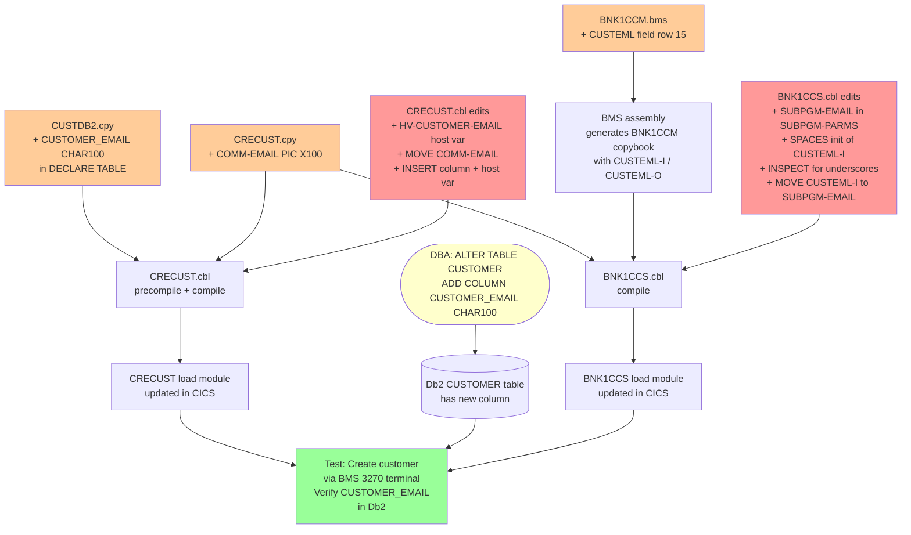

# Impact Analysis Report: Add Email Field — Create Screen Only

**Created**: 2025-08-01
**Author**: IBM Bob Z Architect
**Analysis Method**: Local Workspace (full-stack file analysis)
**Parent Analysis**: [`../add-email-field-20250801/IMPACT-ANALYSIS.md`](../add-email-field-20250801/IMPACT-ANALYSIS.md)
**Confidence Level**: High

---

## 1. Change Summary

### Change Specification

**Title**: Collect and persist customer email address on the Create Customer screen only

**Type**: Enhancement (Phase 1 / Minimal Slice)

**Description**: Add an email input field to the BMS 3270 Create Customer screen (`BNK1CCM.bms` / `BNK1CCS.cbl`), carry it through the CICS LINK commarea into `CRECUST.cbl`, and persist it to the Db2 `CUSTOMER` table. All other operations — inquiry, update, delete, the REST API, and the web UI — remain **completely unchanged**.

**Business Objective**: Begin capturing customer email addresses at creation time as a foundation for future digital communication. Deliberately deferred: display, update, and API exposure of the email field.

### Scope Boundary Decision

| Layer | In Scope | Explicitly Out of Scope |
|---|---|---|
| Db2 `CUSTOMER` table | ✅ ADD COLUMN | — |
| `CUSTDB2.cpy` | ✅ Declare new column | — |
| `CRECUST.cpy` | ✅ New COMMAREA field | — |
| `CRECUST.cbl` | ✅ Host var + INSERT | — |
| `BNK1CCM.bms` | ✅ New screen input field | — |
| `BNK1CCS.cbl` | ✅ Read field, populate commarea | — |
| `CUSTOMER.cpy` | ⚠️ See note below | — |
| `INQCUST.cbl`, `INQCUSTZ.cpy` | ❌ | Unchanged |
| `UPDCUST.cbl`, `UPDCUST.cpy` | ❌ | Unchanged |
| `DELCUS.cbl`, `DELCUS.cpy` | ❌ | Unchanged |
| `BNK1DCS.cbl`, `BNK1DCM.bms` | ❌ | Unchanged |
| `openapi.yaml` | ❌ | Unchanged |
| `customer-create.html` / web UI | ❌ | Unchanged — email captured via 3270 BMS only |
| `api.js` | ❌ | Unchanged |

> **⚠️ `CUSTOMER.cpy` note**: This master record copybook is used by `INQCUST.cbl` and `DELCUS.cbl` (which are out of scope and cannot be recompiled). Adding email to `CUSTOMER.cpy` would force those programs to be recompiled too. The safe approach for this minimal slice is to **NOT add email to `CUSTOMER.cpy`** — instead, add `HV-CUSTOMER-EMAIL` directly as a local host variable inside `CRECUST.cbl` working storage. This keeps the blast radius strictly to the create path.

---

## 2. The Create Path — How Data Flows Today

Understanding the existing flow is essential before making changes.

```
3270 Terminal / BNK1CCM.bms map
        │  EXEC CICS RECEIVE MAP
        ▼
BNK1CCS.cbl  CRE-CUST-DATA section (line 954)
   • Reads map fields (CUSTTITI, CHRISTNI, CUSTAD1I, etc.)
   • Populates SUBPGM-PARMS (working storage, mirrors CRECUST.cpy layout)
   • EXEC CICS LINK PROGRAM('CRECUST') COMMAREA(SUBPGM-PARMS)
        │
        ▼
CRECUST.cbl  WRITE-CUSTOMER-DB2 section (line 1138)
   • COMM-PHONE → HV-CUSTOMER-PHONE
   • COMM-ADDR  → HV-CUSTOMER-ADDR-LINE1..COUNTRY
   • EXEC SQL INSERT INTO CUSTOMER (17 columns) VALUES (17 host vars)
        │
        ▼
Db2 CUSTOMER table
```

The COMMAREA between `BNK1CCS` and `CRECUST` is defined by `CRECUST.cpy` (LINKAGE SECTION in `CRECUST.cbl`, `SUBPGM-PARMS` in `BNK1CCS.cbl`). **Both programs must agree on the layout.**

---

## 3. Exact Changes Required (Minimal Set — 5 Files)

### Change 1 — Db2 table schema (DBA action)

```sql
ALTER TABLE CUSTOMER
  ADD COLUMN CUSTOMER_EMAIL CHAR(100);
```

This is a **DBA-only action**. No recompile, no deploy — just schema. Existing rows get `NULL` in `CUSTOMER_EMAIL`, which is fine since the column will not be read by any existing program.

---

### Change 2 — `CUSTDB2.cpy` — Db2 table declaration

**File**: [`Bank-of-Z/src/base/cics/copy/CUSTDB2.cpy`](../../../src/base/cics/copy/CUSTDB2.cpy)  
**Location**: After line 16 (`CUSTOMER_PHONE CHAR(20)`)

```cobol
* ADD this line after CUSTOMER_PHONE:
              CUSTOMER_EMAIL                 CHAR(100),
```

**Why**: `CRECUST.cbl` includes `CUSTDB2` via `EXEC SQL INCLUDE CUSTDB2`. The DECLARE TABLE must match the actual table definition. Without this, the precompiler will not recognise `CUSTOMER_EMAIL` in the INSERT statement.

**Ripple**: `CUSTDB2.cpy` is included only inside `EXEC SQL ... END-EXEC` blocks. It is not a structural COBOL copybook — it does not trigger recompilation of programs that merely `COPY` it. Programs that include it via `EXEC SQL INCLUDE` (i.e. `CRECUST.cbl`, `INQCUST.cbl`, `UPDCUST.cbl`, `DELCUS.cbl`) must each be re-precompiled and recompiled before their next load. **Since `INQCUST`, `UPDCUST`, and `DELCUS` are not being modified, they should NOT be recompiled in this phase.** Their `CUSTDB2` include is for the existing columns only; adding a new column to the DECLARE does not break their existing SQL — Db2 ignores extra columns in the declaration.

---

### Change 3 — `CRECUST.cpy` — CICS COMMAREA layout

**File**: [`Bank-of-Z/src/base/cics/copy/CRECUST.cpy`](../../../src/base/cics/copy/CRECUST.cpy)  
**Location**: After line 19 (`03 COMM-PHONE PIC X(20).`)

```cobol
           03 COMM-EMAIL                      PIC X(100).
```

**Why**: This copybook defines the COMMAREA shared between `BNK1CCS.cbl` (caller, as `SUBPGM-PARMS`) and `CRECUST.cbl` (called, as LINKAGE SECTION). Both programs must use the same field layout for `EXEC CICS LINK` to transfer data correctly.

**Ripple**: Both `CRECUST.cbl` and `BNK1CCS.cbl` must be recompiled after this change. No other program uses `CRECUST.cpy`.

---

### Change 4 — `CRECUST.cbl` — host variable + INSERT statement

**File**: [`Bank-of-Z/src/base/cics/cobol/CRECUST.cbl`](../../../src/base/cics/cobol/CRECUST.cbl)

**4a — Working Storage: add host variable** (after line 84, inside `HOST-CUSTOMER-ROW`)

```cobol
           03 HV-CUSTOMER-EMAIL          PIC X(100).
```

**4b — `WRITE-CUSTOMER-DB2` section: add MOVE** (after line 1178, after `MOVE COMM-COUNTRY OF COMM-ADDR TO HV-CUSTOMER-COUNTRY`)

```cobol
           MOVE COMM-EMAIL TO HV-CUSTOMER-EMAIL.
```

**4c — `EXEC SQL INSERT INTO CUSTOMER`** (lines 1220–1256): add the new column and host variable

```cobol
* In the column list, after CUSTOMER_CS_REVIEW_DATE:
                   CUSTOMER_EMAIL)
* In the VALUES list, after :HV-CUSTOMER-CS-REVIEW-DATE:
                   :HV-CUSTOMER-EMAIL)
```

**Why**: Without the host variable and the INSERT column, the email captured from the screen is moved into the commarea but silently discarded when the row is written to Db2.

---

### Change 5 — `BNK1CCM.bms` — add email input field to Create Customer map

**File**: [`Bank-of-Z/src/base/cics/bms/BNK1CCM.bms`](../../../src/base/cics/bms/BNK1CCM.bms)

**Location**: After the Country field (around line 94), before the D.O.B. block (line 95).

```asm
         DFHMDF POS=(15,1),LENGTH=16,ATTRB=(NORM,PROT),                 *
               COLOR=NEUTRAL,INITIAL=' Email          '
CUSTEML  DFHMDF POS=(15,18),LENGTH=60,                                  *
               ATTRB=(UNPROT,FSET,NORM),COLOR=GREEN,                    *
               HILIGHT=UNDERLINE
         DFHMDF POS=(15,79),LENGTH=0,ATTRB=(PROT,ASKIP),                *
               COLOR=GREEN
```

> **Design constraint**: The 3270 screen is 80 columns. The label occupies columns 1–17; the field starts at column 18. Maximum usable length is **61 characters** (columns 18–78, with 79 as the attribute byte). Email field length is capped at **60 characters** on the BMS map. `CRECUST.cbl` stores up to 100 chars in `CHAR(100)` — the 60-char BMS cap is safe (it just means very long email addresses must use the web UI when that path is added later).

> **Row displacement**: The D.O.B. block currently starts at line 15. Adding the email row shifts D.O.B. to line 16 and the Sort Code / Customer Number / Credit Score rows down by one. Verify the existing rows do not conflict with the 24-row 3270 screen limit. Current last row is line 24 (function key legend). The map currently uses rows up to line 20 for data fields, so one additional row is safe.

**Regenerate the BMS map copybook** after assembly — `BNK1CCS.cbl` uses `COPY BNK1CCM` to get the generated field name symbols (`CUSTEML`, `CUSTEML-I`, `CUSTEML-O`, etc.).

---

### Change 6 — `BNK1CCS.cbl` — read email from map and populate commarea

**File**: [`Bank-of-Z/src/base/cics/cobol/BNK1CCS.cbl`](../../../src/base/cics/cobol/BNK1CCS.cbl)

**6a — `RECEIVE-MAP` section** (around line 500 — the block that initialises map input fields to SPACES before `EXEC CICS RECEIVE MAP`): add

```cobol
           MOVE SPACES TO CUSTEML-I.
```

**6b — `CRE-CUST-DATA` section, INSPECT block** (around line 979 — after the other `INSPECT ... REPLACING ALL '_' BY ' '` statements): add

```cobol
           INSPECT CUSTEML-I REPLACING ALL '_' BY ' '.
```

**6c — `CRE-CUST-DATA` section, MOVE block** (after line 989, after `MOVE COUNTRYI TO SUBPGM-COUNTRY`): add

```cobol
           MOVE CUSTEML-I TO SUBPGM-EMAIL.
```

**6d — `SUBPGM-PARMS`** (line 102 block, after `03 SUBPGM-PHONE PIC X(20)`): add the email field so the layout matches `CRECUST.cpy`

```cobol
           03 SUBPGM-EMAIL                    PIC X(100).
```

> Note: `SUBPGM-PARMS` in `BNK1CCS.cbl` is a local copy of the CRECUST commarea layout. It must be extended to match `CRECUST.cpy` after Change 3. The email value maps: `CUSTEML-I` (60-char BMS field) → `SUBPGM-EMAIL` (100-char WS) → `COMM-EMAIL` (100-char via `CRECUST.cpy` in CRECUST's LINKAGE) → `HV-CUSTOMER-EMAIL` → `CUSTOMER_EMAIL` in Db2.

---

## 4. Change Propagation Diagram



---

## 5. File Change Summary

| # | File | Change type | Lines changed (est.) | Recompile required |
|---|---|---|---|---|
| — | Db2 `CUSTOMER` table | DBA DDL | 1 SQL statement | No |
| 1 | [`CUSTDB2.cpy`](../../../src/base/cics/copy/CUSTDB2.cpy:16) | Add 1 column to DECLARE TABLE | +1 line | Triggers CRECUST precompile |
| 2 | [`CRECUST.cpy`](../../../src/base/cics/copy/CRECUST.cpy:19) | Add `03 COMM-EMAIL PIC X(100)` | +1 line | Triggers CRECUST + BNK1CCS recompile |
| 3 | [`CRECUST.cbl`](../../../src/base/cics/cobol/CRECUST.cbl:84) | Host variable + MOVE + INSERT col/val | +5 lines across 3 locations | Yes — precompile + compile |
| 4 | [`BNK1CCM.bms`](../../../src/base/cics/bms/BNK1CCM.bms:94) | Add CUSTEML field + label | +7 lines, shift D.O.B. row | BMS assembly; copybook regenerated |
| 5 | [`BNK1CCS.cbl`](../../../src/base/cics/cobol/BNK1CCS.cbl:102) | SUBPGM-EMAIL field + init + inspect + MOVE | +4 lines across 4 locations | Yes — compile |

**Total: 5 source files modified. 2 load modules replaced (`CRECUST`, `BNK1CCS`). 1 mapset re-assembled (`BNK1CCM`).**

---

## 6. What Is NOT Changed (Confirmed Out of Scope)

| Artifact | Status | Consequence |
|---|---|---|
| `INQCUST.cbl` / `INQCUSTZ.cpy` | ❌ Unchanged | Email is stored in Db2 but not returned on inquiry — field reads as spaces |
| `UPDCUST.cbl` / `UPDCUST.cpy` | ❌ Unchanged | Email cannot be updated after creation in this phase |
| `DELCUS.cbl` / `DELCUS.cpy` | ❌ Unchanged | Delete removes the row including the email column — no issue |
| `BNK1DCS.cbl` / `BNK1DCM.bms` | ❌ Unchanged | Display Customer screen does not show email |
| `CUSTOMER.cpy` | ❌ Unchanged | Master record layout not extended — email lives only as a local host variable in CRECUST |
| `openapi.yaml` | ❌ Unchanged | REST API does not accept or return email |
| `customer-create.html` | ❌ Unchanged | Web UI create path does not carry email |
| `customer-details.html` | ❌ Unchanged | Web UI details page does not show email |

---

## 7. Risk Assessment

| Risk ID | Description | Likelihood | Impact | Risk Level | Mitigation |
|---|---|---|---|---|---|
| R1 | BMS row shift breaks 24-row screen boundary | Low | Medium | **LOW** | Verified: current map ends at row 20; adding one row is safe |
| R2 | `CRECUST.cpy` layout change breaks `BNK1CCS.cbl` commarea alignment | Medium | High | **MEDIUM** | Both programs are recompiled in the same build step; lengths verified at precompile time |
| R3 | `CUSTDB2.cpy` update causes other programs (INQCUST, UPDCUST, DELCUS) to pick up the new column declaration on next incidental recompile | Low | Low | **LOW** | The additional DECLARE column is harmless to programs that don't reference it; no action needed |
| R4 | Email silently truncated at 60 chars (BMS cap vs. 100-char Db2 column) | High (by design) | Low | **LOW** | Accepted trade-off for this phase; document for future web UI work |
| R5 | Db2 `ALTER TABLE` causes table space reorganisation delay | Low | Medium | **LOW** | Run `ALTER TABLE` in non-production first; coordinate with DBA for production timing window |

---

## 8. Implementation Sequence

```
Step 1  DBA   ALTER TABLE CUSTOMER ADD COLUMN CUSTOMER_EMAIL CHAR(100)
Step 2  DEV   Edit CUSTDB2.cpy    → add CUSTOMER_EMAIL to DECLARE TABLE
Step 3  DEV   Edit CRECUST.cpy    → add COMM-EMAIL PIC X(100)
Step 4  DEV   Edit CRECUST.cbl    → host var + MOVE + INSERT
Step 5  DEV   Edit BNK1CCM.bms    → add CUSTEML field (resolve row positions)
Step 6  BUILD Assemble BNK1CCM.bms → regenerate BNK1CCM copybook
Step 7  DEV   Edit BNK1CCS.cbl    → SUBPGM-EMAIL + init + inspect + MOVE
Step 8  BUILD Precompile + compile CRECUST.cbl
Step 9  BUILD Compile BNK1CCS.cbl
Step 10 TEST  On 3270 terminal: create a customer, enter an email address
              Query Db2: SELECT CUSTOMER_EMAIL FROM CUSTOMER WHERE ...
              Verify email value stored correctly
Step 11 TEST  Create customer without email → verify row created with NULL/spaces, no abend
Step 12 PROD  Deploy BNK1CCM mapset, CRECUST load module, BNK1CCS load module
```

---

## 9. Future Work (Out of Scope Here)

When the team is ready to expose email beyond the create screen, the parent analysis documents all remaining changes:

- Add `INQCUST-EMAIL` to `INQCUSTZ.cpy` and update `INQCUST.cbl` SELECT
- Add `COMM-EMAIL` to `UPDCUST.cpy` and update `UPDCUST.cbl` UPDATE SET
- Add email display field to `BNK1DCM.bms` / `BNK1DCS.cbl`
- Add `CUSTOMER-EMAIL` to `CUSTOMER.cpy` (full record layout)
- Add `email` to `openapi.yaml` schemas (required in `CreateCustomerRequest`)
- Add email input to `customer-create.html`
- Add email display/update to `customer-details.html`
