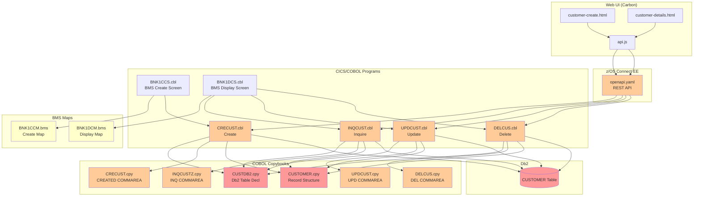
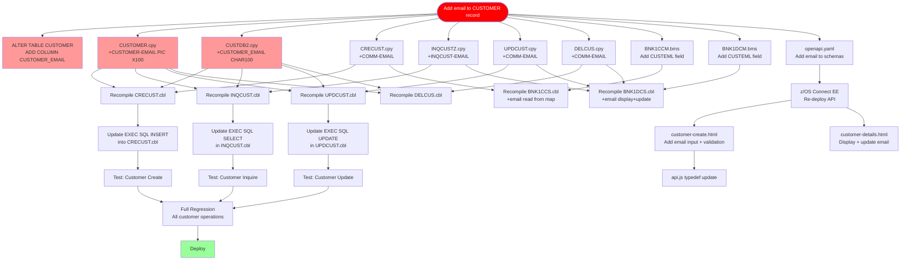

# Impact Analysis Report: Add Email Field to Customer Record

**Created**: 2025-08-01
**Author**: IBM Bob Z Architect
**Analysis Method**: Local Workspace (full-stack file analysis)
**Workspace Alignment**: Fully Aligned
**Confidence Level**: High

---

## 1. Change Summary

### Change Specification

**Title**: Add CUSTOMER-EMAIL field to Customer record

**Type**: Enhancement

**Description**: Add a new email address field to the Db2 CUSTOMER table and propagate it through every layer of the CICS/Db2 path that creates, reads, updates, and deletes customer contact information. The IMS path is explicitly out of scope (separate customer population).

**Business Objective**: Capture customer email addresses to enable digital communication, e-statements, and notification services.

### Decisions Captured from Clarification

| Decision | Value |
|---|---|
| Datastore scope | Db2/CICS only — IMS path out of scope |
| Required on create | Yes — `email` is REQUIRED in `CreateCustomerRequest` |
| API backward compat | Optional in `Customer` and `CustomerUpdate` response/update schemas |

### System Context

**Key Technologies**: COBOL, CICS, Db2 (embedded SQL), BMS maps, z/OS Connect EE (OpenAPI), JavaScript/HTML (Carbon Web Components)

**Entry Points**: `CRECUST.cbl` (create), `INQCUST.cbl` (read), `UPDCUST.cbl` (update), `DELCUS.cbl` (delete)

---

## 2. Scope Definition

### In Scope

| Component | Layer | Reason |
|---|---|---|
| `CUSTDB2.cpy` | Db2 DDL / copybook | Declares the CUSTOMER table — must add email column |
| `CUSTOMER.cpy` | COBOL record structure | Master customer record layout — must add `CUSTOMER-PHONE` sibling |
| `CRECUST.cpy` | COMMAREA copybook | Create-customer commarea — must carry email |
| `INQCUSTZ.cpy` | COMMAREA copybook | Inquiry-customer commarea — must carry email |
| `UPDCUST.cpy` | COMMAREA copybook | Update-customer commarea — must carry email |
| `DELCUS.cpy` | COMMAREA copybook | Delete-customer commarea — read-only carry-forward |
| `CRECUST.cbl` | CICS COBOL program | Writes customer row to Db2 — INSERT must include email |
| `INQCUST.cbl` | CICS COBOL program | SELECTs all customer columns — must include email in SELECT and host variable |
| `UPDCUST.cbl` | CICS COBOL program | UPDATE statement — must add email to SET clause |
| `DELCUS.cbl` | CICS COBOL program | Reads customer for confirmation — SELECT must include email |
| `BNK1CCS.cbl` | CICS BMS program | Create-customer screen driver — must accept and pass email |
| `BNK1DCS.cbl` | CICS BMS program | Display/Update/Delete customer — must display and pass email |
| `BNK1CCM.bms` | BMS mapset | Create customer map — add email input field |
| `BNK1DCM.bms` | BMS mapset | Display customer map — add email display field |
| `openapi.yaml` | z/OS Connect API spec | `CreateCustomerRequest` (required), `Customer`, `CustomerUpdate`, `Address` schemas |
| `customer-create.html` | Web UI | Add email `<cds-text-input>` field |
| `customer-details.html` | Web UI | Show and allow update of email field |
| `api.js` (JS client) | Web UI | JSDoc `Customer` typedef — add `email` property |

### Out of Scope

| Component | Reason |
|---|---|
| `IBGCUDAT.cbl`, `IBSCUDAT.cbl`, `LOADCUST.cbl` | IMS path — separate customer population, confirmed out of scope |
| `CUSTOMER.asm` (DBD), IMS PSBs | IMS schema — out of scope |
| `BNKSTMT.pli` (batch) | Processes account/transaction data, not customer contact details |
| `BANKDATA.cbl` | Data initialisation utility — not part of live contact info path |
| Account-related programs (`CREACC`, `INQACC`, etc.) | Do not carry customer contact fields |

### Functional Area

**Primary Functional Area**: Customer Master Data Management

**Business Function**: The contact information sub-record (phone + address + email) is created once at customer onboarding, retrieved for display and downstream use, and can be updated by bank staff. Every operation that touches the full customer record must propagate the new field.

---

## 3. System Overview

### System Context Diagram



**Legend**: 🔴 Red = primary schema/data origin changed · 🟠 Orange = direct code changes required · 🟡 Yellow = secondary changes

---

## 4. Current Contact Information Trace

### How Phone & Address Flow Today (Baseline)

The following table establishes every point in the stack where `CUSTOMER_PHONE` / `CUSTOMER_ADDR_LINE1`–`CUSTOMER_COUNTRY` currently exist. An email field added in the same pattern must touch all the same rows.

| Layer | Artifact | Field Names | Operation |
|---|---|---|---|
| **Db2 DDL** | [`CUSTDB2.cpy`](../../src/base/cics/copy/CUSTDB2.cpy) | `CUSTOMER_PHONE CHAR(20)`, `CUSTOMER_ADDR_LINE1..COUNTRY` | DECLARE TABLE |
| **COBOL record** | [`CUSTOMER.cpy`](../../src/base/cics/copy/CUSTOMER.cpy:21) | `CUSTOMER-PHONE PIC X(20)`, `CUSTOMER-ADDRESS` group (lines 21–27) | Data structure definition |
| **Create COMMAREA** | [`CRECUST.cpy`](../../src/base/cics/copy/CRECUST.cpy:19) | `COMM-PHONE PIC X(20)`, `COMM-ADDR` group (lines 19–25) | CICS COMMAREA |
| **Inquire COMMAREA** | [`INQCUSTZ.cpy`](../../src/base/cics/copy/INQCUSTZ.cpy:17) | `INQCUST-PHONE PIC X(20)`, `INQCUST-ADDR` group (lines 17–23) | CICS COMMAREA |
| **Update COMMAREA** | [`UPDCUST.cpy`](../../src/base/cics/copy/UPDCUST.cpy:18) | `COMM-PHONE PIC X(20)`, `COMM-ADDR` group (lines 18–24) | CICS COMMAREA |
| **Delete COMMAREA** | [`DELCUS.cpy`](../../src/base/cics/copy/DELCUS.cpy:18) | `COMM-PHONE PIC X(20)`, `COMM-ADDR` group (lines 18–24) | CICS COMMAREA |
| **CRECUST host vars** | [`CRECUST.cbl`](../../src/base/cics/cobol/CRECUST.cbl:75) | `HV-CUSTOMER-PHONE PIC X(20)`, `HV-CUSTOMER-ADDR-LINE1..COUNTRY` | SQL host variables |
| **INQCUST host vars** | [`INQCUST.cbl`](../../src/base/cics/cobol/INQCUST.cbl:56) | `HV-CUSTOMER-PHONE`, `HV-CUSTOMER-ADDR-LINE1..COUNTRY` | SQL host variables |
| **UPDCUST host vars** | [`UPDCUST.cbl`](../../src/base/cics/cobol/UPDCUST.cbl:64) | `HV-CUSTOMER-PHONE`, `HV-CUSTOMER-ADDR-LINE1..COUNTRY` | SQL host variables |
| **DELCUS host vars** | [`DELCUS.cbl`](../../src/base/cics/cobol/DELCUS.cbl:66) | `HV-CUSTOMER-PHONE`, `HV-CUSTOMER-ADDR-LINE1..COUNTRY` | SQL host variables |
| **UPDCUST SQL** | [`UPDCUST.cbl:335-347`](../../src/base/cics/cobol/UPDCUST.cbl:335) | `COMM-PHONE`, `COMM-ADDR-LINE1..COUNTRY` conditional MOVEs + UPDATE SET | Db2 UPDATE |
| **BMS Display map** | [`BNK1DCM.bms`](../../src/base/cics/bms/BNK1DCM.bms:66) | `CUSTAD1` (Addr Line 1), `CUSTAD2` (Addr Line 2), `CUSTCITY`, `CUSTPOST`, `CUSTCTRY` | 3270 screen fields |
| **BMS Create map** | [`BNK1CCM.bms`](../../src/base/cics/bms/BNK1CCM.bms:63) | `CUSTAD1`, `CUSTAD2`, `CITY`, `POSTCODE`, `COUNTRY` | 3270 screen fields |
| **BNK1DCS COMMAREA** | [`BNK1DCS.cbl:137-142`](../../src/base/cics/cobol/BNK1DCS.cbl:137) | `WS-COMM-PHONE`, `WS-COMM-ADDR-LINE1..COUNTRY` in working storage | Inter-program COMMAREA |
| **OpenAPI – Create** | [`openapi.yaml:694-700`](../../src/api/src/main/api/openapi.yaml:694) | `phoneNumber`, `address` (object) | `CreateCustomerRequest` |
| **OpenAPI – Read** | [`openapi.yaml:750-755`](../../src/api/src/main/api/openapi.yaml:750) | `phoneNumber`, `address` | `Customer` schema |
| **OpenAPI – Update** | [`openapi.yaml:808-835`](../../src/api/src/main/api/openapi.yaml:808) | `phoneNumber`, `address` | `CustomerUpdate` schema |
| **OpenAPI – Address** | [`openapi.yaml:767-784`](../../src/api/src/main/api/openapi.yaml:767) | `addressLine1..country` | `Address` component schema |
| **Web – Create page** | [`customer-create.html:71-111`](../../src/frontend/customer-create.html:71) | `phoneNumber`, `addressLine1..country` input fields | HTML form |
| **Web – Details page** | [`customer-details.html:71-72`](../../src/frontend/customer-details.html:71) | `customerAddress` display field, update path | HTML form |
| **JS API client** | [`api.js:430-441`](../../src/frontend/js/api.js:430) | `phoneNumber`, `address` in `Customer` typedef | JS documentation |

---

## 5. Impact Analysis — Adding Email Field

### 5.1 Code-Level Changes Required

#### A. Db2 Table Schema — `CUSTDB2.cpy`

**Impact Type**: Modify  
**Change**: Add `CUSTOMER_EMAIL CHAR(100)` column to the `EXEC SQL DECLARE CUSTOMER TABLE` statement, positioned after `CUSTOMER_PHONE`.

```cobol
* ADD after CUSTOMER_PHONE CHAR(20):
  CUSTOMER_EMAIL                CHAR(100),
```

**Note**: The column must also be added to the live Db2 table with an `ALTER TABLE` DDL statement (a DBA task). Choosing `CHAR(100)` for fixed-length consistency; `VARCHAR(254)` is an alternative if storage is a concern.

---

#### B. Master Record Copybook — `CUSTOMER.cpy`

**Impact Type**: Modify  
**Change**: Add `CUSTOMER-EMAIL PIC X(100)` as a 05-level item immediately after `CUSTOMER-PHONE`.

```cobol
* Line 21 — AFTER CUSTOMER-PHONE:
           05 CUSTOMER-EMAIL               PIC X(100).
```

**Ripple effect**: All programs that `COPY CUSTOMER` must be recompiled. Affected: `CRECUST.cbl`, `INQCUST.cbl`, `DELCUS.cbl`, `UPDCUST.cbl`.

---

#### C. COMMAREA Copybooks — 4 files

All four COMMAREA copybooks follow the same pattern: add `COMM-EMAIL PIC X(100)` (or `INQCUST-EMAIL`) after the phone field.

| Copybook | New field | After field |
|---|---|---|
| [`CRECUST.cpy`](../../src/base/cics/copy/CRECUST.cpy:19) | `03 COMM-EMAIL PIC X(100).` | `03 COMM-PHONE` (line 19) |
| [`INQCUSTZ.cpy`](../../src/base/cics/copy/INQCUSTZ.cpy:17) | `03 INQCUST-EMAIL PIC X(100).` | `03 INQCUST-PHONE` (line 17) |
| [`UPDCUST.cpy`](../../src/base/cics/copy/UPDCUST.cpy:18) | `03 COMM-EMAIL PIC X(100).` | `03 COMM-PHONE` (line 18) |
| [`DELCUS.cpy`](../../src/base/cics/copy/DELCUS.cpy:18) | `03 COMM-EMAIL PIC X(100).` | `03 COMM-PHONE` (line 18) |

**Ripple effect**: All calling programs that dimension their COMMAREA against these copybooks must be recompiled (same 4 programs + `BNK1DCS.cbl`, `BNK1CCS.cbl`).

---

#### D. `CRECUST.cbl` — Create Customer

**Impact Type**: Modify — 3 locations

1. **Host variable** (line ~75): Add `03 HV-CUSTOMER-EMAIL PIC X(100)` after `HV-CUSTOMER-PHONE`.

2. **INSERT INTO CUSTOMER** (inside `WRITE-CUSTOMER-DB2` section): Add column and host variable to the SQL INSERT.
   ```sql
   CUSTOMER_EMAIL,       -- new column
   ...
   :HV-CUSTOMER-EMAIL,   -- new host variable
   ```

3. **MOVE statement before INSERT**: Add
   ```cobol
   MOVE COMM-EMAIL TO HV-CUSTOMER-EMAIL
   ```

---

#### E. `INQCUST.cbl` — Inquire Customer

**Impact Type**: Modify — 2 locations

1. **Host variable** (line ~56): Add `03 HV-CUSTOMER-EMAIL PIC X(100)` after `HV-CUSTOMER-PHONE`.

2. **SELECT ... INTO** in `READ-CUSTOMER-DB2` section: Add `CUSTOMER_EMAIL` to the SELECT column list and `:HV-CUSTOMER-EMAIL` to the INTO clause.

3. **MOVE to output COMMAREA**: Add
   ```cobol
   MOVE HV-CUSTOMER-EMAIL TO INQCUST-EMAIL
   ```

---

#### F. `UPDCUST.cbl` — Update Customer

**Impact Type**: Modify — 3 locations

1. **Host variable** (line ~64): Add `03 HV-CUSTOMER-EMAIL PIC X(100)`.

2. **SELECT ... INTO** (existing read-before-update, line ~265-303): Add `CUSTOMER_EMAIL` and `:HV-CUSTOMER-EMAIL`.

3. **Conditional MOVE** (line ~335 pattern): Add
   ```cobol
   IF COMM-EMAIL(1:1) NOT = ' '
      MOVE COMM-EMAIL TO HV-CUSTOMER-EMAIL
   END-IF.
   ```

4. **UPDATE CUSTOMER SET** (line ~363-378): Add
   ```sql
   CUSTOMER_EMAIL = :HV-CUSTOMER-EMAIL,
   ```

5. **MOVE back to COMMAREA** (line ~395 block): Add
   ```cobol
   MOVE HV-CUSTOMER-EMAIL TO COMM-EMAIL.
   ```

---

#### G. `DELCUS.cbl` — Delete Customer

**Impact Type**: Modify — 1 location (read-only, display only)

1. **Host variable** (line ~66): Add `03 HV-CUSTOMER-EMAIL PIC X(100)`.

2. **SELECT ... INTO** in `DEL-CUST-DB2` section: Add `CUSTOMER_EMAIL` column and `:HV-CUSTOMER-EMAIL`. The delete operation itself does not need email, but the confirmation display does.

---

#### H. `BNK1DCS.cbl` — BMS Display/Update/Delete Customer Screen Driver

**Impact Type**: Modify — 2 locations

1. **`WS-COMM-AREA`** (line ~128-149) and **LINKAGE SECTION COMMAREA** (line ~191-212): Add `03 WS-COMM-EMAIL PIC X(100)` after `WS-COMM-PHONE` / `COMM-PHONE`.

2. **Map SEND logic**: After the city/postcode/country fields are moved to the BMS map output fields, add the corresponding MOVE for the new email map field.

---

#### I. `BNK1CCS.cbl` — BMS Create Customer Screen Driver

**Impact Type**: Modify — 2 locations

1. **`WS-COMM-AREA`** (around line 80): Add email field matching CRECUST commarea layout.

2. **Map data collection logic**: Read the new email input field from the BMS map and MOVE to commarea before LINK to CRECUST.

---

#### J. BMS Mapsets — `BNK1CCM.bms` and `BNK1DCM.bms`

**Impact Type**: Modify

Both maps need a new 3270 field for email. Suggested placement: after the postcode/country block (before the D.O.B. row). Example for both:

```asm
         DFHMDF POS=(14+n,1),LENGTH=16,ATTRB=(NORM,PROT),               *
               COLOR=NEUTRAL,INITIAL=' Email          '
CUSTEML  DFHMDF POS=(14+n,18),LENGTH=100,ATTRB=(UNPROT,FSET,NORM),      *
               COLOR=GREEN,HILIGHT=UNDERLINE
         DFHMDF POS=(14+n,119),LENGTH=0,ATTRB=(PROT,ASKIP)
```

**Note**: A 100-byte email field will overflow the standard 80-column 3270 screen. Either use a shorter maximum (60 chars) on the BMS map with a separate truncation note, or split across two rows. This is a **design decision** for the team before implementation.

---

#### K. `openapi.yaml` — z/OS Connect EE API Spec

**Impact Type**: Modify — 4 schema locations

| Schema | Change | Required? |
|---|---|---|
| `CreateCustomerRequest` (line 666) | Add `email: {type: string, format: email, maxLength: 100}` | **Yes** (required array) |
| `Customer` (line 722) | Add `email: {type: string, format: email}` | No (optional) |
| `CustomerUpdate` (line 785) | Add `email: {type: string, format: email, maxLength: 100}` | No (optional) |

---

#### L. `customer-create.html` — Web UI Create Page

**Impact Type**: Modify — 3 locations

1. **HTML form** (after phone number field, ~line 77): Add a `<cds-text-input>` for email:
   ```html
   <cds-text-input
       id="email"
       label="Email address"
       placeholder="Enter email address"
       maxlength="100"
       required>
   </cds-text-input>
   ```

2. **`validateCustomerData()` function** (line 163): Add `email` to `requiredFields` and `maxLengths` checks. Also add RFC 5322 format validation (`/^[^\s@]+@[^\s@]+\.[^\s@]+$/`).

3. **`createCustomer()` function** (line 204): Add `email: document.getElementById('email').value` to the `customerData` object.

---

#### M. `customer-details.html` — Web UI Details/Update Page

**Impact Type**: Modify — 2 locations

1. **`displayCustomerDetails()` function** (line 292): Add a field to display email.

2. **`updateCustomer()` function** (line 556): Include email in the update payload.

---

#### N. `api.js` — JavaScript API Client

**Impact Type**: Modify — 1 location

Update the `Customer` typedef (line 426) to add:
```js
 * @property {string} [email] - Customer email address
```

---

### 5.2 Application-Level Impact

| Interface | Change | Programs Affected |
|---|---|---|
| CICS COMMAREA layout | All 4 COMMAREA copybooks gain 100 bytes | CRECUST, INQCUST, UPDCUST, DELCUS, BNK1DCS, BNK1CCS |
| Db2 host variable row | `HOST-CUSTOMER-ROW` gains `HV-CUSTOMER-EMAIL` | Same 4 COBOL programs |
| BMS map generated copybook | Regenerated from `.bms` sources | BNK1CCS, BNK1DCS |
| OpenAPI contract | `CreateCustomerRequest` gains required field | All z/OS Connect EE operations: POST /customers |

#### Recompilation Cascade

All 6 CICS COBOL programs must be recompiled in dependency order:

```
CUSTDB2.cpy → CUSTOMER.cpy → CRECUST.cpy, INQCUSTZ.cpy, UPDCUST.cpy, DELCUS.cpy
BNK1CCM.bms → BNK1CCS.cbl
BNK1DCM.bms → BNK1DCS.cbl
```

---

### 5.3 System-Level Impact

#### Db2 DDL Change

```sql
ALTER TABLE CUSTOMER
  ADD COLUMN CUSTOMER_EMAIL CHAR(100);
```

- Existing rows will have `NULL` / spaces — requires a data migration strategy (default to blanks or NULL).
- No index needed unless email lookups are planned; add one if they are:
  ```sql
  CREATE INDEX IDX_CUST_EMAIL ON CUSTOMER(CUSTOMER_EMAIL);
  ```

#### z/OS Connect EE

The `POST /customers` operation mapping must be updated to route the new `email` JSON field to `COMM-EMAIL` in the CRECUST commarea. The same applies to `PUT /customers/{customerId}`.

---

## 6. Change Propagation Map



---

## 7. Risk Assessment

| Risk ID | Description | Category | Likelihood | Impact | Risk Level | Mitigation |
|---|---|---|---|---|---|---|
| R1 | COMMAREA length increase breaks existing callers | Regression | **High** | High | **HIGH** | All COMMAREA copybooks updated together; full regression test; no other callers of CRECUST/INQCUST/UPDCUST/DELCUS exist outside CICS transaction flow |
| R2 | BMS 3270 screen overflow (email is 100 chars, screen is 80 cols) | Design | **High** | Medium | **HIGH** | Limit email to 60 chars on BMS map with note, or span two rows; decision required before implementation |
| R3 | Existing Db2 rows have NULL/space email after ALTER TABLE | Data Integrity | Medium | Medium | **MEDIUM** | Document NULL handling; INQCUST must handle blank email gracefully (no extra validation required if field is optional in responses) |
| R4 | z/OS Connect EE operation mapping not updated | Regression | Medium | High | **MEDIUM** | Include API re-deployment in deployment checklist; smoke-test POST /customers immediately after deploy |
| R5 | `required: [email]` in OpenAPI breaks existing API clients sending create requests without email | Regression | Medium | High | **MEDIUM** | Communicate breaking change to all API consumers before deploy; consider a deprecation window |
| R6 | Email format not validated in CRECUST (COBOL) | Data Quality | Medium | Low | **LOW** | Front-end validation in `customer-create.html` is the primary gate; COBOL does not need regex validation |
| R7 | BNK1CCS map copybook regeneration missed | Build | Low | High | **MEDIUM** | Ensure BMS assembly is part of the build pipeline step; verify generated copybook before COBOL compile |

---

## 8. Assumptions

1. **Db2 DDL deployment** is a separate DBA activity and is not part of the COBOL build pipeline.
2. **No other programs** outside the six identified CICS programs access the `CUSTOMER` table directly.
3. **The IMS CUSTOMER segment** (DBD `CUSTOMER.asm`, 279 bytes fixed) is not modified; the IMS path returns a different `Customer` schema subset through a separate API path (`/ims/customers/`).
4. Email field length chosen as **100 characters** for `PIC X(100)` / `CHAR(100)` to keep the Db2 column as a simple fixed-length character type consistent with `CUSTOMER_ADDR_LINE1 CHAR(50)`.
5. **BNK1UAM.bms / BNK1UAC.cbl** (Update Account) and other non-customer BMS programs are not affected.

---

## 9. Confidence Assessment

**Confidence: High**

- Every layer of the stack was directly inspected (no inference from metadata only).
- Contact field patterns are uniform across all 4 COMMAREA copybooks — the email addition follows the exact same pattern as `COMM-PHONE`.
- The two clarifying questions resolved the only genuine ambiguities (IMS scope and API required/optional boundary).
- One open design decision remains: **BMS screen layout for the email field** (80-column constraint vs. 100-byte email field). This must be resolved before BNK1CCM/BNK1DCM are modified.

---

## 10. Recommended Implementation Sequence

```
Step 1 — DBA: ALTER TABLE CUSTOMER ADD COLUMN CUSTOMER_EMAIL CHAR(100)
Step 2 — COBOL: Update CUSTDB2.cpy, CUSTOMER.cpy
Step 3 — COBOL: Update all 4 COMMAREA copybooks (CRECUST, INQCUSTZ, UPDCUST, DELCUS)
Step 4 — COBOL: Update CRECUST.cbl (host vars + INSERT)
Step 5 — COBOL: Update INQCUST.cbl (host vars + SELECT + MOVE to commarea)
Step 6 — COBOL: Update UPDCUST.cbl (host vars + SELECT + conditional MOVE + UPDATE)
Step 7 — COBOL: Update DELCUS.cbl (host vars + SELECT)
Step 8 — BMS: Update BNK1CCM.bms (add CUSTEML field — resolve 80-col design first)
Step 9 — BMS: Update BNK1DCM.bms (add CUSTEML field)
Step 10 — COBOL: Update BNK1CCS.cbl (read email from map → commarea)
Step 11 — COBOL: Update BNK1DCS.cbl (display + pass email in update path)
Step 12 — Build: Assemble BMS mapsets, recompile all 6 COBOL programs
Step 13 — API: Update openapi.yaml (add email to 3 schemas, mark required in CreateCustomerRequest)
Step 14 — API: Re-deploy z/OS Connect EE service
Step 15 — Web: Update customer-create.html, customer-details.html, api.js
Step 16 — Test: Unit test each CICS program; integration test all customer API operations
Step 17 — Deploy to production
```
